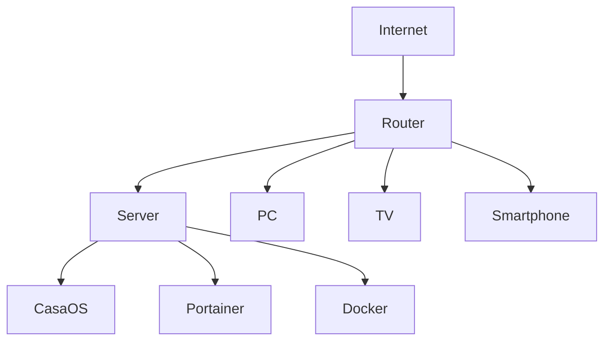
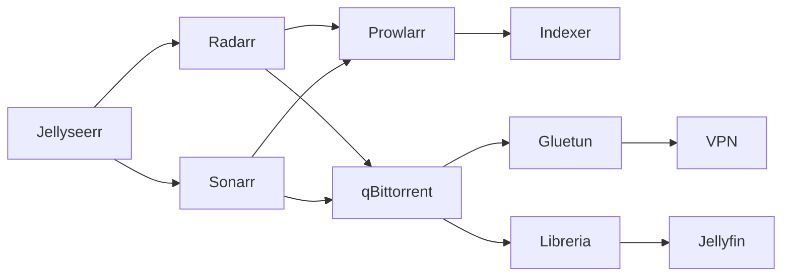
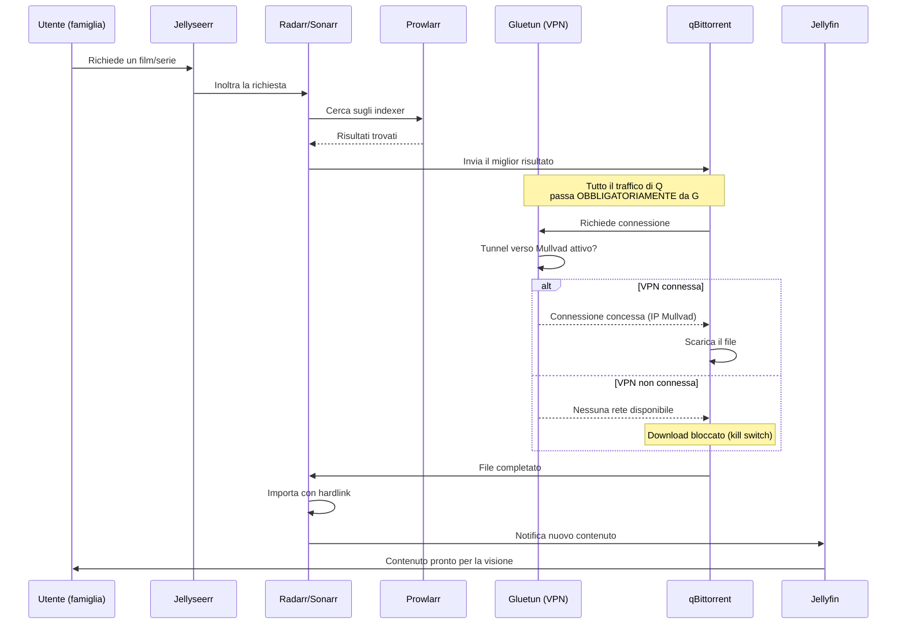

# Panoramica dell'architettura

Prima di installare qualsiasi cosa, è importante avere in testa la mappa completa di come tutti i pezzi comunicano tra loro. Questa pagina è il "diagramma madre" a cui tornare ogni volta che ti perdi tra i dettagli delle sezioni successive.

## Architettura fisica

## I tre livelli concettuali

### Livello 1 — Accesso e gestione

**CasaOS** e **Portainer** sono le due interfacce da cui gestisci il server. CasaOS per le operazioni semplici (aggiungere un container, cambiare una variabile), Portainer per configurazioni avanzate che CasaOS non espone (rete condivisa tra container, capacità di sistema). Ne parliamo nel dettaglio nella sezione Piattaforma Server.

### Livello 2 — Automazione (Stack \*arr)

Il cuore del sistema: **Prowlarr** cerca sugli indexer, **Radarr**/**Sonarr** decidono cosa scaricare e lo passano a **qBittorrent**, **Bazarr** aggiunge i sottotitoli, **Jellyseerr** è il punto di richiesta per gli utenti finali (te e la tua famiglia).

### Livello 3 — Sicurezza di rete

**Gluetun** crea un tunnel VPN verso **Mullvad**, e **qBittorrent** è forzato a passare esclusivamente attraverso quel tunnel (nessuna rete propria). **UFW** controlla chi può raggiungere le interfacce web dei vari servizi. **Tailscale** permette accesso da fuori casa senza esporre nulla pubblicamente. **AdGuard Home** filtra le richieste DNS di tutta la rete domestica.

## Il flusso completo, passo per passo

Questo diagramma è la chiave di lettura di tutta la guida: ogni sezione successiva approfondisce uno di questi passaggi. Tienilo a mente mentre procedi.

## Perché questa architettura e non un'altra

Ogni scelta in questa guida risponde a un principio preciso:

- **Isolamento**: qBittorrent non ha mai accesso diretto a Internet, solo tramite Gluetun — se la VPN si rompe, il download si ferma, non "torna" alla rete normale
- **Automazione**: nessun passaggio manuale tra "richiesta" e "contenuto pronto"
- **Nessuna esposizione pubblica**: tutto è raggiungibile solo da LAN o tramite Tailscale, mai con porte aperte sul router
- **Separazione delle responsabilità**: ogni servizio fa una cosa sola (Prowlarr cerca, Radarr organizza, qBittorrent scarica, Jellyfin mostra) — se uno si rompe, gli altri restano operativi

Con questa mappa mentale, sei pronto per iniziare dalla scelta dell'hardware.
