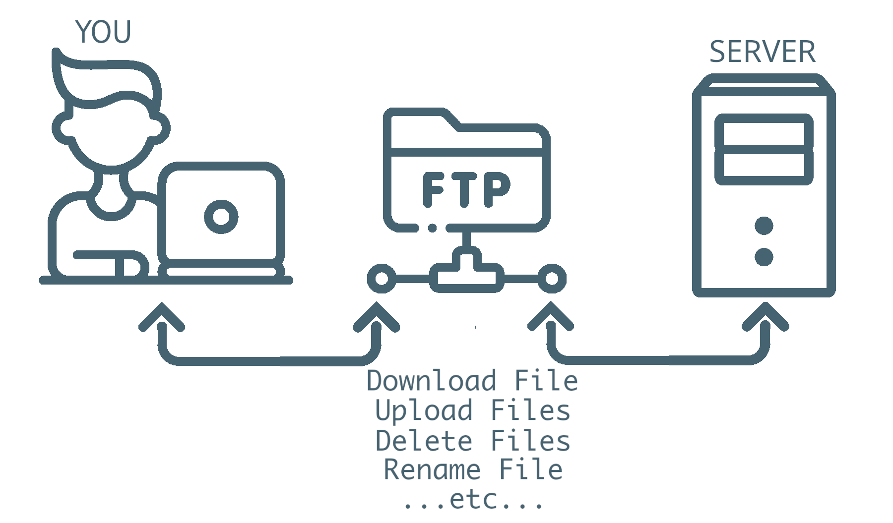
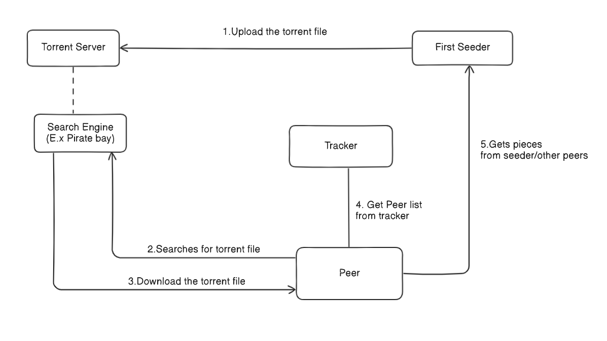
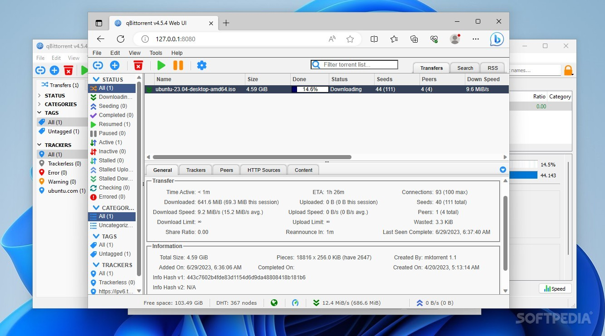

# Come funziona un torrent

Capire questo meccanismo è fondamentale: spiega perché il tuo IP è visibile ad altre persone durante un download, e quindi perché tutta la parte di sicurezza (VPN, kill switch) di questa guida non è "paranoia" ma una necessità reale.

## Il download tradizionale (per confronto)

Quando scarichi un file da un sito normale, il flusso è semplice: tu chiedi il file a **un unico server**, e quel server te lo invia per intero. Il server sa che sei stato tu a scaricarlo (ha il tuo IP nei log), ma nessun altro utente lo sa.

<figure markdown="span">
  { width="600" }
  <figcaption>Download tramite architettura client/server</figcaption>
</figure>

## Il download torrent — decentralizzato

Un torrent funziona in modo completamente diverso: **non esiste un server centrale** che possiede il file. Il file è spezzettato in tanti piccoli pezzi, distribuiti tra centinaia o migliaia di persone diverse che lo stanno scaricando o l'hanno già scaricato.

<figure markdown="span">
  { width="600" }
  <figcaption>Download tramite il protocollo bittorrent (p2p)</figcaption>
</figure>

Scarichi piccoli pezzi da più persone contemporaneamente (**peer**), e allo stesso tempo **carichi** (upload) i pezzi che hai già ad altri che ne hanno bisogno. Chi possiede il file completo e continua a condividerlo si chiama **seeder**; chi lo sta ancora scaricando (e nel frattempo carica quello che ha) è un **leecher** o **peer**.

<figure markdown="span">
  { width="600" }
  <figcaption>UI Web del client QBittorrent</figcaption>
</figure>

Come mostra la immagine il client ci fa vedere cosa stiama scaricando, ad esempio la ISO di ubuntu, quanti seeds e peers ci sono, quanto rimane al download etc...

## Il file .torrent e i tracker/indexer

Il file `.torrent` (o il "magnet link") non contiene il film — contiene solo le **istruzioni**: quali pezzi compongono il file, e dove trovare altri peer che li hanno. Un **tracker** (o, nel nostro caso, un **indexer** come quelli che collegheremo a Prowlarr) è un servizio che tiene traccia di chi sta condividendo cosa, e mette in contatto i peer tra loro.

## Perché il tuo IP è visibile — il punto cruciale

Ecco il concetto chiave di tutta questa guida: **per scaricare e caricare pezzi da altri peer, il tuo client deve comunicare direttamente con loro** — non c'è un intermediario che nasconde chi sei. Ogni peer nello swarm (l'insieme di tutti quelli che stanno scaricando/condividendo quel file) **vede il tuo indirizzo IP reale**, allo stesso modo in cui tu vedi il loro.

Questo è normale e strutturale al funzionamento dei torrent — non è un bug o una falla di sicurezza, è così che il protocollo è progettato per funzionare (decentralizzazione = niente intermediario che nasconde le identità).

## Perché serve una VPN, quindi

Se il tuo IP reale è visibile a centinaia di sconosciuti in uno swarm, chiunque monitori quello swarm (compresi soggetti che lo fanno sistematicamente per varie ragioni, legali o meno) può vedere che il tuo indirizzo IP ha scaricato quel contenuto specifico.

La soluzione è far sì che il traffico del client torrent (qBittorrent, nel nostro stack) passi attraverso un **tunnel VPN**: gli altri peer vedranno l'IP del server VPN, mai il tuo IP reale di casa. Questo è esattamente quello che configuriamo con **Gluetun + Mullvad** più avanti in questa guida, con un meccanismo di **kill switch** e **Network Interface Binding** che garantisce che, se la VPN dovesse cadere per qualsiasi motivo, il download si fermi invece di "tornare" per errore alla tua connessione normale.

## Riassumendo il collegamento con il resto della guida

| Concetto torrent                             | Dove lo affrontiamo nella guida                    |
| -------------------------------------------- | -------------------------------------------------- |
| Swarm, peer, seeder                          | Questa pagina                                      |
| Chi trova i torrent per te                   | Sezione Stack \*arr → Prowlarr                     |
| Chi scarica i pezzi                          | Sezione Stack \*arr → qBittorrent                  |
| Come nascondere il tuo IP durante lo scambio | Sezione Rete e Sicurezza → VPN Gluetun + Mullvad   |
| Come verificare che funzioni davvero         | Sezione Rete e Sicurezza → Verifica protezione VPN |

Con questo concetto chiaro, sei pronto per vedere la visione d'insieme dell'intera architettura, nella prossima pagina.
