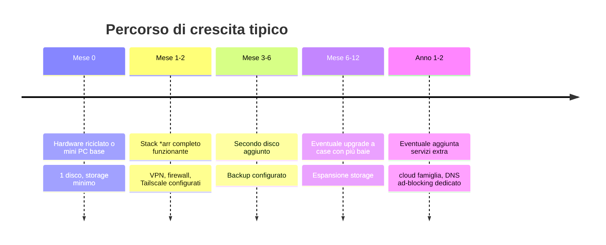

# Percorso di crescita e upgrade

Questa pagina ti aiuta a pianificare _quando_ e _cosa_ aggiornare, invece di comprare tutto in anticipo "per sicurezza" — un errore comune che fa spendere soldi su cose che magari non ti servono mai.

## La linea temporale consigliata

## Quando aggiungere il secondo disco

Il segnale è semplice: quando lo storage inizia a riempirsi (sopra l'80%), o quando hai dati che non vuoi rischiare di perdere (non solo film/serie rigenerabili, ma anche foto di famiglia se aggiungi un cloud personale).

Con un secondo disco puoi passare da:

- **mergerfs** (unione semplice, più spazio totale, rischio isolato al singolo disco se si guasta) — adatto a contenuti rigenerabili
- **mirror ZFS** (stesso identico contenuto su entrambi i dischi, spazio dimezzato ma dati protetti da guasto singolo) — adatto a dati importanti

## Quando passare da DAS esterno a case con baie interne

Segnali che è il momento:

- Hai raggiunto il limite di baie del DAS attuale
- Vuoi eliminare un alimentatore extra e semplificare i cavi
- Stai pianificando di superare le 4-5 unità disco

Questo è un cambio di case, **non** un cambio di sistema operativo o di configurazione software — puoi migrare tutto lo stack senza ricostruirlo da zero (vedi la pagina Backup e Migrazione per la procedura).

## Quando considerare più RAM

Segnali pratici, non teorici:

- Il comando `free -h` mostra costantemente poca RAM libera con lo stack attuale
- Stai per aggiungere servizi extra pesanti (cloud personale tipo Nextcloud/Immich, che hanno database propri)
- Noti rallentamenti quando più container lavorano insieme (es. scan Jellyfin + download attivo + transcoding)

## Quando considerare un livello di virtualizzazione (Proxmox)

Questo è l'upgrade più impegnativo e va valutato solo se:

- Vuoi separare nettamente più categorie di servizi (media, cloud famiglia, rete) in compartimenti isolati
- Prevedi di gestire abbastanza servizi da voler fare snapshot/rollback rapidi
- Ti senti a tuo agio con l'infrastruttura attuale e vuoi il livello successivo di controllo

Non è un passaggio necessario per un homelab media-only ben funzionante — molte installazioni stabili restano per anni su un sistema Ubuntu + Docker diretto, come quello descritto in questa guida.

## Riepilogo — la regola pratica

!!! tip "Principio guida"
Aggiorna un pezzo alla volta, solo quando senti concretamente il limite — non prima. Ogni componente hardware che compri "per il futuro" è un rischio di aver speso male, perché le tue esigenze reali si chiariscono solo usando il sistema, non pianificandolo a tavolino.

Con hardware e percorso di crescita chiari, si passa alla configurazione di rete: il primo passo tecnico vero è dare al server un indirizzo IP fisso.
