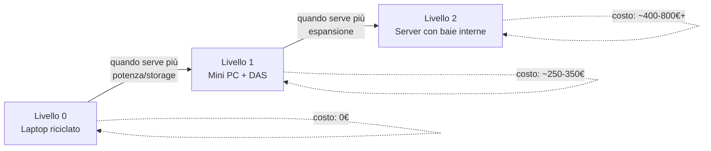

# Da dove partire — scelta dell'hardware

La domanda più comune di chi inizia è "che computer devo comprare?". La risposta onesta è: **probabilmente non devi comprare nulla, per iniziare**. Questa pagina ti guida dalla soluzione più economica possibile fino a un vero server dedicato.

## Livello 0 — Usa quello che hai già

Se hai un **vecchio laptop** o PC fisso che non usi più, è il punto di partenza perfetto per imparare senza spendere nulla:

- Serve solo che supporti Ubuntu Server (praticamente qualsiasi PC degli ultimi 10-12 anni va bene)
- Almeno 4GB di RAM (8GB meglio, per avere margine con più container)
- Uno storage qualsiasi per iniziare (anche l'HDD interno del laptop)

!!! tip "Perché partire così"
L'obiettivo iniziale non è avere lo storage perfetto o il consumo energetico minimo — è **imparare il funzionamento di tutto lo stack** (Docker, arr suite, VPN) senza il rischio di aver speso soldi su hardware che poi scopri non ti serve. Puoi sempre migrare la configurazione su hardware migliore in seguito (vedi la pagina Backup e Migrazione).

## Livello 1 — Mini PC dedicato (il salto più comune)

Quando il vecchio laptop inizia a starti stretto (rumore, consumo elevato, poca RAM), il passo naturale è un **mini PC con CPU Intel N100**:

| Perché l'N100      | Dettaglio                                                                                                                   |
| ------------------ | --------------------------------------------------------------------------------------------------------------------------- |
| Consumo bassissimo | 5-9W a riposo, ideale per un dispositivo acceso 24/7                                                                        |
| Quick Sync Video   | Accelerazione hardware per il transcoding Jellyfin — fondamentale se guardi da dispositivi che non supportano "direct play" |
| Silenzioso         | Molti modelli sono fanless o con ventola quasi impercettibile                                                               |
| Economico          | Mini PC completi (CPU+RAM+storage base) si trovano sui 130-180€                                                             |

A questo si affianca un **DAS** (Direct Attached Storage): un contenitore esterno USB con più baie, dove inserisci gli hard disk per i tuoi media — economico, semplice, "attacca e via".

## Livello 2 — Server dedicato con baie interne

Quando prevedi di espandere molto lo storage (più dischi, RAID/mirror, molti servizi oltre al media server), conviene passare a un **case Mini-ITX con baie interne** (4+ alloggiamenti 3.5"), invece di un mini PC + DAS esterno.

Vantaggi rispetto al DAS:

- Un solo alimentatore invece di due
- Meno cavi, meno ingombro
- Espandi aggiungendo dischi dentro lo stesso case, senza comprare altri contenitori

Con questo livello, spesso si affianca **più RAM** (32GB invece di 16GB) se prevedi di aggiungere servizi extra oltre al media server (cloud personale, DNS ad-blocking, altri container).

## Confronto rapido dei tre livelli

## Cosa NON serve all'inizio

- **RAID complessi**: per iniziare, un singolo disco o due dischi uniti con `mergerfs` bastano — il RAID vero (mirror ZFS) ha senso quando i dati sono importanti e insostituibili (foto di famiglia), meno per media rigenerabile
- **Server enterprise/rack**: rumorosi, energivori, pensati per un contesto diverso dall'uso domestico
- **CPU potenti tipo i7/i9**: per media server + automazione, sono uno spreco di consumo energetico; l'N100 con Quick Sync è più adatto specificamente a questo caso d'uso

## Checklist minima prima di iniziare l'installazione

- Un dispositivo (anche vecchio) su cui installare Ubuntu Server
- Uno storage qualsiasi per iniziare (anche 500GB bastano per fare pratica)
- Una connessione di rete via cavo Ethernet (il WiFi va evitato per un server, meno stabile)
- Accesso al pannello di amministrazione del tuo router (ti servirà per l'IP statico, prossima pagina)

Con l'hardware deciso (anche solo "il vecchio laptop in soffitta"), si passa alla configurazione di rete.
