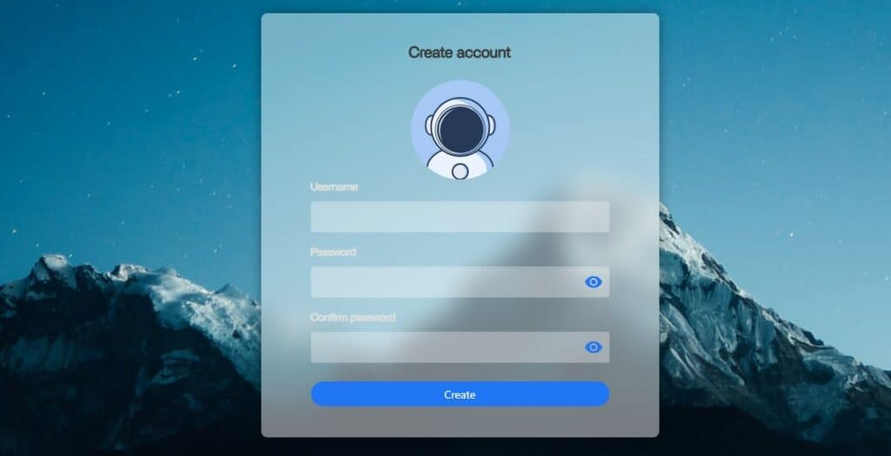
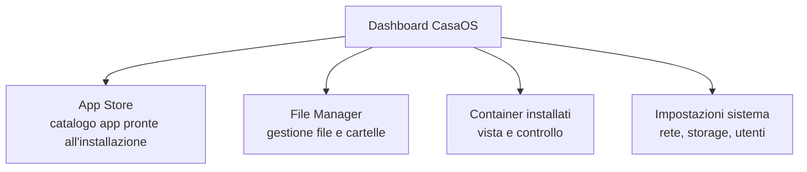
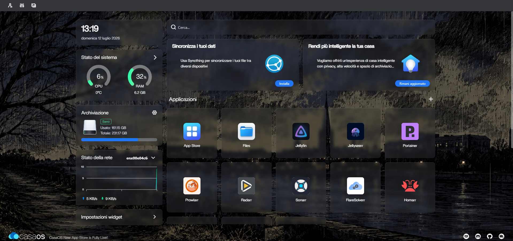

# Installare CasaOS

[CasaOS](https://casaos.zimaspace.com/) ti dà una dashboard web per gestire il server senza dover scrivere ogni comando a mano. È utile soprattutto nella fase iniziale, mentre prendi confidenza con il sistema e vuoi una vista semplificata delle app installate.

Per il ruolo esatto di CasaOS nell'insieme della guida (e i suoi limiti), vedi la pagina **[Perché CasaOS + Portainer](https://mattiap7.github.io/homelab/04-piattaforma/casaos-portainer/)** nella sezione Piattaforma.

## Prerequisiti

CasaOS installa Docker automaticamente se non è già presente: non serve installarlo separatamente prima.

## Installazione

Via SSH sul server:

```bash title="Installa CasaOS"
curl -fsSL https://get.casaos.io | sudo bash
```

Perché questo comando?

- `curl -fsSL https://get.casaos.io` scarica lo script di installazione in modo silenzioso e sicuro.
- `sudo bash` esegue lo script con privilegi di amministratore, necessari per installare Docker e creare i servizi di CasaOS.

Lo script:

1. Verifica i requisiti di sistema
2. Installa Docker (se non presente)
3. Installa e avvia CasaOS
4. Ti mostra l'indirizzo per accedere al termine

!!! tip "Sicurezza prima di tutto"
È sempre una buona abitudine dare un'occhiata a cosa fa uno script prima di eseguirlo con `sudo`. Puoi farlo con:

```bash
curl -fsSL https://get.casaos.io | less
```

## Primo accesso

Apri il browser (da un altro dispositivo sulla stessa rete) e vai su:

```text
http://<IP_DEL_SERVER>
```

Al primo accesso ti verrà chiesto di creare un account amministratore (username e password) — usalo per tutti i successivi accessi alla dashboard.

<figure markdown="span">
  { width="600" }
  <figcaption>CasaOS create account</figcaption>
</figure>

## Panoramica dell'interfaccia



- **App Store**: catalogo di applicazioni pre-configurate installabili con un clic. Molte di quelle che useremo, come Jellyfin, sono già presenti.
- **File Manager**: naviga e gestisci i file del server da browser, per verificare rapidamente la struttura delle cartelle. È utile per controllare che le cartelle create (come `downloads` o `media`) siano state montate correttamente, senza dover aprire un terminale.
- **Container**: vista di tutti i container Docker attivi, con controlli per avviare/fermare/riavviare. Puoi anche vedere i log di un container cliccandoci sopra, il che è utilissimo per capire se un'applicazione si sta avviando correttamente o se c'è un errore.

<figure markdown="span">
  { width="700" }
  <figcaption>CasaOS Dashboard</figcaption>
</figure>

## Configurare lo storage per i media

Prima di installare le app dello stack, prepara la struttura di cartelle che useremo in tutta la guida (coerente con la pagina **Convenzioni di denominazione**):

1. **Montare il disco:** Se hai un secondo disco fisico per i tuoi file, devi prima "agganciarlo" al sistema in una cartella che chiameremo `/DATA`.
2. **Creare le cartelle:** Una volta montato il disco, crea al suo interno questa struttura di cartelle, che useremo per tutto il resto della guida.

```text
/DATA/
├── downloads/
│   ├── completati/
│   └── in-corso/
└── media/
    ├── film/
    └── serie-tv/
```

!!! warning "Attenzione alla struttura!"
Questa struttura di cartelle sarà un punto di riferimento per tutta la guida. Se la cambi qui, dovrai ricordarti di cambiarla in tutte le configurazioni successive (Radarr, Sonarr, Jellyfin, ecc.). Ti consigliamo di seguirla fedelmente.

**Nota:** Se hai un solo disco (quello di sistema), puoi creare questa struttura direttamente nella tua home, ma è consigliato un disco separato per i dati.

## Installare la prima app di prova

Per verificare che tutto funzioni, prova a installare qualcosa di semplice dall'App Store integrato (es. Portainer stesso, che tratteremo nella prossima pagina, oppure una qualsiasi app di test). Se l'installazione va a buon fine e il container appare nella sezione "Container" della dashboard, l'ambiente è pronto.

## Un limite da conoscere fin da subito

!!! warning "CasaOS non basta per tutto"
CasaOS non ti permette di impostare opzioni avanzate come **mettere un container nella stessa rete di un altro (come faremo con qBittorrent e Gluetun)** o di dare permessi speciali a un container. Per questo useremo Portainer.

Con CasaOS attivo e la struttura cartelle pronta, il prossimo passo è aggiungere Portainer per le configurazioni più avanzate.
