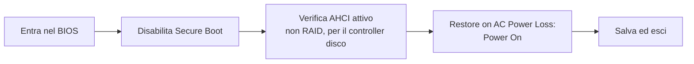
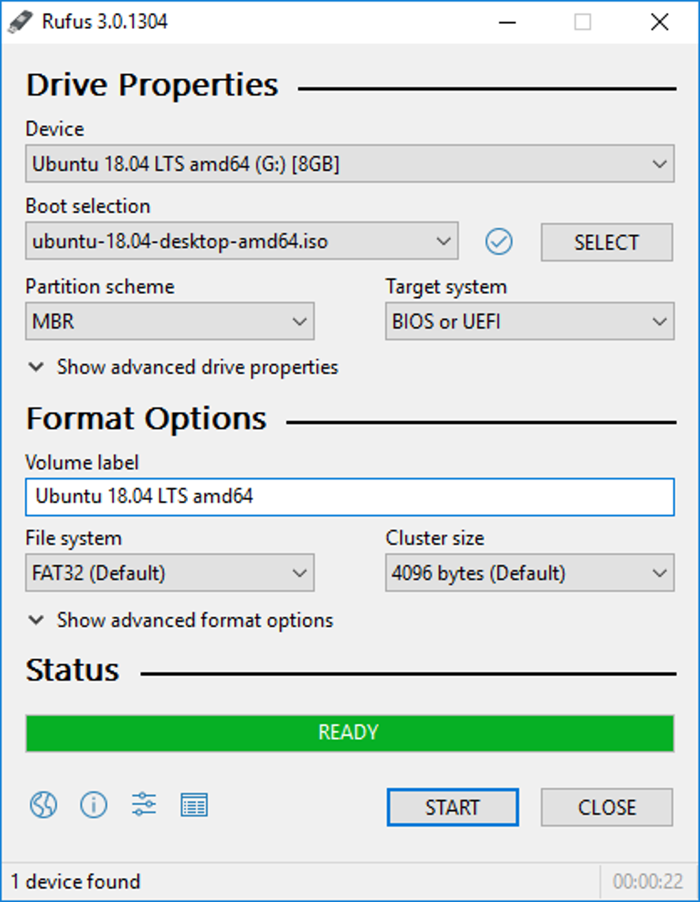

# Installare Ubuntu Server

## Preparazione BIOS/UEFI

Prima di installare qualsiasi cosa, entra nel BIOS del tuo hardware (tasto `Del`, `F2` o `F7` all'accensione, varia per marca) e verifica queste impostazioni:



| Impostazione                | Valore                            | Perché                                                                                       |
| --------------------------- | --------------------------------- | -------------------------------------------------------------------------------------------- |
| Secure Boot                 | Disabilitato                      | Semplifica l'uso di driver di terze parti (es. per l'accelerazione video)                    |
| Modalità controller disco   | AHCI (non RAID)                   | Compatibilità standard con Linux                                                             |
| Comportamento dopo blackout | "Power On" / "Restore last state" | Fondamentale per un server 24/7: dopo un'interruzione di corrente, deve riaccendersi da solo |

## Creazione della chiavetta USB di installazione

Su un altro computer (Windows, Mac o Linux):

1. Scarica l'ISO dal [sito ufficiale di ubuntu](https://ubuntu.com/download/server)
2. Scrivi l'ISO su una chiavetta USB:

### Windows

Usa uno strumento come **[Rufus](https://rufus.ie/it/)** (gratuito), seleziona l'ISO scaricata e la chiavetta USB, avvia la scrittura.

<figure markdown="span">
  { width="600", heigh="200" }
  <figcaption>Rufus main page</figcaption>
</figure>

### linux/MAC

Anche su linux potete farlo tramite Rufus come fatto su windows (sempre se usate una distribuzione con GUI), altrimenti potete farlo dal terminale, per prima cosa dovete visualizzare tutti i dischi collegati:

```bash
lsblk
```

Output di esempio:

```text
NAME   SIZE TYPE MOUNTPOINTS
sda    1.8T disk
├─sda1 512M part /boot
└─sda2 1.8T part /

sdb   14.9G disk
└─sdb1 14.9G part /media/user/USB
```

In questo esempio la chiavetta USB è `/dev/sdb`.

```bash
sudo umount /dev/sdb*
```

Una volta fatto l'unmount della chiavetta lanciate il seguente comando
!!! danger "Verifica sempre il device di destinazione"
Con `dd`, `/dev/sdX` deve essere il device della chiavetta, **mai** il disco del tuo PC. Un errore qui cancella dati in modo permanente e irreversibile.

```bash
sudo dd \
    if=ubuntu-24.04-live-server-amd64.iso \
    of=/dev/sdb \
    bs=4M status=progress oflag=sync
```

- `if=` indica il file ISO da scrivere
- `of=` indica il dispositivo USB (non una partizione)
- `bs=4M` aumenta la velocità di scrittura
- `status=progress` mostra l'avanzamento
- `oflag=sync` forza la sincronizzazione dei dati

Al termine dovresti vedere qualcosa di simile:

```text
1234567890 bytes copied, 35 s, 35 MB/s
```

Per sicurezza esegui anche:

```bash
sync
```

Una volta terminata la sincronizzazione:

```bash
sudo eject /dev/sdb
```

Ora la chiavetta è pronta per l'avvio.

## Installazione guidata

1. Inserisci la USB nel server, avvia, ed entra nel **boot menu** (tasto `F7`/`F11`/`Esc`, dipende dal modello di scheda madre) per avviare dalla USB invece che dal disco interno
2. **Lingua**: scegli la tua lingua preferita per l'installer
3. **Layout tastiera**: seleziona il layout corretto
4. **Network**: lascia DHCP automatico per ora — l'IP statico lo configureremo separatamente dopo, dal router (vedi sezione Rete e Sicurezza)
5. **Storage**: seleziona **"Use an entire disk"**, scegliendo il disco interno del sistema (non un eventuale disco esterno destinato ai media, se già collegato)
6. **Profile setup**:
   - Your name: il tuo nome
   - Server name (hostname): un nome identificativo, es. `homelab`
   - Username: scegli un nome utente personale (evita `admin`/`root`, meno prevedibile per motivi di sicurezza)
   - Password: robusta, salvala subito in un password manager
7. **SSH Setup**: spunta **"Install OpenSSH server"** — è quello che userai per gestire il server da remoto
8. **Featured Server Snaps**: non selezionare nulla in questa schermata — Docker lo installeremo manualmente in seguito, per avere sempre l'ultima versione ufficiale invece della snap
9. Attendi il completamento dell'installazione, rimuovi la chiavetta USB quando richiesto, e riavvia

## Primo accesso e aggiornamenti

Dopo il riavvio, accedi con le credenziali create durante l'installazione (da tastiera/monitor collegati direttamente, oppure via SSH se conosci già l'IP assegnato):

```bash
ssh tuo_utente@<IP_ASSEGNATO>
```

Aggiorna subito il sistema:

```bash
sudo apt update && sudo apt full-upgrade -y
sudo reboot
```

## Impostazioni di base

```bash
# Hostname (se vuoi cambiarlo rispetto a quanto scelto durante l'installazione)
sudo hostnamectl set-hostname homelab

# Timezone
sudo timedatectl set-timezone Europe/Rome

# Verifica
timedatectl
```

## Trovare l'IP assegnato

```bash
ip a
```

Cerca la riga `inet` sotto la tua interfaccia di rete principale (spesso `eth0` o un nome simile tipo `enp3s0`) — quello è l'indirizzo IP attuale del server, assegnato automaticamente via DHCP. Lo renderemo fisso nella sezione dedicata all'IP statico.

Con Ubuntu Server installato e aggiornato, il prossimo passo è configurare bene l'accesso SSH, che userai per tutta la gestione futura del server.
