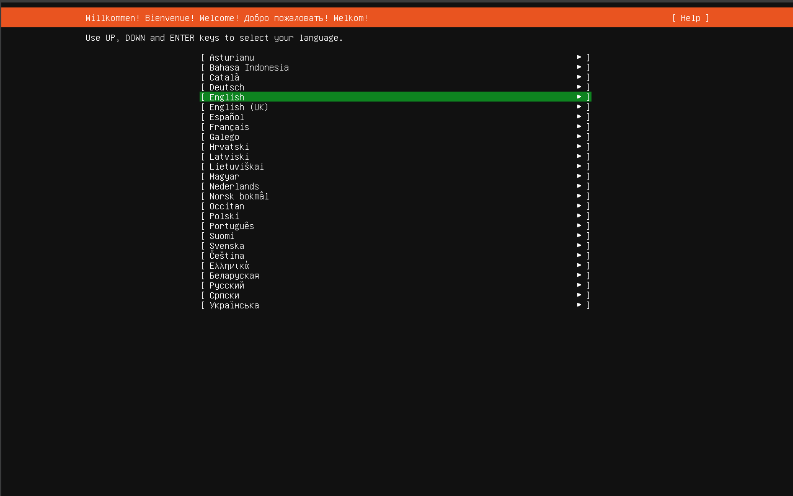
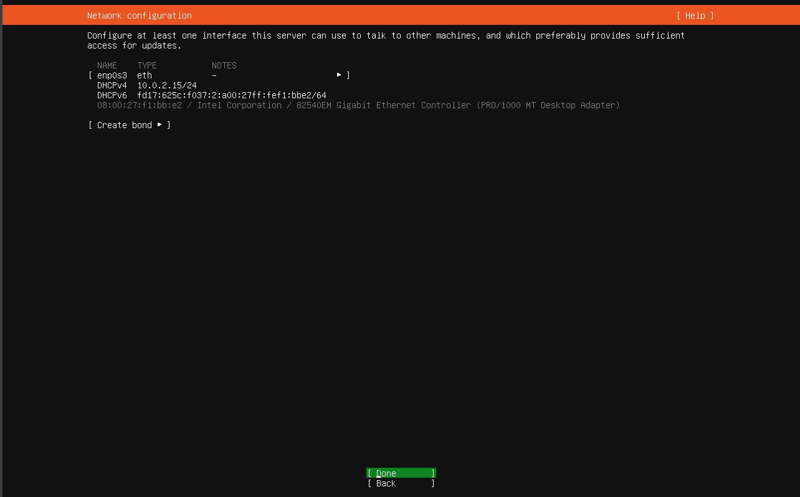
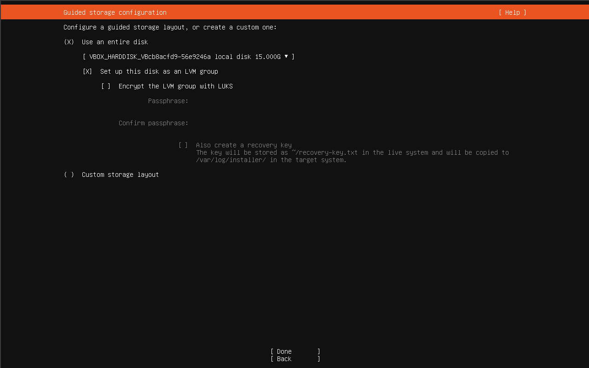
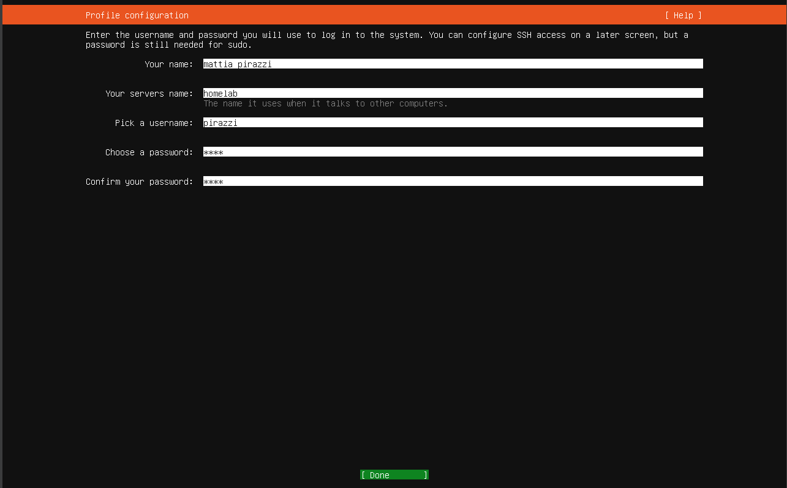
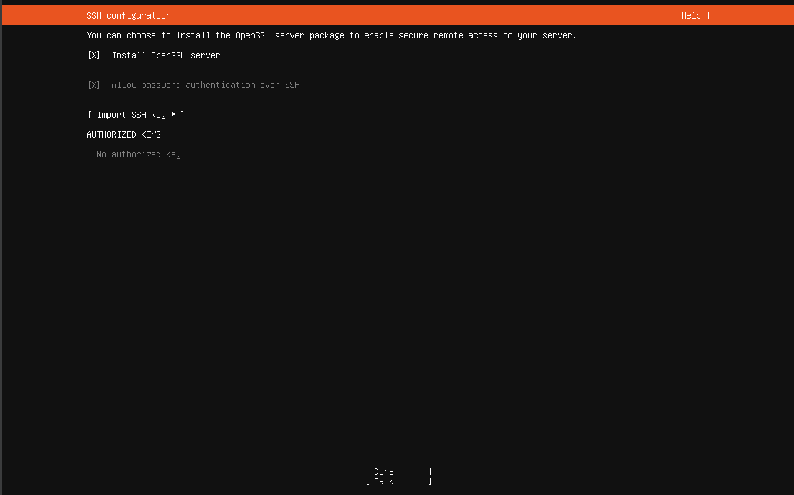

# Installare Ubuntu Server

## Preparazione BIOS/UEFI

Prima di installare qualsiasi cosa, entra nel BIOS del tuo hardware (tasto `Del`, `F2` o `F7` all'accensione, varia per marca) e verifica queste impostazioni:

1. Accedi al BIOS/UEFI del computer.
2. Disabilita **Secure Boot**.
3. Verifica che il controller di archiviazione sia configurato in modalità **AHCI** e non **RAID**.
4. Cerca l'opzione **Restore on AC Power Loss** (o un nome equivalente) e impostala su **Power On**, in modo che il server si riaccenda automaticamente dopo un'interruzione di corrente.
5. Salva le modifiche ed esci dal BIOS/UEFI.

| Impostazione                | Valore                            | Perché                                                                                       |
| --------------------------- | --------------------------------- | -------------------------------------------------------------------------------------------- |
| Secure Boot                 | Disabilitato                      | Semplifica l'uso di driver di terze parti (es. per l'accelerazione video)                    |
| Modalità controller disco   | AHCI (non RAID)                   | Compatibilità standard con Linux                                                             |
| Comportamento dopo blackout | "Power On" / "Restore last state" | Fondamentale per un server 24/7: dopo un'interruzione di corrente, deve riaccendersi da solo |

## Creazione della chiavetta USB di installazione

Su un altro computer (Windows, Mac o Linux):

1. Scarica l'ISO dal [sito ufficiale di ubuntu](https://ubuntu.com/download/server)
2. Scrivi l'ISO su una chiavetta USB:

### Windows

Usa uno strumento come **[Rufus](https://rufus.ie/it/)** (gratuito), seleziona l'ISO scaricata e la chiavetta USB, avvia la scrittura.

<figure markdown="span">
  { width="600", heigh="200" }
  <figcaption>Rufus main page</figcaption>
</figure>

### linux/MAC

Anche su linux potete farlo tramite Rufus come fatto su windows (sempre se usate una distribuzione con GUI), altrimenti potete farlo dal terminale, per prima cosa dovete visualizzare tutti i dischi collegati:

```bash
lsblk
```

Output di esempio:

```text
NAME   SIZE TYPE MOUNTPOINTS
sda    1.8T disk
├─sda1 512M part /boot
└─sda2 1.8T part /

sdb   14.9G disk
└─sdb1 14.9G part /media/user/USB
```

In questo esempio la chiavetta USB è `/dev/sdb`.

```bash
sudo umount /dev/sdb*
```

Una volta fatto l'unmount della chiavetta lanciate il seguente comando
!!! danger "Verifica sempre il device di destinazione"
Con `dd`, `/dev/sdX` deve essere il device della chiavetta, **mai** il disco del tuo PC. Un errore qui cancella dati in modo permanente e irreversibile.

```bash
sudo dd \
    if=ubuntu-24.04-live-server-amd64.iso \
    of=/dev/sdb \
    bs=4M status=progress oflag=sync
```

- `if=` indica il file ISO da scrivere
- `of=` indica il dispositivo USB (non una partizione)
- `bs=4M` aumenta la velocità di scrittura
- `status=progress` mostra l'avanzamento
- `oflag=sync` forza la sincronizzazione dei dati

Al termine dovresti vedere qualcosa di simile:

```text
1234567890 bytes copied, 35 s, 35 MB/s
```

Per sicurezza esegui anche:

```bash
sync
```

Una volta terminata la sincronizzazione:

```bash
sudo eject /dev/sdb
```

Ora la chiavetta è pronta per l'avvio.

## Installazione guidata

Adesso procederò a guidarvi all'installazione del sistema operativo, ubuntu server rende la installazione molto semplice, io lo farò tramite una Virtual Machine ma i passaggi non cambieranno per nulla.

Inserisci la USB nel server, avvia, ed entra nel **boot menu** (tasto `F7`/`F11`/`Esc`, dipende dal modello di scheda madre) per avviare dalla USB invece che dal disco interno

**Lingua e Layout tastiera**, scegli la tua lingua preferita per l'installer e il layout corretto della tastiera

<figure markdown="span">
  { width="600" }
  <figcaption>Ubuntu server lingua</figcaption>
</figure>

**Network**, lascia DHCP automatico per ora — l'IP statico lo configureremo separatamente dopo, dal router (vedi sezione Rete e Sicurezza)

<figure markdown="span">
  { width="600" }
  <figcaption>Ubuntu server Network configuration</figcaption>
</figure>

**Storage**, seleziona **"Use an entire disk"**, scegliendo il disco interno del sistema, potete anche criptare il disco con una passphrase, scelta vostra

<figure markdown="span">
  { width="600" }
  <figcaption>Ubuntu server disk layout</figcaption>
</figure>

**Profile setup**:
Your name: il tuo nome
Server name (hostname): un nome identificativo, es. `homelab`
Username: scegli un nome utente personale
Password: robusta, salvala subito in un password manager

<figure markdown="span">
  { width="600" }
  <figcaption>Ubuntu server profile configuration</figcaption>
</figure>

**SSH Setup**, spunta **"Install OpenSSH server"** — è quello che userai per gestire il server da remoto, se avete chiavi su github potete importarle

<figure markdown="span">
  { width="600" }
  <figcaption>Ubuntu server SSH setup</figcaption>
</figure>

Adesso aspettate che termini il download e fate il primo accesso

## Primo accesso e aggiornamenti

Dopo il riavvio, accedi con le credenziali create durante l'installazione, aggiorna subito il sistema:

```bash
sudo apt update && sudo apt full-upgrade -y
sudo reboot
```

## Impostazioni di base

```bash
# Timezone
sudo timedatectl set-timezone Europe/Rome

# Verifica
timedatectl
```
