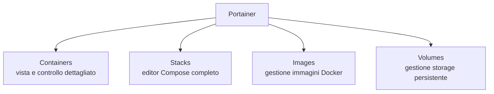

# Installare Portainer

Portainer affianca CasaOS per tutte le configurazioni Docker che la sua interfaccia grafica nativa non espone — in particolare, come vedremo nella sezione VPN, per container come Gluetun che richiedono `network_mode` condiviso, `cap_add` e `devices`. Per il ragionamento completo su quando usare l'uno o l'altro, vedi **Perché CasaOS + Portainer** nella sezione Piattaforma.

## Installazione

Possiamo installare `portainer` sia tramite terminale ma se preferisci puoi farlo anche dall'interfaccia grafica: apri CasaOS → **App Store** → cerca "Portainer" → **Installa**.

## Primo accesso

```
http://<IP_DEL_SERVER>:9000
```

Al primo accesso, crea l'utente amministratore (username e password) — hai un tempo limitato (di solito pochi minuti) per completare questo passaggio dopo l'avvio del container, altrimenti dovrai riavviarlo.

## Panoramica dell'interfaccia



La funzione più importante per questa guida è **Stacks**: un editor web dove incolli un file `docker-compose.yml` completo, con **tutta** la sintassi Compose disponibile — a differenza di CasaOS, qui puoi impostare `network_mode`, `cap_add`, `devices`, e qualsiasi altra opzione avanzata.
