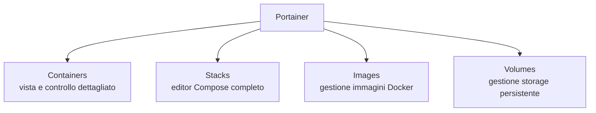

# Installare Portainer

Portainer affianca CasaOS per tutte le configurazioni Docker che la sua interfaccia grafica nativa non espone — in particolare, come vedremo nella sezione VPN, per container come Gluetun che richiedono `network_mode` condiviso, `cap_add` e `devices`. Per il ragionamento completo su quando usare l'uno o l'altro, vedi **Perché CasaOS + Portainer** nella sezione Piattaforma.

## Installazione

Puoi installarlo in due modi equivalenti.

### Opzione A — da terminale (consigliata, più diretta)

```bash
cd /var/lib/casaos/apps
mkdir portainer
cd portainer
vim docker-compose.yml
```

```yaml
services:
  portainer:
    image: portainer/portainer-ce:latest
    container_name: portainer
    volumes:
      - /var/run/docker.sock:/var/run/docker.sock
      - portainer_data:/data
    ports:
      - "9000:9000"
    restart: unless-stopped

volumes:
  portainer_data:
```

```bash
docker compose up -d
```

### Opzione B — dall'App Store di CasaOS

Se preferisci partire dall'interfaccia grafica: apri CasaOS → **App Store** → cerca "Portainer" → **Installa**. Funziona ugualmente bene per l'installazione iniziale; le configurazioni avanzate successive (Stacks) le farai comunque dall'interfaccia di Portainer stessa, indipendentemente da come l'hai installato.

## Primo accesso

```
http://<IP_DEL_SERVER>:9000
```

Al primo accesso, crea l'utente amministratore (username e password) — hai un tempo limitato (di solito pochi minuti) per completare questo passaggio dopo l'avvio del container, altrimenti dovrai riavviarlo.

## Panoramica dell'interfaccia



La funzione più importante per questa guida è **Stacks**: un editor web dove incolli un file `docker-compose.yml` completo, con **tutta** la sintassi Compose disponibile — a differenza di CasaOS, qui puoi impostare `network_mode`, `cap_add`, `devices`, e qualsiasi altra opzione avanzata.

## Creare il tuo primo Stack

1. `Stacks → Add stack`
2. Dai un nome descrittivo (es. `vpn-download` per lo stack Gluetun+qBittorrent che vedremo nella sezione successiva)
3. Incolla il contenuto YAML nell'editor
4. Se il tuo stack usa variabili d'ambiente sensibili (come le chiavi VPN), usa la sezione **"Environment variables"** sotto l'editor invece di scriverle in chiaro nel YAML — approfondito nella sezione Rete e Sicurezza
5. **Deploy the stack**

## Verificare che un container sia visibile da entrambe le interfacce

Un dettaglio utile da sapere subito: un container creato via Portainer **appare comunque** nella dashboard di CasaOS (entrambe le interfacce mostrano tutti i container Docker del sistema, indipendentemente da chi li ha creati). Puoi avviare/fermare un container da qualsiasi delle due — solo per _modifiche strutturali_ (rete, capacità di sistema) dovrai tornare su Portainer.

## Riepilogo — la divisione dei compiti che useremo in questa guida

| Container                                              | Dove configurarlo   |
| ------------------------------------------------------ | ------------------- |
| Radarr, Sonarr, Bazarr, Prowlarr, Jellyfin             | CasaOS va benissimo |
| Gluetun (richiede `cap_add`, `devices`)                | Portainer           |
| qBittorrent (richiede `network_mode: service:gluetun`) | Portainer           |

Con entrambe le piattaforme di gestione pronte, il setup iniziale è completo. Il prossimo passo è la configurazione di rete: dare al server un indirizzo IP fisso, per poi passare a firewall, VPN, e tutto il resto della sezione Rete e Sicurezza.
