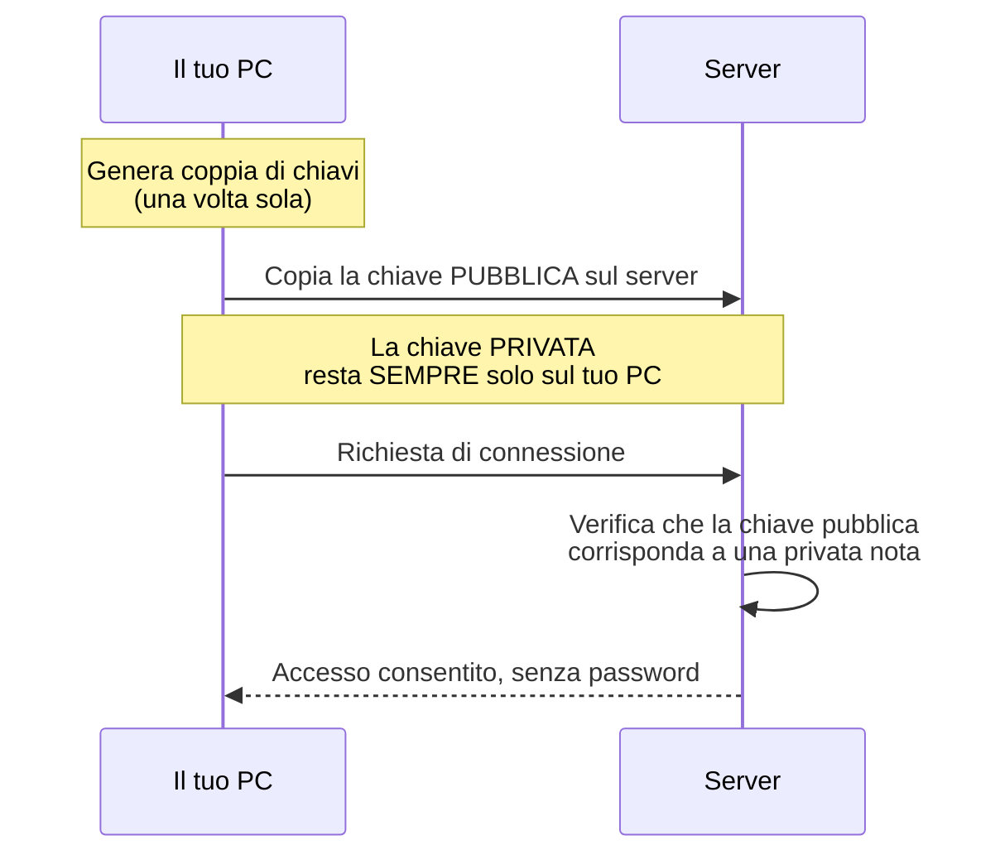

# Primi passi con SSH

**SSH** (Secure Shell) è il modo in cui gestirai il server da remoto per tutta questa guida — invece di collegare monitor e tastiera ogni volta, ti connetti dal tuo PC principale e operi come se fossi seduto davanti al server.

## Connessione base (con password, temporanea)

Per prima cosa devi trovare il tuo ip address

```bash
ip a
```

Cerca la riga `inet` sotto la tua interfaccia di rete principale (spesso `eth0` o un nome simile tipo `enp3s0`) — quello è l'indirizzo IP attuale del server, assegnato automaticamente via DHCP. Lo renderemo fisso nella sezione dedicata all'IP statico.

Adesso puoi collegarti al terminale del server dal tuo pc windows.

```bash
ssh tuo_utente@<IP_DEL_SERVER>
```

Al primo collegamento, ti verrà chiesto di confermare l'identità del server (accetta con `yes`) e poi la password impostata durante l'installazione.

## Perché passare all'autenticazione a chiave

La password, per quanto robusta, può essere indovinata con attacchi automatizzati (bot che provano migliaia di combinazioni). Una **chiave SSH** è una coppia di file crittografici (una parte pubblica, una privata) che rende l'accesso molto più sicuro — e più comodo, perché non dovrai più digitare la password ogni volta.



## Generazione della chiave (sul tuo PC, non sul server)

```bash
ssh-keygen -t ed25519 -C "homelab-access"
```

Premi invio per accettare il percorso di default. Puoi impostare una passphrase per protezione extra (consigliato), o lasciarla vuota per comodità.

## Copiare la chiave pubblica sul server

Su Linux e macOS è possibile utilizzare il comando:

```bash
ssh-copy-id tuo_utente@<IP_DEL_SERVER>
```

Su Windows, invece, `ssh-copy-id` non è disponibile di default nel client OpenSSH. È possibile ottenere lo stesso risultato con PowerShell:

```powershell
type $env:USERPROFILE\.ssh\id_rsa.pub | ssh tuo_utente@<IP_DEL_SERVER> "mkdir -p ~/.ssh && chmod 700 ~/.ssh && cat >> ~/.ssh/authorized_keys && chmod 600 ~/.ssh/authorized_keys"
```

Dopo aver eseguito il comando, potrai autenticarti al server tramite chiave SSH senza dover reinserire la password (a condizione che l'autenticazione tramite chiave sia abilitata sul server).

```bash
ssh tuo_utente@<IP_DEL_SERVER>
```

Se accedi senza che ti venga chiesta la password, la chiave funziona correttamente.

## Disabilitare l'accesso via password (hardening)

Solo **dopo** aver verificato che l'accesso a chiave funziona, sul server:

```bash
sudo vim /etc/ssh/sshd_config
```

Modifica (o aggiungi) queste righe:

```
PermitRootLogin no
PasswordAuthentication no
PubkeyAuthentication yes
```

!!! danger "Verifica PRIMA di chiudere la sessione attuale"
Prima di riavviare il servizio SSH, apri una **nuova** sessione SSH separata (un secondo terminale) per confermare che il login a chiave funzioni ancora. Se disabiliti la password senza aver verificato la chiave, e qualcosa non va, resti bloccato fuori dal server — servirà accesso fisico per rimediare.

```bash
sudo systemctl restart ssh
```

## Cosa ottieni con questo hardening

| Prima                                             | Dopo                                                                |
| ------------------------------------------------- | ------------------------------------------------------------------- |
| Chiunque conosca username può tentare la password | Serve fisicamente la chiave privata sul dispositivo che si connette |
| Login root diretto possibile                      | Root disabilitato, va usato `sudo` dal tuo utente normale           |
| Vulnerabile a bot che tentano password comuni     | Resistente a questo tipo di attacco automatizzato                   |
