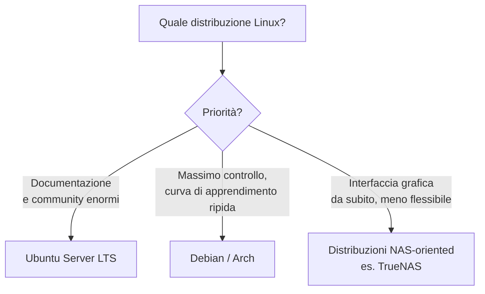

# Scegliere il Sistema Operativo

## Perché non Windows

Windows può tecnicamente far girare Docker (tramite WSL2), ma non è pensato per un uso da server 24/7: consuma più risorse a riposo, richiede più manutenzione (aggiornamenti che a volte forzano riavvii), e la community di homelab/self-hosting documenta quasi tutto pensando a Linux. Se stai costruendo un server dedicato, parti da Linux.

## Perché Ubuntu Server (e non altre distribuzioni Linux)

Per questa guida usiamo **[Ubuntu Server LTS](https://ubuntu.com/download/server)** per motivi pratici, non ideologici:

- **Community enorme**: qualsiasi problema tu incontri, è quasi certamente già stato documentato da qualcun altro
- **LTS Long Term Support**: supporto di sicurezza per 5 anni, non serve reinstallare/aggiornare la versione spesso
- **Nessuna interfaccia grafica**: un server non ne ha bisogno, risparmi RAM e superficie di attacco
- **Compatibilità totale con Docker**: nessuna frizione nell'installazione

## Cosa significa "Server" vs "Desktop"

Quando scarichi Ubuntu, esistono due varianti:

| Variante           | Cosa include                                                | Per il nostro uso                           |
| ------------------ | ----------------------------------------------------------- | ------------------------------------------- |
| **Ubuntu Desktop** | Interfaccia grafica completa, applicazioni desktop          | ❌ Spreco di risorse per un server headless |
| **Ubuntu Server**  | Solo terminale, nessuna GUI, ottimizzato per essere leggero | ✅ Quello che useremo                       |

"Server" non significa hardware particolare — è solo la versione del sistema operativo senza interfaccia grafica, pensata per essere gestita da remoto via SSH.

## Requisiti minimi realistici

Per il carico di lavoro di questa guida (stack \*arr + Jellyfin + VPN):

- **CPU**: qualsiasi CPU x86_64 degli ultimi 10 anni; se hai margine di scelta, una con supporto Quick Sync (Intel) aiuta molto per il transcoding video
- **RAM**: 4GB minimo per iniziare, 8GB+ consigliati con più container attivi
- **Storage per il sistema**: 20-30GB bastano per il solo OS (i media vanno su storage separato)
- **Rete**: connessione via cavo Ethernet, non WiFi — più stabile per un servizio always-on
