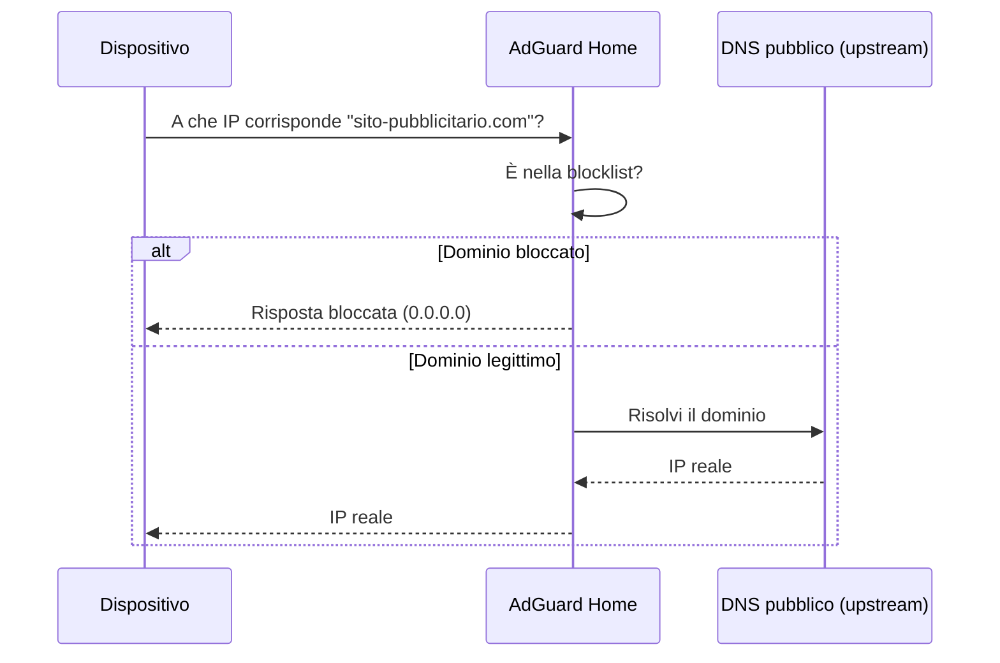
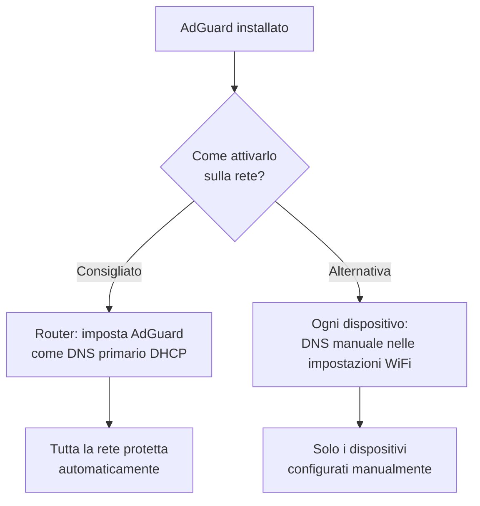

# DNS e ad-blocking — AdGuard Home

## A cosa serve

**AdGuard Home** è un server DNS con blocco pubblicità/tracker integrato. Sostituisce il DNS che normalmente ti dà il router/ISP: ogni volta che un dispositivo di casa (telefono, PC, smart TV) chiede "a che indirizzo corrisponde questo sito?", la richiesta passa da AdGuard, che blocca la risposta se riconosce il dominio come pubblicità/tracker/malware — su **tutti** i dispositivi della rete, non solo nel browser dove hai un adblocker installato.



## Installazione

```yaml
services:
  adguard:
    image: adguard/adguardhome:latest
    container_name: adguard
    volumes:
      - ./adguard/work:/opt/adguardhome/work
      - ./adguard/conf:/opt/adguardhome/conf
    ports:
      - "53:53/tcp"
      - "53:53/udp"
      - "3000:3000/tcp" # solo per il setup iniziale
      - "8082:80/tcp" # WebUI (porta 80 spostata per non entrare in conflitto con CasaOS)
    restart: unless-stopped
```

```bash
docker compose up -d adguard
```

!!! warning "Conflitto sulla porta 53"
La porta 53 (DNS) è spesso già occupata sull'host da `systemd-resolved`. Verifica prima:
`bash
    sudo ss -tulpn | grep :53
    `
Se occupata, disabilita il resolver di sistema prima di avviare AdGuard:
`bash
    sudo systemctl disable --now systemd-resolved
    sudo rm /etc/resolv.conf
    echo "nameserver 127.0.0.1" | sudo tee /etc/resolv.conf
    `

## Regole firewall

```bash
sudo ufw allow from 192.168.1.0/24 to any port 53 comment 'AdGuard DNS'
sudo ufw allow from 192.168.1.0/24 to any port 3000 proto tcp comment 'AdGuard setup iniziale'
sudo ufw allow from 192.168.1.0/24 to any port 8082 proto tcp comment 'AdGuard WebUI'
```

## Setup guidato iniziale

1. Apri `http://<IP_server>:3000` (solo per la prima configurazione)
2. **Admin Web Interface**: lascia la porta proposta (diventerà l'interfaccia permanente, es. `8082`)
3. **DNS Server**: lascia porta `53`
4. Crea username/password amministratore
5. Completa il wizard

Da questo momento, l'interfaccia permanente è su `http://<IP_server>:8082`.

## Attivarlo su tutta la rete — il passaggio che spesso si dimentica

Installarlo non basta: devi dire ai dispositivi di casa di usarlo come DNS.



**Opzione consigliata**: entra nel pannello del router (`192.168.1.1`), cerca le impostazioni DNS (spesso sotto "LAN"/"DHCP"), imposta come DNS primario l'IP del tuo server. Ogni dispositivo che si connette riceve automaticamente questo DNS.

!!! danger "Testa prima su un solo dispositivo"
Se AdGuard avesse un problema di configurazione e lo applichi subito a tutto il router, rischi di lasciare temporaneamente senza Internet tutta casa (nessuna risoluzione DNS = niente funziona). Verifica su un dispositivo per un giorno prima di applicarlo globalmente.

## Configurazione consigliata

**Filtri**: `Filters → DNS blocklists` → aggiungi liste come AdGuard DNS filter (spesso preselezionata), OISD Blocklist, EasyPrivacy.

**DNS Rewrites** (nomi locali comodi, opzionale): `Filters → DNS rewrites`

```
Domain: jellyfin.homelab.local
Answer: 192.168.1.14
```

Da quel momento, chiunque sulla rete può digitare `jellyfin.homelab.local` invece dell'IP numerico.

## Verifica che funzioni

```bash
nslookup doubleclick.net <IP_server>
```

Se AdGuard blocca correttamente, la risposta sarà `0.0.0.0` invece dell'IP reale di quel dominio pubblicitario.

---

Con tutta la sezione Rete e Sicurezza completata, il passo successivo è scegliere la piattaforma software su cui gestire tutti questi container.
