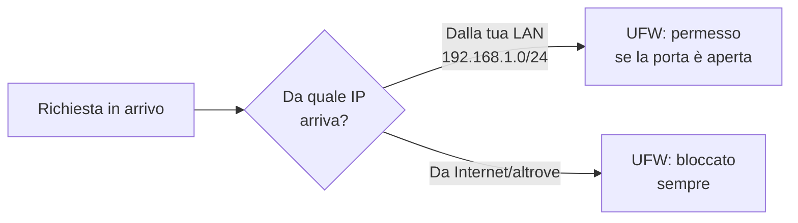

# Firewall — UFW

## A cosa serve

Ogni servizio che installerai (Jellyfin, Radarr, Sonarr, qBittorrent...) apre una **porta di rete** per essere raggiungibile via browser. Senza un firewall, **ogni dispositivo sulla tua rete** (e potenzialmente, in caso di errori di configurazione del router, anche da Internet) può raggiungere quelle porte.

**UFW** (Uncomplicated Firewall) è lo strumento che decide, porta per porta, chi può connettersi al tuo server. La regola di base che useremo in tutta questa guida è: **tutto bloccato di default, aperto solo quello che serve, solo per chi è sulla tua rete locale**.

## Il principio guida



## Installazione e configurazione base

Sostituisci `192.168.1.0/24` con la tua subnet reale (la trovi con `ip a`, guardando l'indirizzo del server e mantenendo `/24` finale).

```bash
sudo apt install ufw -y

# Politiche di default: blocca tutto in entrata, permetti tutto in uscita
sudo ufw default deny incoming
sudo ufw default allow outgoing

# SSH — fai questa regola PER PRIMA, sempre
sudo ufw allow from 192.168.1.0/24 to any port 22 proto tcp comment 'SSH'
```

!!! danger "Non saltare questo passaggio"
Se attivi UFW senza aver prima aggiunto la regola SSH, ti blocchi fuori dal server e servirà accesso fisico (monitor+tastiera) per rimediare. Aggiungi sempre SSH per primo, verifica con `sudo ufw show added` che ci sia, e solo dopo procedi.

## Regole per i servizi principali

```bash
# SSH (Rete Locale)
sudo ufw allow from 192.168.1.0/24 to any port 22 proto tcp comment 'SSH'

# CasaOS
sudo ufw allow from 192.168.1.0/24 to any port 80 proto tcp comment 'CasaOS HTTP'
sudo ufw allow from 192.168.1.0/24 to any port 443 proto tcp comment 'CasaOS HTTPS'

# Jellyfin
sudo ufw allow 8096/tcp comment 'Jellyfin'

# qBittorrent WebUI (esposta tramite Gluetun)
sudo ufw allow from 192.168.1.0/24 to any port 8080 proto tcp comment 'qBittorrent WebUI'

# Porta torrent (deve restare raggiungibile anche da Internet per la connettività P2P,
# ma il traffico passa comunque dentro il tunnel VPN, quindi resta protetto)
sudo ufw allow 6881/tcp comment 'qBittorrent torrent TCP'
sudo ufw allow 6881/udp comment 'qBittorrent torrent UDP'

# Stack *arr
sudo ufw allow from 192.168.1.0/24 to any port 7878 proto tcp comment 'Radarr'
sudo ufw allow from 192.168.1.0/24 to any port 8989 proto tcp comment 'Sonarr'
sudo ufw allow from 192.168.1.0/24 to any port 9696 proto tcp comment 'Prowlarr'
sudo ufw allow from 192.168.1.0/24 to any port 6767 proto tcp comment 'Bazarr'
sudo ufw allow 5055/tcp comment 'Jellyseerr'

# Portainer
sudo ufw allow from 192.168.1.0/24 to any port 9000 proto tcp comment 'Portainer'
```

## Attivazione sicura

```bash
# Verifica tutte le regole PRIMA di attivare
sudo ufw show added

# Attiva solo dopo aver confermato che SSH è tra le regole
sudo ufw enable
```

Subito dopo, **da un'altra sessione/dispositivo** (senza chiudere quella attuale):

```bash
ssh utente@192.168.1.14
```

Se funziona, sei al sicuro. Solo a quel punto chiudi la sessione originale.

## Verifica completa

```bash
sudo ufw status verbose
```

## Regole per Tailscale (quando lo configuri)

Tailscale crea una sua interfaccia di rete virtuale, separata dalla LAN. Serve una regola dedicata (approfondita nella pagina Tailscale):

```bash
sudo ufw allow in on tailscale0
```

## Se ti blocchi fuori per errore

Serve accesso fisico al server (monitor+tastiera collegati direttamente):

```bash
sudo ufw disable
```

Questo rimuove il blocco immediatamente. Verifica poi la subnet reale con `ip a` sul server e `ipconfig` (Windows) o `ifconfig`/`ip a` (altri client) sul dispositivo da cui ti connetti — un errore comune è che il client non sia davvero sulla subnet che hai scritto nelle regole.

## Aggiungere nuovi servizi in futuro

Stesso schema sempre:

```bash
sudo ufw allow from 192.168.1.0/24 to any port <PORTA> proto tcp comment '<NOME_SERVIZIO>'
```

!!! tip "Buona pratica"
Aggiungi le regole una alla volta, verificando di restare connesso dopo ognuna — specialmente quando modifichi in blocco molte regole insieme.

Con il firewall attivo, il prossimo passo cruciale è la protezione VPN per i download.
