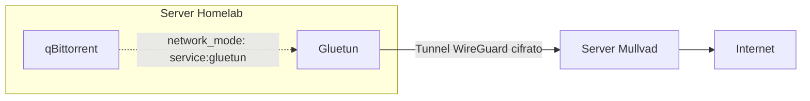
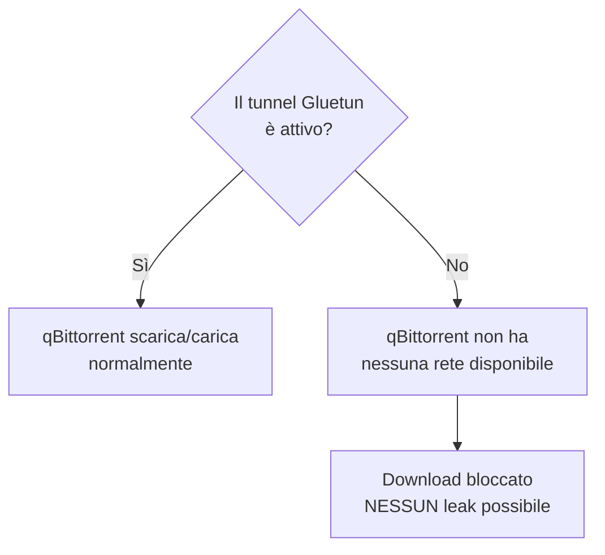

# VPN — Gluetun + Mullvad

Questa è la sezione più importante per la sicurezza del tuo download. Se hai letto la pagina "Come funziona un torrent", sai già perché serve: il tuo IP reale sarebbe altrimenti visibile a chiunque nello swarm.

## Il concetto — Gluetun non è un'app, è un container

**Mullvad** è il servizio VPN (a pagamento, ~5€/mese) a cui ti connetti. **Gluetun** è il client WireGuard containerizzato che gestisce quella connessione dentro Docker — non serve installare nessuna app VPN separata, né su Windows, né sul sistema operativo del server: Gluetun **è** il client.



## Passo 1 — Account Mullvad e chiavi WireGuard

1. Vai su **mullvad.net** → crea account (ti dà solo un numero a 16 cifre, nessuna email richiesta)
2. **Salva subito il numero account** — è l'unico modo di accedere, non recuperabile se perso
3. Aggiungi credito (5€/mese)
4. Nel pannello account → **Configurazione WireGuard** → **Genera chiave**
5. Copia la **chiave privata** mostrata
6. Seleziona il tab **Linux** → trovi anche l'**Address** (es. `10.64.xxx.xxx/32`)

!!! danger "La chiave privata si vede una sola volta"
Copiala e salvala subito in un posto sicuro. Se la perdi, dovrai generarne una nuova.

## Passo 2 — Configurazione Gluetun

Nel tuo `docker-compose.yml`:

```yaml
services:
  gluetun:
    image: qmcgaw/gluetun:latest
    container_name: gluetun
    cap_add:
      - NET_ADMIN
    devices:
      - /dev/net/tun:/dev/net/tun
    ports:
      - "8080:8080" # WebUI qBittorrent
      - "6881:6881"
      - "6881:6881/udp"
    environment:
      - VPN_SERVICE_PROVIDER=mullvad
      - VPN_TYPE=wireguard
      - WIREGUARD_PRIVATE_KEY=LA_TUA_CHIAVE_PRIVATA
      - WIREGUARD_ADDRESSES=IL_TUO_INDIRIZZO/32
      - SERVER_COUNTRIES=Netherlands
      - FIREWALL=on
      - FIREWALL_OUTBOUND_SUBNETS=192.168.1.0/24
      - TZ=Europe/Rome
    volumes:
      - ./gluetun:/gluetun
    restart: unless-stopped
    healthcheck:
      test: ["CMD", "wget", "-qO-", "https://ipinfo.io/ip"]
      interval: 60s
      timeout: 10s
      retries: 3
```

| Variabile                                      | Perché è importante                                                                                                       |
| ---------------------------------------------- | ------------------------------------------------------------------------------------------------------------------------- |
| `FIREWALL=on`                                  | Attiva il kill switch interno: se il tunnel cade, Gluetun blocca ogni traffico che tenterebbe di uscire fuori dalla VPN   |
| `FIREWALL_OUTBOUND_SUBNETS`                    | La tua subnet LAN — senza questa, perdi anche la comunicazione locale tra container                                       |
| `cap_add: NET_ADMIN` + `devices: /dev/net/tun` | Necessari per creare il tunnel WireGuard — non modificabili su un container già esistente, vanno impostati alla creazione |

## Passo 3 — qBittorrent, il vero kill switch

```yaml
qbittorrent:
  image: lscr.io/linuxserver/qbittorrent:latest
  container_name: qbittorrent
  network_mode: "service:gluetun" # <-- il cuore della sicurezza
  depends_on:
    gluetun:
      condition: service_healthy
  environment:
    - PUID=1000
    - PGID=1000
    - TZ=Europe/Rome
    - WEBUI_PORT=8080
  volumes:
    - ./qbittorrent:/config
    - /DATA/Downloads:/downloads
  restart: unless-stopped
  # NESSUNA sezione "ports:" qui — le porte sono su Gluetun
```

### Perché funziona come kill switch

`network_mode: service:gluetun` non crea una rete propria per qBittorrent — condivide letteralmente lo stack di rete di Gluetun. Non è un firewall che blocca il traffico non-VPN: è l'**assenza strutturale** di un percorso di rete alternativo. Se Gluetun perde il tunnel, qBittorrent non ha semplicemente nessun'altra via per uscire su Internet.



## Passo 4 — Impostazioni di sicurezza extra in qBittorrent

Nel WebUI (`http://<IP_server>:8080`), `Strumenti → Opzioni`:

**Advanced**

- **Network Interface**: seleziona `tun0` — secondo livello di protezione indipendente da Gluetun

**Connection**

- Disattiva UPnP/NAT-PMP (non funziona dentro un tunnel gestito da un altro container)

**BitTorrent**

- Crittografia: **Richiedi crittografia**
- **Anonymous Mode**: attivo se disponibile

**Web UI**

- Cambia subito username e password di default (mai lasciare quelli standard)

!!! warning "Errore comune"
Nel campo **Indirizzo IP** della sezione Web UI, NON scrivere mai un URL con `http:` davanti — quel campo vuole solo l'IP puro o `*` (tutte le interfacce). Scrivere `http:192.168.1.14` causa un errore di bind che impedisce alla WebUI di partire.

## Impostazioni consigliate su Mullvad

- **Paese server**: scegli uno con buone leggi sulla privacy e buona velocità dall'Italia (Paesi Bassi, Svezia, Svizzera sono scelte comuni)
- Verifica sul sito Mullvad quali server sono esplicitamente P2P-friendly per prestazioni torrent migliori

Con Gluetun e qBittorrent configurati, il passo successivo obbligatorio è **verificare** che tutto funzioni davvero — non dare mai per scontato che una configurazione VPN sia corretta senza testarla.
