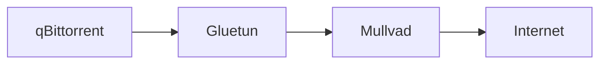
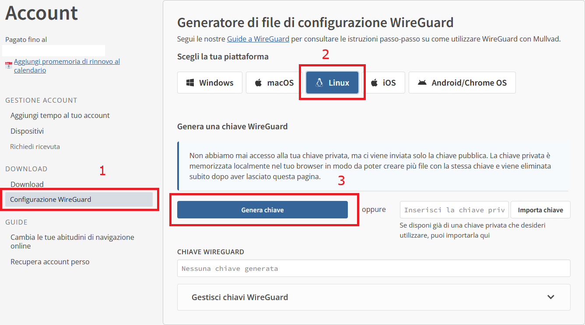
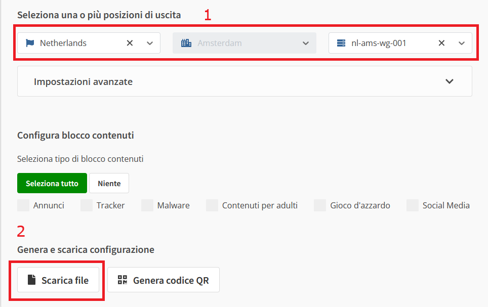
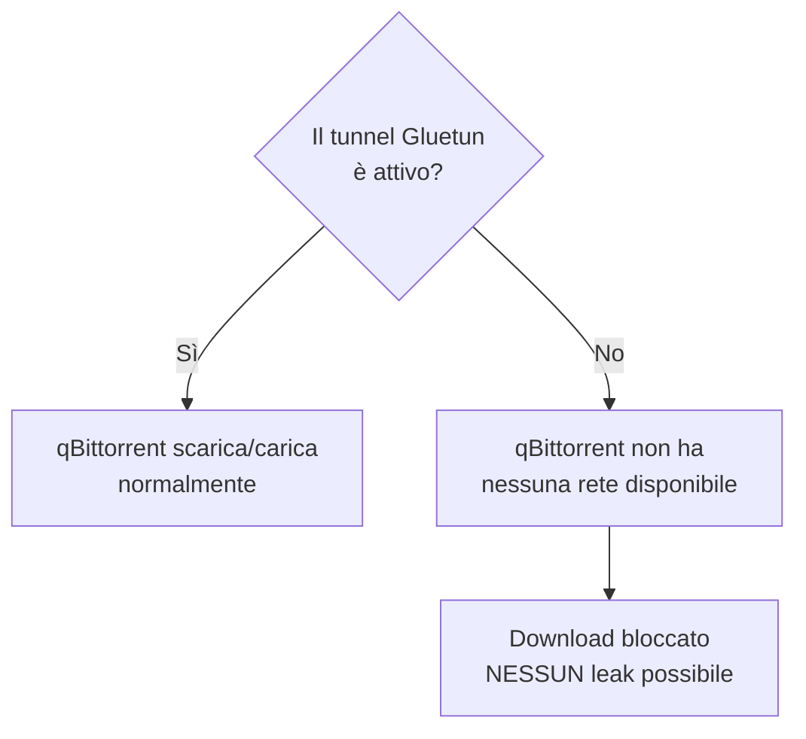
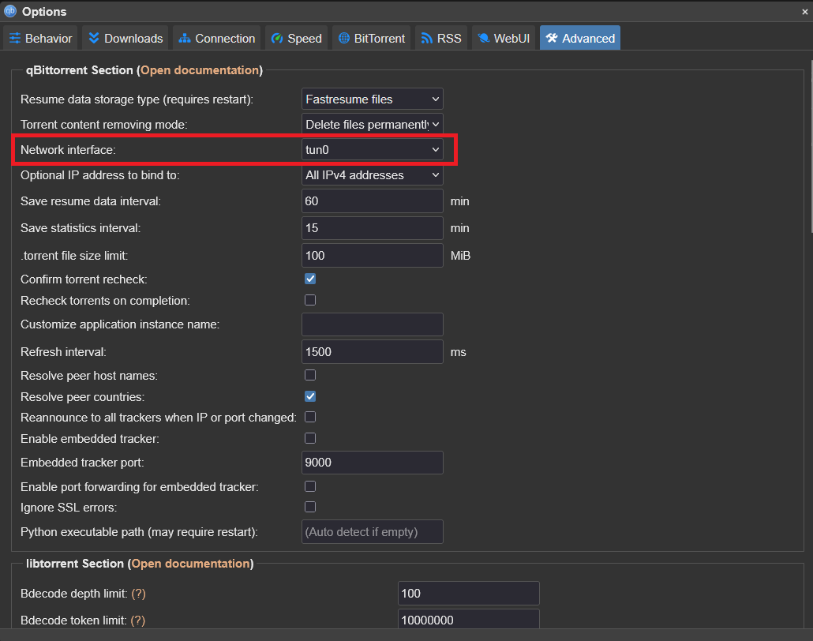
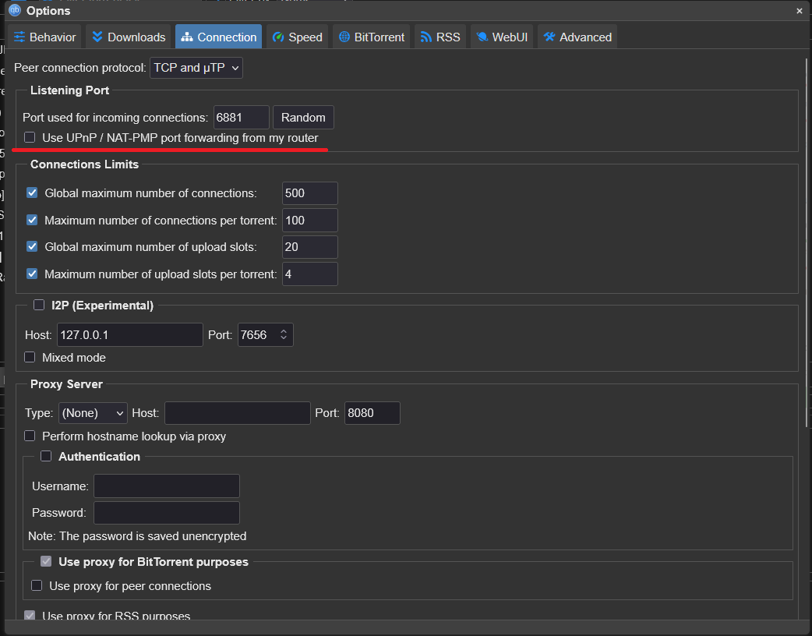
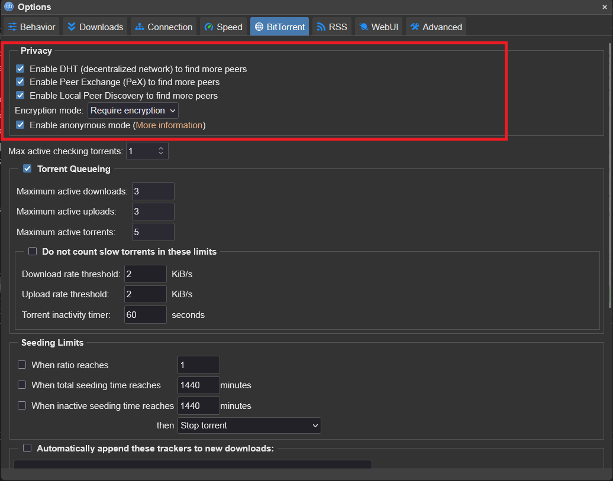
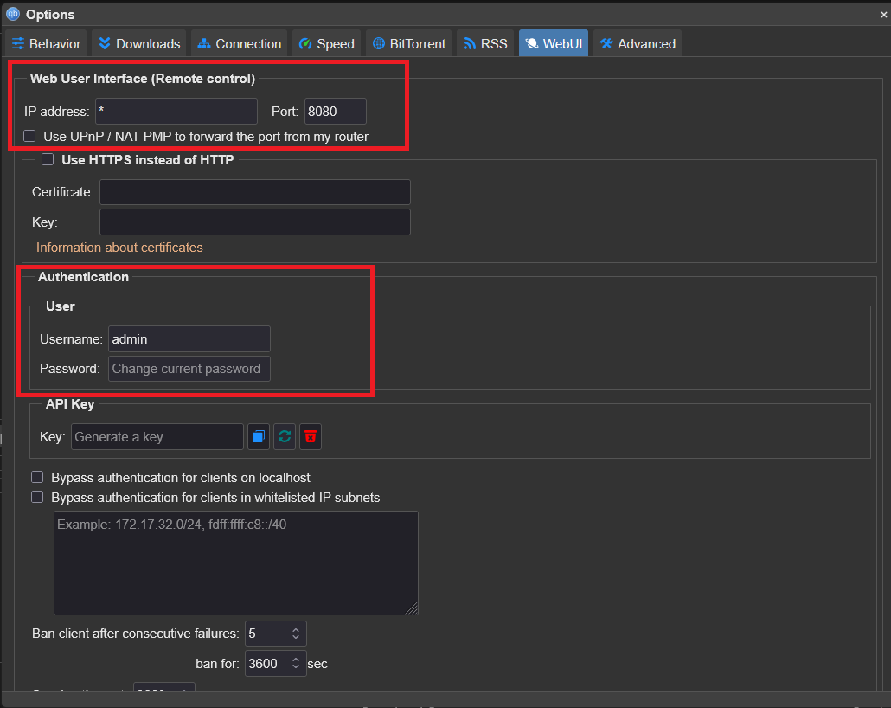

# VPN — Gluetun + Mullvad

Questa è la sezione più importante per la sicurezza del tuo download. Se hai letto la pagina "Come funziona un torrent", sai già perché serve: il tuo IP reale sarebbe altrimenti visibile a chiunque nello swarm.

## Il concetto — Gluetun non è un'app, è un container

**[Mullvad](https://mullvad.net/it)** è il servizio VPN (a pagamento, ~5€/mese) a cui ti connetti. **Gluetun** è il client WireGuard containerizzato che gestisce quella connessione dentro Docker — non serve installare nessuna app VPN separata, né su Windows, né sul sistema operativo del server: Gluetun **è** il client.



qBittorrent **non comunica mai direttamente con Internet**, tutto il traffico passa prima attraverso Gluetun, che crea un tunnel WireGuard verso i server Mullvad.

## Passo 1: Creare una configurazione WireGuard su Mullvad

Per utilizzare Mullvad con Gluetun è necessario generare una configurazione WireGuard dal sito ufficiale di Mullvad. Se non hai ancora un account, puoi crearne uno direttamente su **[Mullvad](https://mullvad.net/it)**: a differenza di molti altri servizi VPN, Mullvad non richiede un indirizzo email né una password. Al termine della registrazione ti verrà assegnato un **numero account di 16 cifre**, che rappresenta l'unico metodo per accedere al tuo account.

!!! danger "Conserva il numero account"
Il numero account è l'unica credenziale necessaria per accedere a Mullvad. Se lo perdi e non ne hai una copia, non sarà possibile recuperarlo.

Dopo aver aggiunto credito al tuo account (attualmente il costo è di **5 € al mese**), entra nel pannello di controllo e apri la sezione dedicata alla configurazione **WireGuard** e genera una chiave.

<figure markdown="span">
  { width="600" }
  <figcaption>Creazione della configurazione WireGuard</figcaption>
</figure>

Dopo di che sarà possibile scaricare il file di configurazione

<figure markdown="span">
  { width="600" }
  <figcaption>Creazione del file .conf</figcaption>
</figure>

Da questa pagina puoi scegliere il paese, il server e generare una nuova configurazione WireGuard. Al termine verrà scaricato un file con un nome simile a:

```text
nl-ams-wg-001.conf
```

È importante capire cosa rappresenta questo file.

Non si tratta di un programma da installare sul server, né di un client VPN: è semplicemente un **file di configurazione** contenente tutte le informazioni necessarie per stabilire un tunnel WireGuard.

Un file `.conf` generato da Mullvad è simile al seguente:

```ini
[Interface]
# Device: Nome device (associato alla chiave precedentemente generato)
PrivateKey = ...
Address = 10.xxx.xxx.xxx/32,fc00:bbbb:bbbb:bb01::x:xxxx/128
DNS = ...

[Peer]
PublicKey = ...
AllowedIPs = ...
Endpoint = ip:porta
```

Le informazioni che interessano per questa guida sono principalmente:

- **PrivateKey** → la chiave privata WireGuard;
- **Address** → l'indirizzo IP assegnato da Mullvad.

Questi valori verranno successivamente utilizzati nella configurazione di Gluetun.

### Perché non installiamo l'app Mullvad?

Potrebbe sembrare naturale installare il client ufficiale Mullvad sul server Linux, ma nel nostro caso **non è necessario**.

Il server utilizzerà infatti **Gluetun**, un container Docker che implementa direttamente il protocollo WireGuard e si occupa autonomamente di instaurare la connessione VPN.

In pratica:

- **Gluetun è il client WireGuard**;
- **non serve installare l'app Mullvad sul server**;
- **non serve importare il file `.conf` nel sistema operativo**.

Le varie opzioni presenti nella pagina di generazione della configurazione (ad esempio Kill Switch, Multihop o altre impostazioni disponibili) sono pensate per chi utilizza il file `.conf` con un client WireGuard tradizionale, come l'app ufficiale WireGuard o il client Mullvad.

Nel nostro setup queste opzioni vengono ignorate.

La protezione del traffico viene infatti gestita direttamente da Gluetun tramite:

- il firewall interno (`FIREWALL=on`);
- la condivisione dello stack di rete con qBittorrent (`network_mode: service:gluetun`).

Questo significa che qBittorrent non dispone di una propria connessione verso Internet: tutto il traffico passa obbligatoriamente attraverso Gluetun. Se la VPN dovesse interrompersi, il firewall interno di Gluetun bloccherà automaticamente qualsiasi comunicazione verso l'esterno, impedendo che il client BitTorrent utilizzi accidentalmente la connessione normale.

In altre parole, il **kill switch che protegge realmente il server è quello di Gluetun**, non quello eventualmente configurabile nella pagina di generazione del file WireGuard.

### Copiare il file sul server

Una volta scaricato il file `.conf`, è consigliabile copiarlo sul server, così da poter consultare facilmente i valori che contiene durante la configurazione di Gluetun.

Da un computer Linux, macOS oppure da PowerShell su Windows (con OpenSSH installato), puoi utilizzare il comando:

```bash
scp nl-ams-wg-001.conf username@ip_del_server:/home/username/
```

dove:

- `nl-ams-wg-001.conf` è il file appena scaricato;
- `username` è l'utente del server;
- `ip_del_server` è l'indirizzo IP del server;
- `/home/username/` è la cartella di destinazione sul server.

`scp` (**Secure Copy**) utilizza il protocollo SSH per trasferire file in modo cifrato da un computer a un altro. Se hai già configurato l'accesso SSH al server, il trasferimento richiederà semplicemente la password (oppure utilizzerà automaticamente la tua chiave SSH).

Una volta copiato il file, puoi visualizzarne il contenuto direttamente sul server:

```bash
cat ~/nl-ams-wg-001.conf
```

oppure aprirlo con un editor di testo:

```bash
vim ~/nl-ams-wg-001.conf
```

## Passo 2 — Configurazione vpn-network (Gluetun + QBittorrent)

Adesso creiamo il container che conterra sia Gluetun che QBittorrent il client torrent, in più verrà creata una rete docker `vpn-network` questo ci faciliterà anche la comunicazioni tra i vari container.

Dopo aver fatto l'accesso a Portainer:

1. Seleziona l'ambiente **Local** (o quello corrispondente al tuo server).
2. Nel menu laterale apri **Stacks**.
3. Clicca su **Add stack**.
4. Assegna un nome allo stack, ad esempio `homelab-vpn`.
5. Incolla il contenuto del tuo file `docker-compose.yml` nel web editor.

```yaml
version: "3.8"

services:
  gluetun:
    image: qmcgaw/gluetun:latest
    container_name: gluetun
    cap_add:
      - NET_ADMIN
    devices:
      - /dev/net/tun:/dev/net/tun
    ports:
      - "8181:8080"
      - "6881:6881"
      - "6881:6881/udp"
    environment:
      - VPN_SERVICE_PROVIDER=mullvad
      - VPN_TYPE=wireguard
      - WIREGUARD_PRIVATE_KEY=...
      - WIREGUARD_ADDRESSES=.../32
      - SERVER_COUNTRIES=Netherlands
      - FIREWALL=on
      - FIREWALL_OUTBOUND_SUBNETS=192.168.1.0/24 # vostra subnet
      - TZ=Europe/Rome
    volumes:
      - /DATA/AppData/gluetun:/gluetun
    restart: unless-stopped
    healthcheck:
      test: ["CMD", "wget", "-qO-", "https://ipinfo.io/ip"]
      interval: 60s
      timeout: 10s
      retries: 3
    # utilizzo il network creato
    networks:
      - vpn-network

  qbittorrent:
    image: lscr.io/linuxserver/qbittorrent:latest
    container_name: qbittorrent
    network_mode: "service:gluetun" # sicurezza di gluetun
    depends_on:
      gluetun:
        condition: service_healthy
    environment:
      - PUID=1000
      - PGID=1000
      - TZ=Europe/Rome
      - WEBUI_PORT=8080
    volumes:
      - /DATA/AppData/qbittorrent:/config
      - /DATA/Downloads:/downloads
    restart: unless-stopped

# creazione del network dedicato
networks:
  vpn-network:
    external: true
```

Premi **Deploy the stack**, Portainer creerà automaticamente tutti i container, le reti e i volumi definiti nel file Compose.

| Variabile                                      | Perché è importante                                                                                                       |
| ---------------------------------------------- | ------------------------------------------------------------------------------------------------------------------------- |
| `FIREWALL=on`                                  | Attiva il kill switch interno: se il tunnel cade, Gluetun blocca ogni traffico che tenterebbe di uscire fuori dalla VPN   |
| `FIREWALL_OUTBOUND_SUBNETS`                    | La tua subnet LAN — senza questa, perdi anche la comunicazione locale tra container                                       |
| `cap_add: NET_ADMIN` + `devices: /dev/net/tun` | Necessari per creare il tunnel WireGuard — non modificabili su un container già esistente, vanno impostati alla creazione |

### Perché creare una rete Docker dedicata?

Quando Docker crea un container senza particolari configurazioni, lo collega alla rete `bridge` predefinita. Sebbene funzioni, utilizzare una **rete dedicata** per i servizi dell'homelab offre diversi vantaggi.

Creando una rete, ad esempio `vpn-network`, tutti i container dello stack potranno comunicare direttamente tra loro utilizzando il **nome del container** invece dell'indirizzo IP.

Ad esempio:

- Radarr potrà raggiungere qBittorrent usando `qbittorrent:8080`;
- Sonarr potrà collegarsi a Prowlarr usando `prowlarr:9696`;
- Jellyfin potrà comunicare con gli altri servizi senza conoscere i loro indirizzi IP.

Questo rende la configurazione più semplice e molto più robusta: se un container cambia indirizzo IP (evento normale in Docker), gli altri continueranno comunque a raggiungerlo tramite il suo nome.

Un altro vantaggio è l'isolamento. I container appartenenti alla stessa rete possono comunicare tra loro, mentre quelli esterni non possono accedere direttamente ai servizi interni, a meno che non vengano pubblicate esplicitamente delle porte.

In questa guida tutti i servizi dell'ecosistema multimediale utilizzeranno la stessa rete Docker dedicata, così da poter comunicare in modo semplice, sicuro e indipendente dagli indirizzi IP assegnati da Docker.

### Perché funziona come kill switch

`network_mode: service:gluetun` non crea una rete propria per qBittorrent — condivide letteralmente lo stack di rete di Gluetun. Non è un firewall che blocca il traffico non-VPN: è l'**assenza strutturale** di un percorso di rete alternativo. Se Gluetun perde il tunnel, qBittorrent non ha semplicemente nessun'altra via per uscire su Internet.



## Passo 3 — Mettere in sicurezza qBittorrent

Prima di utilizzare qBittorrent è consigliabile modificare alcune impostazioni che migliorano la sicurezza e riducono il rischio di esporre il traffico o l'interfaccia di amministrazione.

### Cambiare subito la password della WebUI

!!! danger "Modifica immediatamente la password"
Dalla versione **4.6** delle immagini LinuxServer, qBittorrent non utilizza più una password di default. Al primo avvio viene generata una **password temporanea casuale**, che rimane valida finché non ne imposti una personale.

Per recuperare la password temporanea esegui:

```bash
docker logs qbittorrent 2>&1 | grep -i "temporary password"
```

L'output sarà simile a:

```text
The WebUI administrator username is: admin
The WebUI administrator password was not set. A temporary password is provided for this session: xxxxxxxxx
```

Accedi quindi alla WebUI all'indirizzo:

```text
http://<IP_DEL_SERVER>:8080
```

utilizzando:

- **Username:** `admin`
- **Password:** quella mostrata nei log.

Una volta effettuato l'accesso, cambia immediatamente le credenziali andando in:

```
Strumenti → Opzioni → Web UI → Autenticazione
```

Imposta un nuovo username e una password robusta, quindi salva le modifiche.

Se dopo il riavvio del container la password continua a tornare quella temporanea, il problema è quasi sempre dovuto ai permessi della cartella di configurazione.

Per verificare dove è montato `/config`:

```bash
docker inspect qbittorrent --format '{{ range .Mounts }}{{ println .Source .Destination }}{{ end }}'
```

Se necessario correggi i permessi:

```bash
sudo chown -R 1000:1000 /percorso/reale/qbittorrent
docker restart qbittorrent
```

---

## Configurare l'interfaccia di rete

Apri:

```
Strumenti → Opzioni → Avanzate
```

Alla voce **Network Interface** seleziona:

```
tun0
```

<figure markdown="span">
  { width="600" }
  <figcaption>Selezione dell'interfaccia <code>tun0</code></figcaption>
</figure>

Questa impostazione rappresenta un **secondo livello di protezione**.

Anche se qBittorrent utilizza già la rete di Gluetun grazie a `network_mode: service:gluetun`, vincolare il client all'interfaccia `tun0` impedisce al traffico di utilizzare accidentalmente altre interfacce di rete qualora fossero disponibili.

---

## Disabilitare UPnP

Vai in:

```
Strumenti → Opzioni → Connessione
```

e disattiva:

- **UPnP / NAT-PMP**

<figure markdown="span">
  { width="600" }
  <figcaption>Disabilitare UpNp</figcaption>
</figure>

Quando qBittorrent è dietro Gluetun, queste tecnologie non sono necessarie e non possono aprire automaticamente porte sul router.

---

## Aumentare la privacy del protocollo BitTorrent

Apri:

```
Strumenti → Opzioni → BitTorrent
```

Imposta:

- **Modalità crittografia:** **Richiedi crittografia**
- **Anonymous Mode:** abilitata (se disponibile)

<figure markdown="span">
  { width="600" }
  <figcaption>Impostazioni consigliate per la privacy</figcaption>
</figure>

Queste impostazioni aumentano la privacy delle connessioni BitTorrent e riducono la possibilità di connessioni non cifrate.

---

## Verificare la configurazione della WebUI

Dopo aver modificato username e password, controlla anche il resto della configurazione della WebUI:

```
Strumenti → Opzioni → Web UI
```

<figure markdown="span">
  { width="600" }
  <figcaption>Configurazione della WebUI</figcaption>
</figure>

!!! warning "Errore comune"
Nel campo **Indirizzo IP** della WebUI **non inserire mai un URL**.

    Sono validi valori come:

    - `*`
    - `0.0.0.0`
    - `192.168.1.14`

    Non sono invece validi valori come:

    - `http://192.168.1.14`
    - `https://192.168.1.14`

Inserendo `http://` o `https://`, qBittorrent non riuscirà ad avviare correttamente la WebUI perché tenterà di eseguire il bind su un indirizzo non valido.
