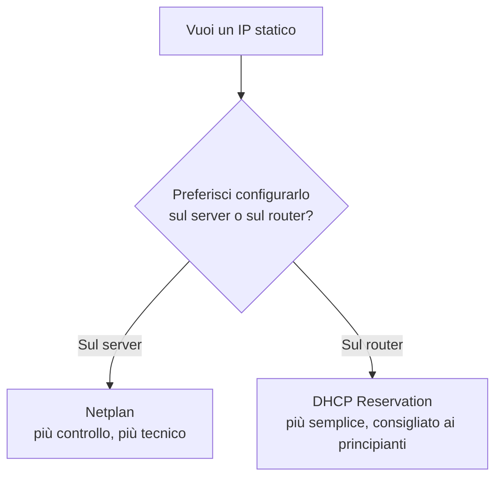

# Configurare un IP statico

## Perché serve

Per default, il tuo router assegna un IP al server tramite **DHCP** — un sistema automatico che può cambiare l'indirizzo assegnato nel tempo (es. dopo un riavvio del router). Se l'IP del server cambia, tutte le regole firewall, i bookmark, le configurazioni tra container (che spesso usano IP fissi) smettono di funzionare.

Un **IP statico** risolve il problema: dici al server (o al router) "usa sempre questo indirizzo, mai un altro".

## Due modi per farlo — quale scegliere



**Consiglio per chi inizia**: usa la **DHCP Reservation** dal router. È più semplice, si configura da un'interfaccia grafica, e se in futuro cambi scheda di rete o reinstalli il sistema operativo, l'IP resta comunque fisso (perché la regola vive nel router, non nel server).

## DHCP Reservation dal router

Trova l'indirizzo MAC della scheda di rete del server:

```bash
ip link
```

Otterrai un output simile a:

```text
2: eth0: <BROADCAST,MULTICAST,UP,LOWER_UP>
    link/ether 00:e0:4c:68:91:ab brd ff:ff:ff:ff:ff:ff
```

In questo esempio:

- `eth0` è il nome della scheda di rete;
- `00:e0:4c:68:91:ab` è il relativo MAC address.

1. Accedi al pannello del tuo router (di solito `192.168.1.1`, verifica con `ip route | grep default`).

2. Cerca la sezione **DHCP** (spesso sotto "LAN" o "Rete Locale") → **Riserva IP / Static Lease / DHCP Reservation** (il nome cambia a seconda del router).

3. Associa il MAC address del server all'IP che vuoi assegnargli in modo permanente (es. `192.168.1.14`).

4. Riavvia la connessione di rete del server (o l'intero server) per far sì che richieda un nuovo indirizzo, questa volta fisso:

   ```bash
   sudo systemctl restart systemd-networkd
   ```

   Verifica con `ip a` se il tuo ip è cambiato, in caso, riavvia il server e come prossimo login ssh userai il nuovo ip.

## Metodo consigliato — Netplan (configurazione diretta sul server)

Se preferisci non toccare il router, o il tuo router non supporta la **DHCP Reservation**, puoi configurare un indirizzo IP statico direttamente sul server tramite Netplan.

Prima di modificare il file di configurazione, crea sempre una copia di backup:

```bash
cd /etc/netplan/
sudo cp 00-installer-config.yaml 00-installer-config.yaml.backup
```

In caso di problemi potrai ripristinare la configurazione precedente.

Prima di cambiare il file di configurazione, abbi cura di annotare il nome della tua interfaccia di rete (es. `eth0`, `enp3s0`, ecc.) e l'indirizzo IP del router (gateway predefinito), lo troverai tramite il comando:

```bash
ip a
```

Dopo aver annotato queste informazioni, apri il file di configurazione con un editor di testo (qui usiamo `vim`, ma puoi usare anche `nano` o altri):

```bash
sudo vim 00-installer-config.yaml
```

Esempio:

```yaml
network:
  version: 2
  ethernets:
    eth0: # sostituisci con il nome della tua interfaccia reale
      dhcp4: no
      addresses:
        - 192.168.1.14/24
      routes:
        - to: default
          via: 192.168.1.1 # IP del router
      nameservers:
        addresses: [1.1.1.1, 8.8.8.8]
```

Se il server utilizza un **adattatore USB → Ethernet** (ad esempio un laptop senza porta Ethernet integrata), il nome dell'interfaccia potrebbe essere poco intuitivo, come `enx00e04c6891ab`, perché Linux lo genera a partire dal **MAC address** dell'adattatore.

Per evitare che il nome dell'interfaccia cambi se l'adattatore viene collegato a una porta USB diversa o viene rilevato in modo differente dal sistema, è possibile utilizzare le direttive `match` e `set-name` di Netplan. In questo modo l'interfaccia verrà identificata tramite il suo MAC address e rinominata con un nome più semplice e stabile (ad esempio `ethernet0`).

```yaml
network:
  version: 2
  renderer: networkd

  ethernets:
    usb-ethernet:
      match:
        macaddress: "00:e0:4c:68:91:ab"
      set-name: ethernet0
      dhcp4: false
      addresses:
        - 192.168.1.14/24
      routes:
        - to: default
          via: 192.168.1.1
      nameservers:
        addresses: [1.1.1.1, 8.8.8.8]
```

Per trovare il MAC address dell'adattatore esegui:

```bash
ip link
```

Grazie a `set-name: ethernet0`, una volta applicata la configurazione l'interfaccia verrà sempre vista dal sistema come `ethernet0`, rendendo la configurazione più semplice da leggere e mantenere.

Applica la configurazione:

```bash
sudo netplan apply
```

Dopo l'applicazione verifica che tutto sia configurato correttamente.

Controlla l'indirizzo IP assegnato:

```bash
ip a
```

Dovresti vedere l'indirizzo configurato (`192.168.1.14` nell'esempio).

## Verifica finale

Da un altro dispositivo sulla stessa rete:

```bash
ping 192.168.1.14
```

Se risponde, l'IP statico è attivo. Da questo momento, tutte le configurazioni successive di questa guida (regole firewall, connessioni tra container, bookmark) faranno riferimento a questo indirizzo fisso.

Con l'IP statico impostato, il prossimo passo è capire come proteggere il server con un firewall.
