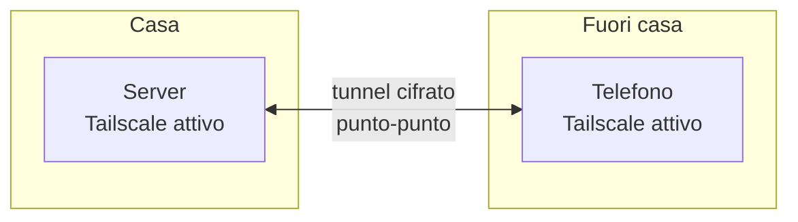

# Accesso remoto sicuro — Tailscale

## Il problema che risolve

Vuoi poter guardare Jellyfin, o controllare i download, anche quando non sei a casa. La tentazione più comune (e pericolosa) è aprire una porta sul router per raggiungere il server da Internet — questo espone il servizio a **chiunque nel mondo**, non solo a te.

**Tailscale** risolve il problema in modo completamente diverso: crea una rete privata virtuale tra i tuoi dispositivi, ovunque si trovino, senza aprire nessuna porta pubblica.

## Come funziona, in breve



Ogni dispositivo con Tailscale installato riceve un IP privato fisso (tipo `100.x.x.x`), raggiungibile da qualsiasi altro tuo dispositivo Tailscale, ovunque tu sia connesso a Internet — WiFi di casa, 4G, WiFi di un altro posto, non importa.

## Passo 1 — Crea un account

Vai su **[tailscale.com](https://tailscale.com/)** → **Get started** → accedi con Google/Microsoft/GitHub/email.

## Passo 2 — Installa sul server

**Opzione diretta sul sistema:**

```bash
curl -fsSL https://tailscale.com/install.sh | sh
sudo tailscale up
```

Segui il link mostrato per autenticare il server sul tuo account.

**Opzione via Docker** (più coerente con l'architettura containerizzata di questa guida):

```yaml
services:
  tailscale:
    image: tailscale/tailscale:latest
    container_name: tailscale
    hostname: homelab
    environment:
      - TS_AUTHKEY=tskey-xxxxxxx # genera da tailscale.com/admin/settings/keys
      - TS_STATE_DIR=/var/lib/tailscale
    volumes:
      - ./tailscale/state:/var/lib/tailscale
      - /dev/net/tun:/dev/net/tun
    cap_add:
      - NET_ADMIN
      - NET_RAW
    restart: unless-stopped
```

Verifica:

```bash
tailscale status
```

## Passo 3 — Installa sui tuoi dispositivi

| Dispositivo              | Dove scaricare                             |
| ------------------------ | ------------------------------------------ |
| Windows                  | tailscale.com/download/windows             |
| Smartphone (iOS/Android) | App Store / Google Play, cerca "Tailscale" |

Login con lo stesso account su ogni dispositivo.

## Passo 4 — Accedi al server da fuori casa

Una volta attivo su entrambi (server e telefono/PC), da fuori casa apri il browser:

```
http://100.101.102.103:8096   → Jellyfin
http://100.101.102.103:9000   → Portainer
```

(sostituisci con l'IP Tailscale reale visto con `tailscale status`)

## Comodità extra — MagicDNS

Invece di ricordare l'IP numerico, attiva **MagicDNS** dal pannello Tailscale (`tailscale.com/admin` → DNS). Da quel momento puoi scrivere semplicemente:

```
http://homelab:8096
```

## Un dettaglio da non dimenticare — UFW e Tailscale

Tailscale crea una sua interfaccia di rete virtuale (`tailscale0`), separata dalla LAN normale. Le regole UFW per `192.168.1.0/24` **non coprono** questo traffico. Serve una regola dedicata:

```bash
sudo ufw allow in on tailscale0
```

Questo permette tutto il traffico proveniente dall'interfaccia Tailscale — ragionevole, dato che chiunque arrivi da lì ha già dovuto autenticarsi con il tuo account Tailscale, un livello di sicurezza forte a monte.

Se preferisci un controllo più granulare, porta per porta:

```bash
sudo ufw allow from 100.64.0.0/10 to any port 8096 proto tcp comment 'Jellyfin via Tailscale'
```

(`100.64.0.0/10` è la subnet che Tailscale usa per tutti i suoi indirizzi)

## Test finale

Disattiva il WiFi di casa dal telefono, usa la connessione dati mobile, apri l'app Tailscale (verifica "Connected"), poi prova ad aprire Jellyfin all'indirizzo/nome Tailscale. Se funziona da fuori rete di casa, la configurazione è completa.

Con l'accesso remoto sicuro configurato, l'ultimo tassello della sezione rete è il DNS ad-blocking con AdGuard Home.
