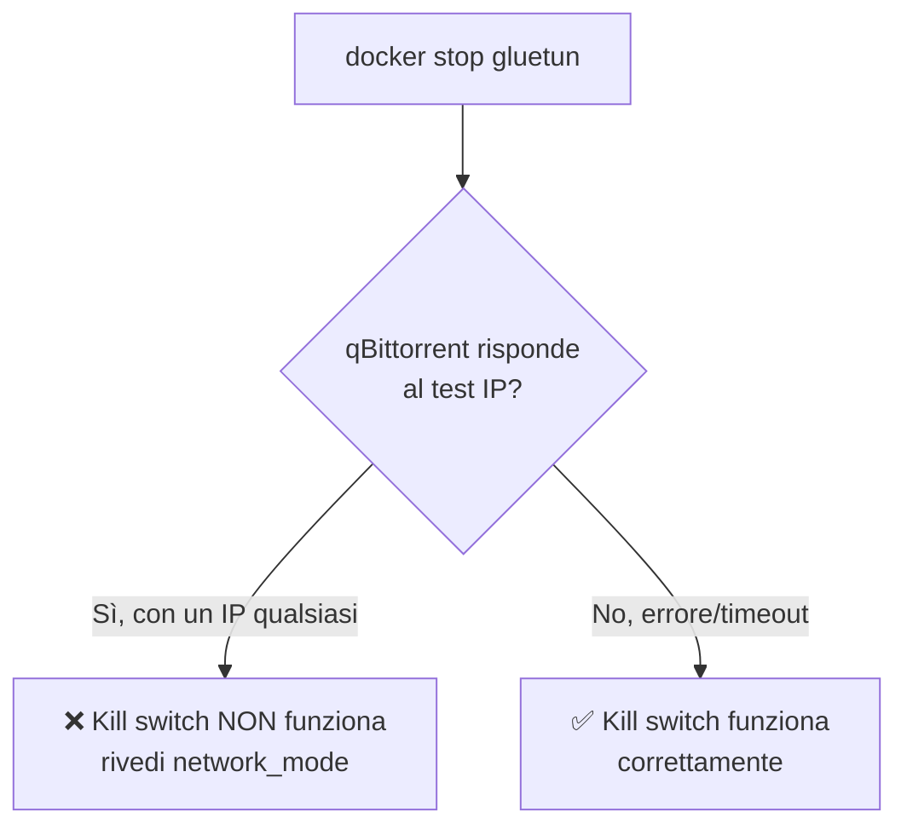

# Verificare che la protezione VPN funzioni davvero

Non fidarti mai di una configurazione VPN senza averla testata attivamente. Questa pagina raccoglie tutti i metodi di verifica, dal più semplice al più rigoroso.

## Metodo 1 — Confronto IP dal terminale (il più diretto)

```bash
docker exec gluetun wget -qO- https://ipinfo.io/ip
docker exec qbittorrent wget -qO- https://ipinfo.io/ip
```

I due comandi devono restituire **esattamente lo stesso IP** (perché qBittorrent condivide la rete di Gluetun), e quell'IP deve essere **diverso** dal tuo IP di casa.

Per conoscere il tuo IP reale (da verificare che sia diverso), cerca "qual è il mio ip" su Google **da un dispositivo che non è in VPN**.

## Metodo 2 — Verifica specifica per torrent

Il metodo più semplice e affidabile per verificare che **qBittorrent stia realmente utilizzando la VPN** consiste nell'utilizzare il test torrent di **ipleak.net**, che mostra l'indirizzo IP effettivamente visibile agli altri peer della rete BitTorrent.

1. Apri **[ipleak.net](https://ipleak.net)**
2. Scorri fino alla sezione **Torrent Address Detection**
3. Clicca su **Activate** per generare il torrent di test.
4. Copia il link e incollalo su il client web di qbittorrent.
5. Aggiorna la pagina: verrà mostrato l'indirizzo IP visto dai peer BitTorrent.

Se l'IP visualizzato corrisponde a quello assegnato dalla tua VPN (ad esempio Mullvad), significa che qBittorrent sta instradando correttamente tutto il traffico attraverso la VPN. Se invece compare il tuo IP pubblico fornito dall'ISP, la configurazione non è sicura e va corretta prima di iniziare qualsiasi download.

## Metodo 3 — Log di Gluetun

```bash
docker logs gluetun | grep "Public IP address is"
```

Quell'IP deve essere quello del server Mullvad, mai il tuo.

## Metodo 4 — Test del kill switch (il più importante, spesso saltato)

Verificare che l'IP sia mascherato mentre tutto funziona è utile, ma il vero test di sicurezza è: **cosa succede se la VPN cade?**

```bash
# Ferma temporaneamente Gluetun per simulare una caduta della VPN
docker stop gluetun

# Verifica che qBittorrent NON abbia più connettività
docker exec qbittorrent wget -qO- https://ipinfo.io/ip
```

Il secondo comando **deve fallire** (timeout o errore di rete) — se invece restituisce un IP qualsiasi (specialmente il tuo IP reale), il kill switch non sta funzionando e va rivista la configurazione `network_mode`.

```bash
# Riavvia Gluetun al termine del test
docker start gluetun
```



## Checklist di verifica completa

- `docker exec gluetun` e `docker exec qbittorrent` restituiscono lo stesso IP
- Quell'IP è diverso dal tuo IP reale di casa
- checkmytorrentip.com conferma lo stesso IP Mullvad visto dai peer
- I log di Gluetun mostrano una connessione riuscita
- Fermando Gluetun, qBittorrent perde completamente la connettività (test kill switch)

## Quando ripetere questi test

- Dopo ogni modifica alla configurazione di Gluetun o qBittorrent
- Dopo un aggiornamento dell'immagine Gluetun (es. tramite Watchtower)
- Periodicamente, come controllo di routine (ogni mese circa)

!!! tip "Automatizzare il controllo"
Puoi collegare l'healthcheck di Gluetun (già presente nella configurazione della pagina precedente) a uno strumento come Healthchecks.io per ricevere una notifica automatica se la VPN dovesse restare disconnessa per troppo tempo, invece di dover controllare manualmente.

Con la protezione VPN verificata, il prossimo passo è configurare l'accesso remoto sicuro con Tailscale.
