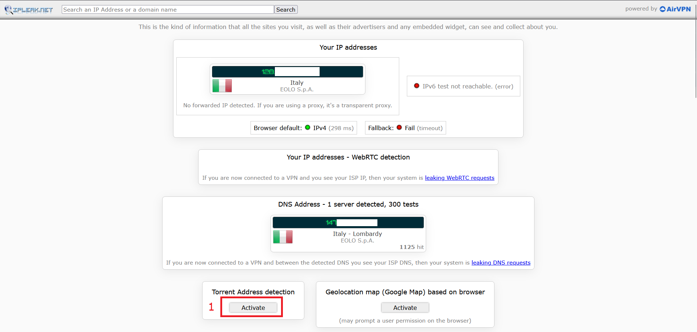
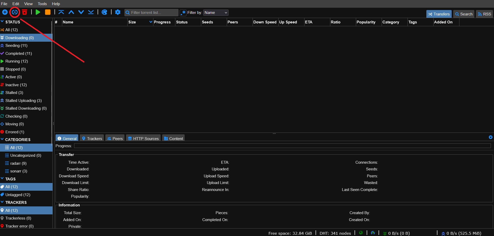
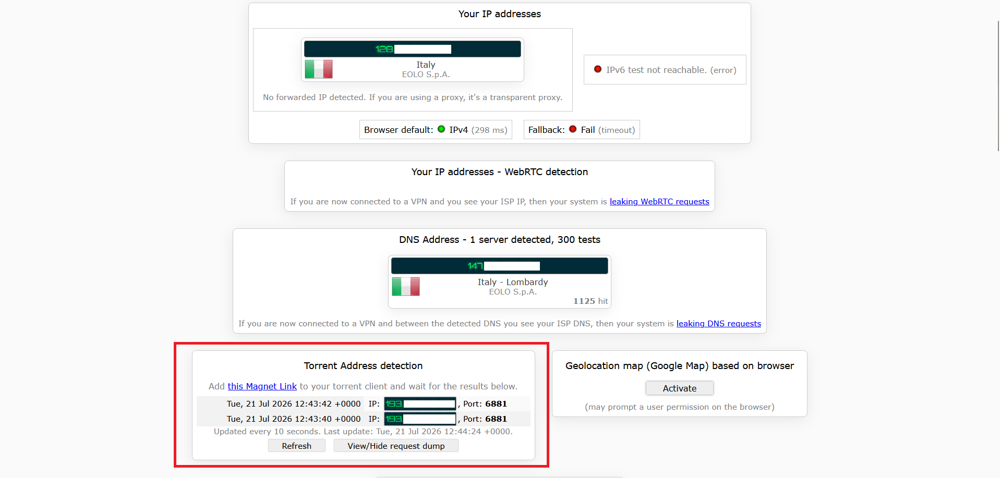
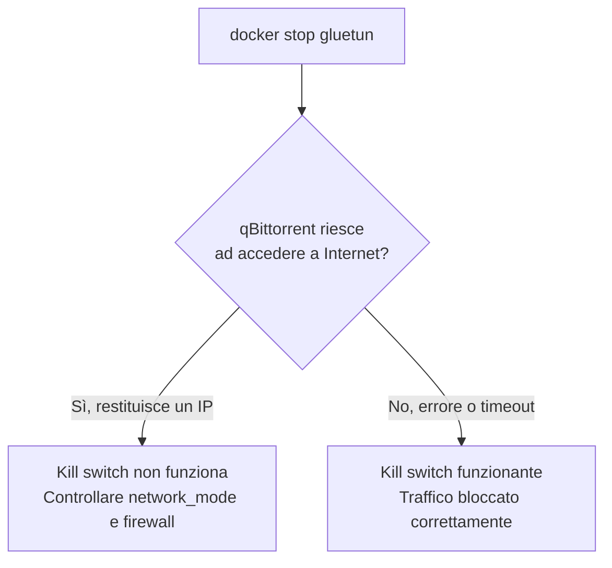

# Verificare che la protezione VPN funzioni davvero

Non fidarti mai di una configurazione VPN senza averla testata attivamente. Questa pagina raccoglie tutti i metodi di verifica, dal più semplice al più rigoroso.

## Metodo 1 — Confronto IP dal terminale (il più diretto)

```bash
docker exec gluetun wget -qO- https://ipinfo.io/ip
docker exec qbittorrent wget -qO- https://ipinfo.io/ip
```

I due comandi devono restituire **esattamente lo stesso IP** (perché qBittorrent condivide la rete di Gluetun), e quell'IP deve essere **diverso** dal tuo IP di casa.

Per conoscere il tuo IP reale (da verificare che sia diverso), cerca "qual è il mio ip" su Google **da un dispositivo che non è in VPN**.

## Metodo 2 — Verifica specifica per BitTorrent

Il metodo più affidabile per verificare che **qBittorrent stia realmente utilizzando la VPN** consiste nel test offerto da **ipleak.net**.

A differenza di un normale test dell'indirizzo IP, questo controllo verifica **l'IP che gli altri peer della rete BitTorrent vedono realmente**, simulando una connessione torrent senza scaricare alcun contenuto.

1. Apri **[ipleak.net](https://ipleak.net)**.

2. Scorri fino alla sezione **Torrent Address Detection**.

3. Clicca su **Activate**. Il sito genererà un link magnet univoco per la tua sessione.

<figure markdown="span">
  { width="600" }
  <figcaption>Generazione del magnet link di test</figcaption>
</figure>

4. Apri la WebUI di qBittorrent e scegli **Aggiungi collegamento torrent** (Add Torrent Link).

5. Incolla il magnet link copiato da ipleak.net e avvia il download.

<figure markdown="span">
  { width="600" }
  <figcaption>Inserimento del magnet link in qBittorrent</figcaption>
</figure>

Non verrà scaricato alcun film, serie TV o altro contenuto: il torrent serve esclusivamente a stabilire una connessione con i server di ipleak.net, che potranno così rilevare quale indirizzo IP è visibile sulla rete BitTorrent.

6. Dopo qualche secondo, torna sulla pagina di **ipleak.net** e aggiornala.

Nella sezione **Torrent Address Detection** comparirà l'indirizzo IP rilevato.

<figure markdown="span">
  { width="600" }
  <figcaption>Indirizzo IP rilevato sulla rete BitTorrent</figcaption>
</figure>

Se l'IP mostrato appartiene al server VPN (ad esempio Mullvad), significa che qBittorrent sta inviando tutto il traffico BitTorrent attraverso il tunnel VPN e la configurazione è corretta.

Se invece compare il tuo indirizzo IP pubblico assegnato dal tuo provider Internet (ISP), significa che qualcosa non funziona correttamente e **non dovresti iniziare alcun download** finché il problema non sarà risolto.

## Metodo 3 — Log di Gluetun

```bash
docker logs gluetun | grep "Public IP address is"
```

Quell'IP deve essere quello del server Mullvad, mai il tuo.

## Metodo 4 — Test del kill switch (il più importante, spesso saltato)

Verificare che qBittorrent utilizzi l'IP della VPN mentre tutto funziona è utile, ma il vero test di sicurezza è un altro:

**Cosa succede se la VPN cade?**

Un kill switch correttamente configurato deve impedire completamente a qBittorrent di comunicare con Internet quando Gluetun non è più disponibile.

Nel nostro setup qBittorrent utilizza la rete di Gluetun tramite:

```yaml
network_mode: service:gluetun
```

Questo significa che qBittorrent **non possiede una propria interfaccia di rete**: utilizza direttamente quella del container Gluetun.

### Simulare una caduta della VPN

Ferma temporaneamente il container Gluetun:

```bash
docker stop gluetun
```

Ora prova a verificare se qBittorrent riesce ancora a raggiungere Internet:

```bash
docker exec qbittorrent wget -qO- https://ipinfo.io/ip
```

Il comando deve fallire.

Un risultato come:

```text
wget: bad address 'ipinfo.io'
```

è corretto.

Questo errore significa che qBittorrent non riesce nemmeno a risolvere il dominio `ipinfo.io` tramite DNS: non ha una connessione Internet disponibile e non sta cercando di uscire attraverso la connessione normale del server.

In pratica:

- non sta usando il tuo IP pubblico;
- non sta bypassando la VPN;
- non ha nessuna rete disponibile.

Il kill switch sta funzionando correttamente.



---

## Riavviare la VPN dopo il test

Terminato il test, riavvia Gluetun:

```bash
docker start gluetun
```

Aspetta qualche secondo affinché il tunnel WireGuard venga ristabilito, poi verifica che la VPN sia nuovamente attiva:

```bash
docker exec gluetun wget -qO- https://ipinfo.io/ip
```

Il risultato deve essere un IP Mullvad, ad esempio:

```text
193.32.249.159
```

Questo conferma che Gluetun è nuovamente collegato alla VPN.

---

## Riavviare qBittorrent dopo Gluetun

Con `network_mode: service:gluetun` c'è un comportamento importante da conoscere.

Se Gluetun viene riavviato mentre qBittorrent è già in esecuzione, qBittorrent **non sempre si ricollega automaticamente** al nuovo stack di rete.

È quindi possibile avere questa situazione:

```bash
docker exec gluetun wget -qO- https://ipinfo.io/ip
```

restituisce correttamente l'IP Mullvad:

```text
193.32.249.159
```

mentre:

```bash
docker exec qbittorrent wget -qO- https://ipinfo.io/ip
```

continua a fallire:

```text
wget: bad address 'ipinfo.io'
```

In questo caso la VPN funziona, ma qBittorrent è ancora collegato al vecchio ambiente di rete.

La soluzione è riavviare anche qBittorrent:

```bash
docker restart qbittorrent
```

Ora il test dovrebbe restituire lo stesso IP Mullvad:

```bash
docker exec qbittorrent wget -qO- https://ipinfo.io/ip
```

Output:

```text
193.32.249.159
```

---

## Riavvio sicuro della coppia VPN + qBittorrent

Se devi riavviare manualmente la VPN, riavvia sempre entrambi i container:

```bash
docker restart gluetun
sleep 15
docker restart qbittorrent
```

Oppure puoi creare un alias:

```bash
vim ~/.bashrc
```

```bash title="creazione alias dentro .bashrc"
alias restart-vpn='docker restart gluetun && sleep 15 && docker restart qbittorrent'
# Salva ed esci poi esegui
source ~/.bashrc
```

Da questo momento puoi usare:

```bash
restart-vpn
```

per riavviare correttamente tutta la catena.

In condizioni normali questo problema non si presenta: Gluetun e qBittorrent rimangono attivi grazie alla configurazione:

```yaml
restart: unless-stopped
```

e il traffico rimane sempre vincolato alla VPN.

## Quando ripetere questi test

- Dopo ogni modifica alla configurazione di Gluetun o qBittorrent
- Dopo un aggiornamento dell'immagine Gluetun (es. tramite Watchtower)
- Periodicamente, come controllo di routine (ogni mese circa)

!!! tip "Automatizzare il controllo"
Puoi collegare l'healthcheck di Gluetun (già presente nella configurazione della pagina precedente) a uno strumento come Healthchecks.io per ricevere una notifica automatica se la VPN dovesse restare disconnessa per troppo tempo, invece di dover controllare manualmente.

Con la protezione VPN verificata, il prossimo passo è configurare l'accesso remoto sicuro con Tailscale.
