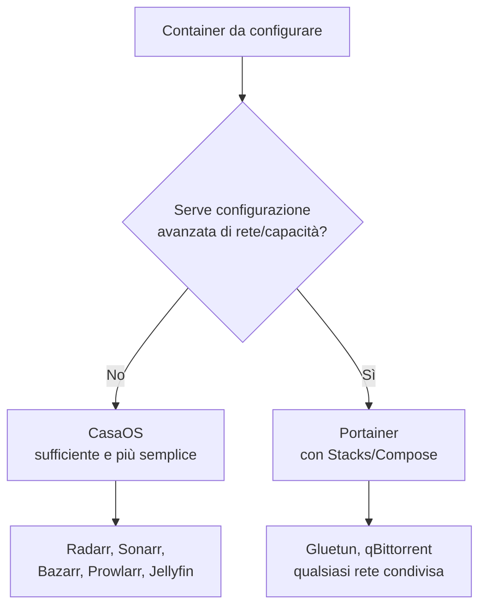

# Perché CasaOS + Portainer

Chi inizia con Docker si trova spesso davanti a due estremi: una GUI troppo semplice che nasconde le opzioni avanzate, oppure il terminale puro che richiede di ricordare ogni comando a memoria. La combinazione di **CasaOS** e **Portainer** ti dà il meglio di entrambi i mondi, con ognuno dei due usato per quello che sa fare meglio.

## Cosa fa bene CasaOS

CasaOS è una dashboard pensata per essere accogliente: installi app da un catalogo con un clic, vedi tutti i tuoi container con un'interfaccia visiva pulita, gestisci storage e file in modo semplice.

**Ottimo per**: Radarr, Sonarr, Bazarr, Prowlarr, Jellyfin — servizi dove ti serve solo configurare porte, volumi, e variabili d'ambiente semplici.

## Il limite di CasaOS (e perché serve Portainer)

CasaOS **non espone tutte le opzioni Docker avanzate** dalla sua interfaccia grafica nativa. In particolare, per il nostro stack, mancano controlli per:

- `network_mode: service:X` (condividere la rete di un altro container — fondamentale per il kill switch VPN)
- `cap_add` (capacità di sistema aggiuntive, necessarie per Gluetun)
- `devices` (mappare dispositivi hardware come `/dev/net/tun` o `/dev/dri`)



## Come usare Portainer

Portainer offre una funzione chiamata **Stacks**, che è essenzialmente un editor grafico per file `docker-compose.yml` — hai tutta la potenza della sintassi Compose completa, senza dover lavorare da terminale ogni volta.

**Installazione:**

```yaml
services:
  portainer:
    image: portainer/portainer-ce:latest
    container_name: portainer
    volumes:
      - /var/run/docker.sock:/var/run/docker.sock
      - portainer_data:/data
    ports:
      - "9000:9000"
    restart: unless-stopped

volumes:
  portainer_data:
```

Accedi a `http://<IP_server>:9000`, crea l'utente admin al primo accesso.

**Per lo stack Gluetun+qBittorrent:**

1. `Stacks → Add stack`
2. Nome: es. `vpn-download`
3. Incolla il YAML completo (vedi pagina Gluetun + Mullvad)
4. **Deploy the stack**

## Un dettaglio importante — visibilità incrociata

I container creati via Portainer **restano comunque visibili** nella dashboard di CasaOS (entrambi mostrano semplicemente tutti i container Docker della macchina, indipendentemente da chi li ha creati). Puoi avviare/fermare da entrambe le interfacce — solo per _modifiche approfondite_ alla configurazione di rete dovrai tornare su Portainer.

## Il terminale resta comunque utile

Anche con CasaOS e Portainer, il terminale (SSH) resta indispensabile per: installazione iniziale del sistema, debug approfondito (log, permessi file), configurazione firewall, e situazioni di emergenza (es. ti blocchi fuori e serve `ufw disable`).

Questa guida userà tutti e tre gli strumenti, ognuno dove è più adatto — non c'è "uno giusto", c'è "il migliore per quel compito specifico".

## Riepilogo pratico

| Strumento           | Quando usarlo                                                                |
| ------------------- | ---------------------------------------------------------------------------- |
| **CasaOS**          | Installazione app semplici, visione d'insieme, gestione file/storage         |
| **Portainer**       | Container con network_mode condiviso, cap_add, devices — Gluetun/qBittorrent |
| **Terminale (SSH)** | Setup iniziale sistema, firewall, debug, log, emergenze                      |

Con la piattaforma di gestione chiara, la prossima pagina copre un dettaglio pratico ma importante: come nominare consistentemente cartelle e container in tutto lo stack.
