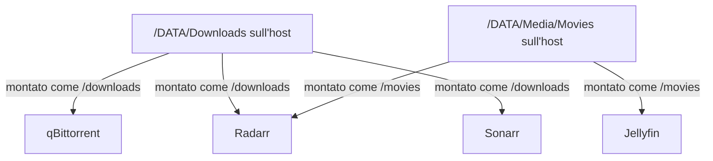

# Convenzioni di denominazione

Una causa molto comune di problemi in uno stack come questo non è un bug software, ma **inconsistenza nei nomi** — path diversi tra container che dovrebbero vedere la stessa cartella, porte confuse, nomi container ambigui. Questa pagina fissa una convenzione da seguire ovunque nella guida.

## Perché i path devono essere identici ovunque

Questo è il principio più importante di tutti: **ogni container che tocca gli stessi media deve montare la cartella host con lo stesso path interno**.



Se anche un solo container usa un path diverso (es. `/downloads` invece di `/data/torrents`), gli **hardlink si rompono**: invece di collegare istantaneamente il file scaricato alla libreria, Radarr/Sonarr lo **copiano**, raddoppiando spazio disco e tempo di importazione.

## Struttura cartelle standard usata in questa guida

```
/DATA
    /Media
        /Movies
        /TV
        /Anime
        /Music
    /Downloads
        /complete
        /incomplete
    /AppData
        /jellyfin
        /radarr
        /sonarr
        /prowlarr
        /bazarr
        /qbittorrent
        /gluetun
        /adguard
```

| Cartella                         | Contenuto                                               | Motivazione                                                                |
| -------------------------------- | ------------------------------------------------------- | -------------------------------------------------------------------------- |
| `/Media/Movies`, `/TV`, `/Anime` | Librerie separate                                       | Jellyfin usa scraper/metadata diversi per tipo di contenuto                |
| `/Downloads`                     | File in scaricamento e completati                       | Deve stare **sullo stesso filesystem** di `/Media` per permettere hardlink |
| `/AppData`                       | Configurazioni, database, credenziali di ogni container | Separata dai media, è quello che va sempre in backup                       |

## Mapping porte standard usato in questa guida

| Servizio                        | Porta    |
| ------------------------------- | -------- |
| CasaOS                          | 80 / 443 |
| Jellyfin                        | 8096     |
| qBittorrent WebUI (via Gluetun) | 8080     |
| qBittorrent torrent             | 6881     |
| Radarr                          | 7878     |
| Sonarr                          | 8989     |
| Prowlarr                        | 9696     |
| Bazarr                          | 6767     |
| Jellyseerr                      | 5055     |
| Portainer                       | 9000     |
| AdGuard Home WebUI              | 8082     |
| AdGuard Home DNS                | 53       |
| FlareSolverr                    | 8191     |

!!! tip "Perché usare sempre le stesse porte in questa guida"
Non è obbligatorio usare esattamente questi numeri, ma **una volta scelti, restano fissi in tutta la configurazione**. Cambiarli a metà causa errori difficili da diagnosticare (es. una regola firewall dimenticata sulla porta vecchia, o un container che cerca ancora la porta precedente).

## Nomi container — convenzione

Usa sempre `container_name` esplicito e minuscolo, uguale al nome del servizio nel compose:

```yaml
services:
  radarr:
    container_name: radarr # stesso nome del servizio, sempre
```

Questo è importante perché **i container si raggiungono tra loro per nome**, non per IP (Docker gestisce automaticamente la risoluzione dei nomi all'interno della stessa rete). Es. Radarr raggiunge qBittorrent scrivendo `gluetun` come host (non `qbittorrent`, dato che la rete appartiene a Gluetun) — questo tipo di dettaglio è molto più facile da ricordare con nomi consistenti.

## Naming dei file media — convenzione consigliata

Radarr e Sonarr rinomivim automaticamente i file secondo un pattern configurabile (`Settings → Media Management → Naming`). Un pattern equilibrato e ampiamente compatibile:

**Film:**

```
{Movie Title} ({Release Year}) [{Quality Full}]
```

Esempio: `Il Nome della Rosa (1986) [Bluray-1080p]`

**Serie TV:**

```
{Series Title} - S{season:00}E{episode:00} - {Episode Title} [{Quality Full}]
```

Esempio: `Breaking Bad - S01E01 - Pilot [WEBDL-1080p]`

!!! tip "Non cambiare il pattern dopo aver iniziato"
Cambiare la convenzione di naming quando hai già centinaia di file richiede un re-processing completo della libreria. Decidi il pattern all'inizio e mantienilo.

## Variabili d'ambiente — convenzione

Centralizza sempre le variabili comuni in un file `.env` nella cartella dello stack, invece di ripeterle in ogni servizio:

```env
PUID=1000
PGID=1000
TZ=Europe/Rome
```

```yaml
services:
  radarr:
    environment:
      - PUID=${PUID}
      - PGID=${PGID}
      - TZ=${TZ}
```

!!! danger "Non versionare mai .env pubblicamente"
Il file `.env` conterrà anche credenziali sensibili (chiavi VPN, password database). Se usi Git per versionare la tua configurazione, aggiungi `.env` a `.gitignore` e mantieni solo un `.env.example` con valori fittizi.

Con le convenzioni chiare, si passa al cuore dell'automazione: lo stack \*arr.
