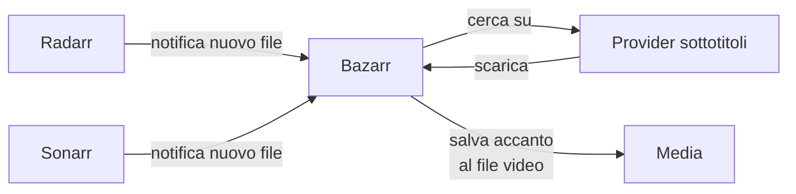

# Bazarr — sottotitoli automatici

## A cosa serve

Bazarr osserva le librerie gestite da Radarr e Sonarr e cerca automaticamente sottotitoli mancanti nelle lingue che scegli, senza intervento manuale.



## Installazione

```yaml
services:
  bazarr:
    image: lscr.io/linuxserver/bazarr:latest
    container_name: bazarr
    environment:
      - PUID=${PUID}
      - PGID=${PGID}
      - TZ=${TZ}
    volumes:
      - ./bazarr:/config
      - /DATA/Media/Movies:/movies
      - /DATA/Media/TV:/tv
    ports:
      - "6767:6767"
    restart: unless-stopped
```

!!! tip "Path identici a Radarr/Sonarr"
Bazarr deve montare **esattamente gli stessi path** di `/movies` e `/tv` usati da Radarr e Sonarr — coerentemente con il principio spiegato nella pagina Convenzioni di denominazione.

## Collegamento a Radarr e Sonarr

`Settings → Radarr`:

- Address: `radarr`, Port: `7878`
- API Key: da Radarr, `Settings → General`

`Settings → Sonarr`:

- Address: `sonarr`, Port: `8989`
- API Key: da Sonarr, `Settings → General`

## Configurazione lingue

`Settings → Languages`:

- Aggiungi le lingue desiderate (es. Italiano, Inglese)
- Puoi impostare una lingua come "obbligatoria" e altre come opzionali

## Provider sottotitoli

`Settings → Providers`: attiva più provider possibile (OpenSubtitles, Subscene, ecc.) — più fonti aumentano la probabilità di trovare sottotitoli per contenuti di nicchia.

!!! tip "Alcuni provider richiedono un account gratuito"
Es. OpenSubtitles richiede registrazione gratuita e inserimento credenziali nella configurazione del provider — ne aumenta significativamente il tasso di successo rispetto all'accesso anonimo.

## Test manuale

Su un contenuto già presente in libreria, forza una ricerca manuale dei sottotitoli per verificare che tutto funzioni prima di lasciare l'automazione fare il resto.

## Quando Bazarr non serve

Se le tue release sono già **multi-audio** grazie ai Custom Format configurati in Radarr/Sonarr (vedi pagina precedente), spesso i sottotitoli sono già incorporati nel file e Bazarr non ha nulla da aggiungere. Bazarr diventa utile soprattutto quando:

- Il file scaricato è mono-lingua (es. solo inglese) ma vuoi sottotitoli italiani
- Vuoi sottotitoli in una lingua che non era disponibile incorporata nel file

Con Bazarr configurato, l'ultimo pezzo dello stack \*arr è la sicurezza specifica di qBittorrent — che qui riprendiamo dal punto di vista dell'integrazione con Radarr/Sonarr.
