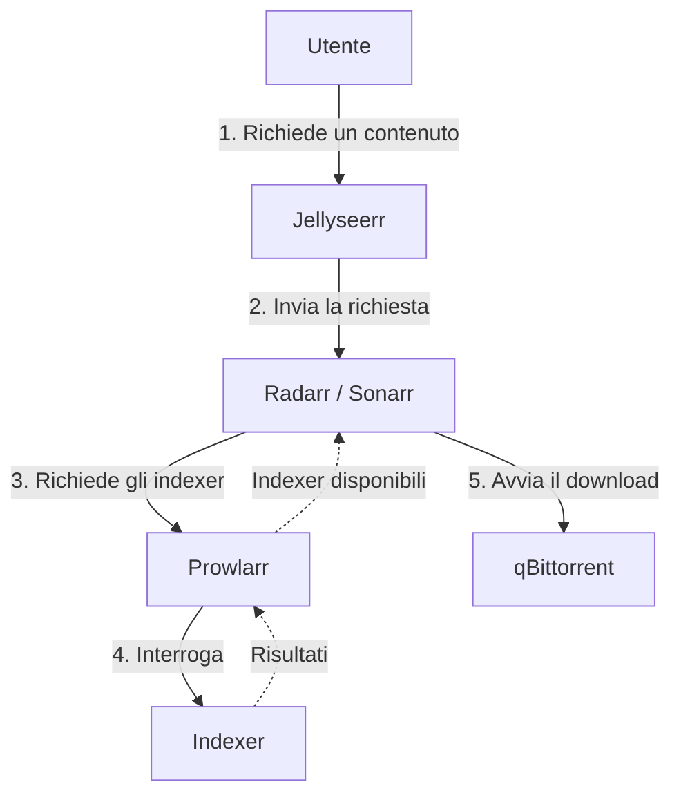
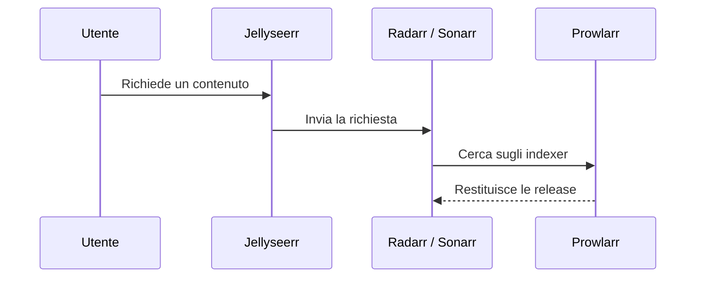
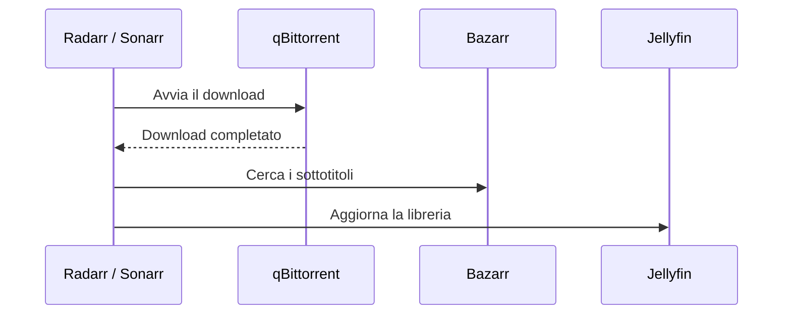
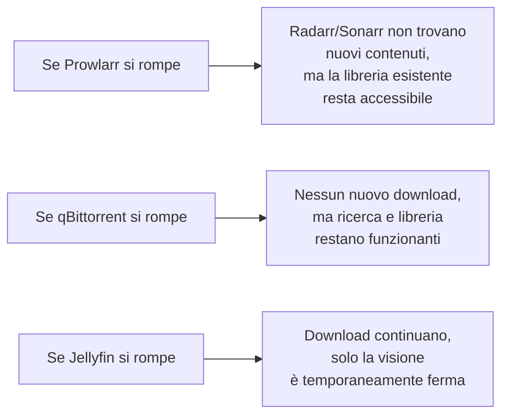

# Panoramica dello Stack \*arr

Lo "stack \*arr" prende il nome dal fatto che quasi tutte le applicazioni che lo compongono finiscono con "-arr" (Sonarr, Radarr, Prowlarr, Bazarr...). Insieme formano una catena di automazione completa: da "voglio guardare questo film" a "eccolo pronto in libreria", senza intervento manuale.

## Il ruolo di ogni componente

| Componente      | Cosa fa                                                    | Analogia semplice                     |
| --------------- | ---------------------------------------------------------- | ------------------------------------- |
| **Prowlarr**    | Cerca sugli indexer (i "motori di ricerca" dei torrent)    | Il bibliotecario che sa dove cercare  |
| **Radarr**      | Gestisce la libreria film: cosa monitorare, cosa scaricare | Il responsabile acquisti per i film   |
| **Sonarr**      | Stessa cosa di Radarr, ma per le serie TV                  | Il responsabile acquisti per le serie |
| **Bazarr**      | Cerca e scarica sottotitoli automaticamente                | L'addetto ai sottotitoli              |
| **qBittorrent** | Esegue materialmente il download                           | Il corriere che porta il pacco        |
| **Jellyseerr**  | Interfaccia semplice per le richieste degli utenti         | Il modulo "richiedi un film"          |
| **Jellyfin**    | Mostra il contenuto pronto per la visione                  | La vetrina/lo scaffale finale         |

## Il workflow completo end-to-end

Per prima cosa avviene quindi la richiesta del contenuto

Trovata la release avviene il download del contenuto

## Perché serve ogni pezzo — non è ridondanza

Un dubbio comune di chi inizia: "perché non basta un solo programma che fa tutto?". La risposta è **separazione delle responsabilità**: ogni componente fa una cosa sola e la fa bene, e se uno si rompe, gli altri restano operativi.

## Cosa imparerai nelle prossime pagine

1. **Prowlarr** — come configurare gli indexer, cosa sono, come gestire siti protetti da Cloudflare
2. **Radarr e Sonarr** — configurazione completa, collegamento al download client, qualità e lingua
3. **Bazarr** — sottotitoli automatici
4. **qBittorrent** — impostazioni di sicurezza specifiche (già introdotte nella sezione VPN, qui le colleghiamo allo stack)

!!! tip "Ordine di configurazione consigliato"
Configura sempre in quest'ordine: prima Prowlarr (la fonte di ricerca), poi Radarr/Sonarr (che dipendono da Prowlarr), poi Bazarr (che dipende da Radarr/Sonarr). Jellyseerr va configurato per ultimo, dato che si collega a tutti gli altri.

Si parte da Prowlarr, il punto di ingresso di tutta la ricerca.
