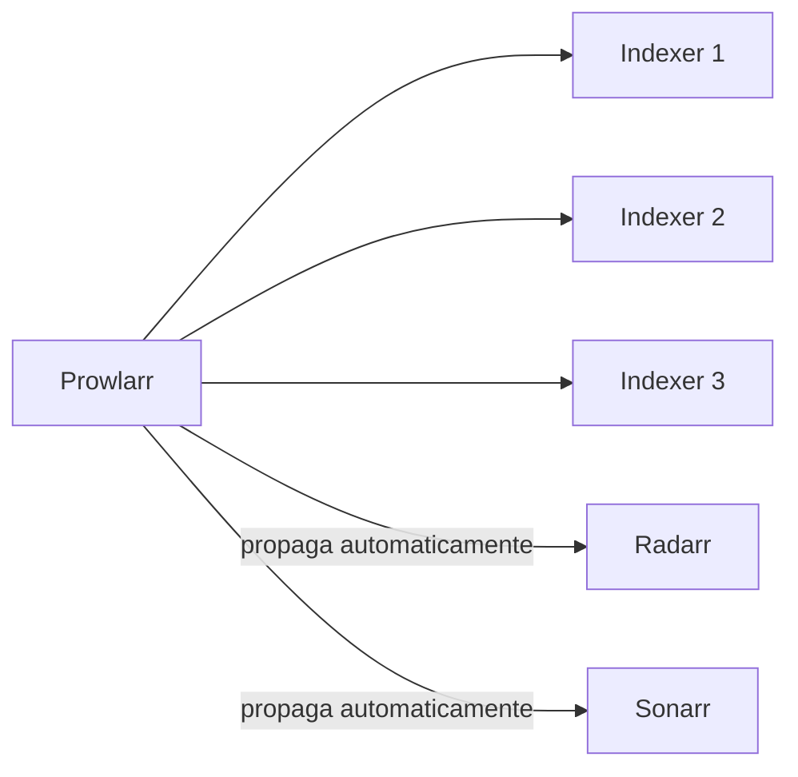
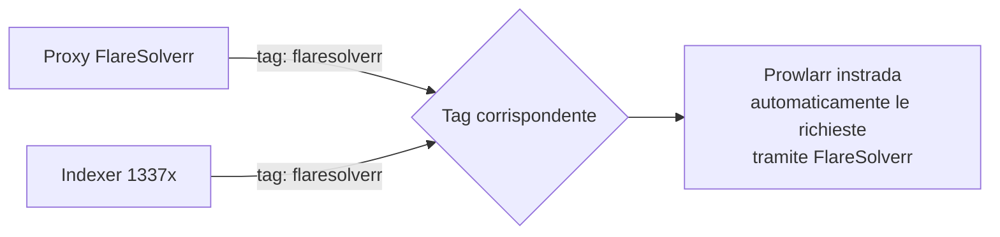

# Prowlarr — indexer manager

## Cos'è un indexer

Un **indexer** è un servizio che tiene traccia di quali torrent esistono e dove trovarli — è il "motore di ricerca" per i contenuti. Ci sono indexer pubblici (accessibili a chiunque) e privati (richiedono invito/registrazione).

**Prowlarr** centralizza la gestione di tutti i tuoi indexer in un unico posto, e li propaga automaticamente a Radarr e Sonarr — non li configuri separatamente in ogni app.



## Installazione base

```yaml
services:
  prowlarr:
    image: lscr.io/linuxserver/prowlarr:latest
    container_name: prowlarr
    environment:
      - PUID=${PUID}
      - PGID=${PGID}
      - TZ=${TZ}
    volumes:
      - ./prowlarr:/config
    ports:
      - "9696:9696"
    restart: unless-stopped
```

## Aggiungere indexer

1. `Indexers → Add Indexer`
2. Cerca per nome (es. "1337x", "TorrentGalaxy") — la maggior parte è già nel catalogo integrato, non serve inserire URL manualmente
3. Compila eventuali campi richiesti (per gli indexer pubblici spesso basta "Enable" e "Save")
4. `Indexers → Test All` per verificare che siano tutti raggiungibili

## Indexer consigliati per iniziare

**Generici (film e TV):**

| Indexer        | Note                                               |
| -------------- | -------------------------------------------------- |
| 1337x          | Molto popolare, richiede FlareSolverr (vedi sotto) |
| TorrentGalaxy  | Buona copertura, richiede FlareSolverr             |
| The Pirate Bay | Storico, copertura ampia                           |
| LimeTorrents   | Buon complemento                                   |
| EZTV           | Specifico per serie TV                             |
| YTS            | Film, qualità/dimensioni limitate a poche release  |

**Anime:**

| Indexer       | Note                                     |
| ------------- | ---------------------------------------- |
| Nyaa.si       | La fonte principale per anime            |
| SubsPlease    | Fansub di alta qualità, molto aggiornato |
| Shana Project | Anime                                    |

## FlareSolverr — necessario per indexer protetti da Cloudflare

Molti indexer pubblici sono dietro Cloudflare, che blocca le richieste automatiche con un captcha/JS challenge. **FlareSolverr** è un container che risolve questa protezione al posto di Prowlarr.

```yaml
services:
  flaresolverr:
    image: ghcr.io/flaresolverr/flaresolverr:latest
    container_name: flaresolverr
    environment:
      - LOG_LEVEL=info
      - TZ=${TZ}
    ports:
      - "8191:8191"
    restart: unless-stopped
```

### Collegarlo agli indexer — tramite Tag, non un menu diretto

A differenza di quanto ci si aspetterebbe, il collegamento tra un indexer e FlareSolverr **non avviene con una selezione diretta**, ma tramite **tag condivisi**:



1. `Settings → Indexers → Indexer Proxies` → crea/apri FlareSolverr → assegna un tag (es. `flaresolverr`)
2. Apri l'indexer che ne ha bisogno (es. 1337x) → nel campo **Tags**, aggiungi lo stesso tag
3. Salva, poi rilancia il **Test** sull'indexer

!!! tip "Le richieste tramite FlareSolverr sono più lente"
FlareSolverr apre un browser headless reale per risolvere la protezione — ogni richiesta richiede diversi secondi in più. Applica il tag solo agli indexer che ne hanno effettivamente bisogno, lasciando gli altri (che rispondono via API diretta) più veloci.

## Collegare Prowlarr a Radarr/Sonarr

`Settings → Apps → Add Application`:

- **Radarr**: URL `http://radarr:7878`, API key di Radarr (`Settings → General` in Radarr)
- **Sonarr**: URL `http://sonarr:8989`, API key di Sonarr

## Categorie — un dettaglio che causa molti problemi

Ogni indexer ha delle **categorie** associate (Movies, TV, Anime...). Se le categorie sincronizzate tra Prowlarr e Radarr/Sonarr non corrispondono a quello che l'indexer offre davvero, la sincronizzazione fallisce con errori tipo _"no results in the configured categories"_.

`Settings → Apps → Radarr → Sync Categories`: mantieni solo categorie Movies pertinenti. Indexer puramente anime (Nyaa, SubsPlease) vanno collegati **solo a Sonarr**, non a Radarr, a meno che tu non scarichi anche film anime con categorie apposite.

## Troubleshooting rapido

| Sintomo                                     | Causa probabile                                       | Soluzione                                            |
| ------------------------------------------- | ----------------------------------------------------- | ---------------------------------------------------- |
| "Blocked by CloudFlare Protection"          | Manca FlareSolverr collegato                          | Assegna il tag FlareSolverr all'indexer (vedi sopra) |
| "Unable to connect... DNS/SSL issues"       | Spesso temporaneo, o orologio di sistema disallineato | Verifica `timedatectl`, riprova dopo qualche minuto  |
| "No results in configured categories"       | Mismatch categorie indexer↔app                        | Correggi Sync Categories in Settings → Apps          |
| Tutti gli indexer "temporarily unavailable" | Prowlarr stesso irraggiungibile (es. dopo riavvio)    | Verifica `docker ps`, poi `Test All` di nuovo        |

Con Prowlarr configurato, il prossimo passo è collegarlo a Radarr e Sonarr, che decideranno cosa scaricare davvero.
