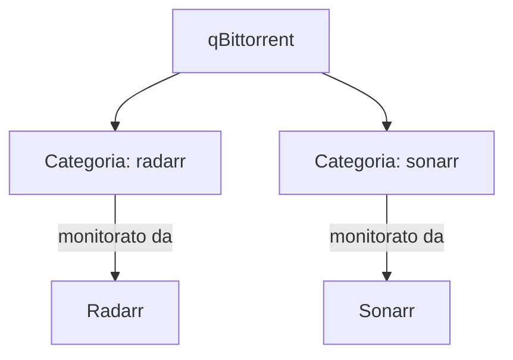

# qBittorrent nello Stack \*arr

La configurazione di sicurezza di qBittorrent (VPN, kill switch) è coperta nella sezione Rete e Sicurezza. Questa pagina si concentra su come qBittorrent si integra con il resto dello stack di automazione, più alcuni problemi pratici comuni.

## Promemoria — il principio di sicurezza

```yaml
qbittorrent:
  network_mode: "service:gluetun" # nessuna rete propria
  depends_on:
    gluetun:
      condition: service_healthy
```

Se non hai ancora configurato questa parte, torna alla pagina **[VPN — Gluetun + Mullvad](https://mattiap7.github.io/homelab/03-rete-sicurezza/gluetun-mullvad/)** prima di proseguire: è il prerequisito di sicurezza per tutto quello che segue.

## Categorie — l'organizzazione che rende tutto automatico

Assegnare categorie diverse per Radarr e Sonarr in qBittorrent (`radarr`, `sonarr`) permette a ciascuna app di riconoscere e gestire solo i propri download, senza confusione:



Le categorie si configurano automaticamente quando colleghi qBittorrent come download client in Radarr/Sonarr (vedi pagina precedente) — non serve crearle manualmente in anticipo.

## Impostare una password fissa (problema comune)

Dalla versione 4.6+ delle immagini LinuxServer, qBittorrent genera una password temporanea casuale ad ogni avvio finché non ne imposti una tua esplicitamente.

**Procedura corretta:**

1. Trova la password temporanea:
   ```bash
   docker logs qbittorrent 2>&1 | grep -i "temporary password"
   ```
2. Accedi con `admin` + quella password
3. **Subito**, prima di fare altro: `Strumenti → Opzioni → Web UI` → sezione **Autenticazione** → imposta username e password nuovi → **Salva**

!!! danger "Errore comune — campo sbagliato"
Non confondere il campo **"Indirizzo IP"** (in alto nella stessa pagina, che controlla su quale interfaccia di rete ascolta il servizio) con i campi di autenticazione (più in basso). Scrivere un URL tipo `http:192.168.1.14` nel campo Indirizzo IP causa un errore di bind che impedisce alla WebUI di avviarsi. Lascialo su `*` o vuoto.

**Se la password continua a non fissarsi** anche dopo il salvataggio, il problema è quasi sempre permessi del volume di configurazione:

```bash
# Trova il path reale montato su /config
docker inspect qbittorrent --format '{{ range .Mounts }}{{ println .Source .Destination }}{{ end }}'

# Correggi la proprietà se non coincide con PUID/PGID
sudo chown -R 1000:1000 /path/reale/qbittorrent
docker restart qbittorrent
```

## Impostazioni consigliate per uso con lo stack

**Connection**: porta di ascolto coerente con quella esposta da Gluetun (es. `6881`), UPnP/NAT-PMP disattivato.

**BitTorrent**: crittografia richiesta, Anonymous Mode attivo se disponibile.

**Advanced**: `Network Interface` impostata su `tun0` — secondo livello di protezione indipendente dal kill switch di Gluetun.

## Problemi comuni

| Sintomo                                 | Causa probabile                                            | Soluzione                                                                                 |
| --------------------------------------- | ---------------------------------------------------------- | ----------------------------------------------------------------------------------------- |
| "Impossibile raggiungere il sito"       | Container fermo, o errore di bind (vedi sopra)             | `docker logs qbittorrent`, verifica il campo Indirizzo IP                                 |
| "Unauthorized" senza aver toccato nulla | Browser prova automaticamente HTTPS senza schema esplicito | Usa sempre `http://` esplicito nell'URL                                                   |
| Radarr/Sonarr non si collegano          | Host sbagliato (`qbittorrent` invece di `gluetun`)         | Correggi l'host nella configurazione Download Client                                      |
| Download fermo, velocità 0              | Gluetun disconnesso dalla VPN                              | Verifica `docker logs gluetun`, testa con i metodi della pagina "Verifica protezione VPN" |

Con lo stack \*arr completo, il prossimo passo è configurare Jellyfin — l'interfaccia che tu e la tua famiglia userete davvero per guardare i contenuti.
