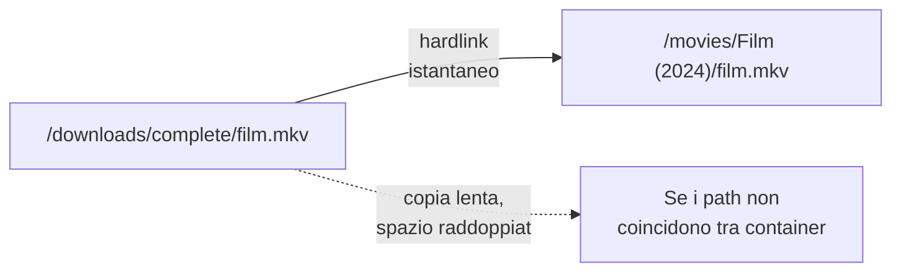
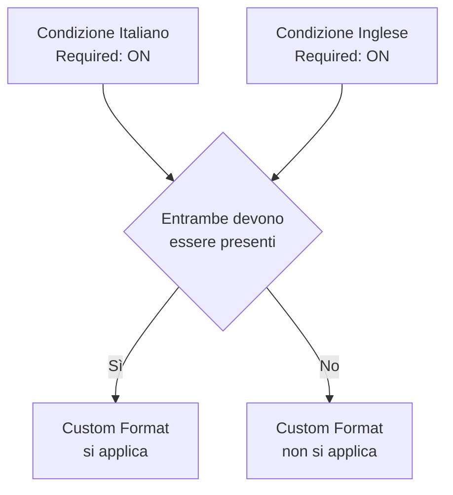

# Radarr e Sonarr

Radarr (film) e Sonarr (serie TV) funziovim in modo quasi identico — questa pagina li tratta insieme, evidenziando le differenze dove esistono.

## Installazione base

```yaml
services:
  radarr:
    image: lscr.io/linuxserver/radarr:latest
    container_name: radarr
    environment:
      - PUID=${PUID}
      - PGID=${PGID}
      - TZ=${TZ}
    volumes:
      - ./radarr:/config
      - /DATA/Media/Movies:/movies
      - /DATA/Downloads:/downloads
    ports:
      - "7878:7878"
    restart: unless-stopped

  sonarr:
    image: lscr.io/linuxserver/sonarr:latest
    container_name: sonarr
    environment:
      - PUID=${PUID}
      - PGID=${PGID}
      - TZ=${TZ}
    volumes:
      - ./sonarr:/config
      - /DATA/Media/TV:/tv
      - /DATA/Media/Anime:/anime
      - /DATA/Downloads:/downloads
    ports:
      - "8989:8989"
    restart: unless-stopped
```

## Collegamento al download client (qBittorrent via Gluetun)

`Settings → Download Clients → Add → qBittorrent`:

| Campo             | Valore                                                                                             |
| ----------------- | -------------------------------------------------------------------------------------------------- |
| Host              | `gluetun` (**non** `qbittorrent` — la rete appartiene a Gluetun, vedi sezione VPN)                 |
| Port              | `8080`                                                                                             |
| Username/Password | quelli del WebUI qBittorrent                                                                       |
| Category          | `radarr` (su Radarr) / `sonarr` (su Sonarr) — categorie separate per organizzare meglio i download |

!!! danger "Errore comune"
Scrivere `qbittorrent` invece di `gluetun` come host è l'errore più frequente in questa configurazione. qBittorrent non ha un proprio hostname raggiungibile in rete perché condivide lo stack di rete di Gluetun (`network_mode: service:gluetun`).

## Root folder e import automatico

`Settings → Media Management`:

- Root folder Radarr: `/movies`
- Root folder Sonarr: `/tv` (e `/anime` se gestisci una libreria separata)
- **Use Hardlinks instead of Copy**: attivo



!!! warning "Gli hardlink funziovim solo se..."
`/downloads` e `/movies`/`/tv` devono essere sullo **stesso filesystem host**. Se sono su dischi/mount diversi, Radarr/Sonarr copieranno invece di collegare, raddoppiando spazio e tempo di importazione. Vedi la pagina Convenzioni di denominazione per la struttura cartelle corretta.

## Quality Profile — cosa scaricare

`Settings → Profiles → Quality Profiles`: definisci le qualità accettate (es. WEB-DL 1080p, Bluray 1080p) in ordine di preferenza. Se il profilo è troppo restrittivo (es. solo Bluray-2160p Remux), molti contenuti resteranno "Missing" a tempo indefinito perché nessuna release disponibile soddisfa il criterio.

## Custom Formats — preferire release multi-lingua

Per ottenere automaticamente release con più tracce audio (es. italiano+inglese insieme):

1. `Settings → Custom Formats → Add Custom Format`
2. Nome: `Multi-Audio ITA-ENG`
3. `Add Condition → Language` → seleziona Italiano, **spunta "Required"**
4. Aggiungi un'altra condizione Language → Inglese, **spunta "Required"** anche qui



5. Vai su `Settings → Profiles → Quality Profiles → [profilo] → Custom Formats`, aggiungi il formato appena creato con uno **score alto** (es. +100)

Da questo momento, tra più release disponibili, verrà preferita quella multi-lingua.

## Perché una richiesta resta "Missing" — e cosa fare

"Missing" non significa errore — significa che il contenuto è monitorato ma non ancora trovato. Il sistema **ritenta automaticamente** con due meccanismi:

- **RSS Sync**: controlla periodicamente (ogni 15-20 minuti) i nuovi contenuti pubblicati dagli indexer
- **Ricerca automatica periodica**: rifà ricerche attive ogni 6-12 ore su tutto ciò che è ancora mancante

Non serve rifare la richiesta manualmente — resterà attiva finché non trova qualcosa che soddisfi i criteri.

**Per accelerare/forzare subito**: apri il contenuto → icona lente d'ingrandimento (**Ricerca manuale**) → mostra esattamente quali indexer sono stati interrogati e perché ogni risultato è stato scartato o accettato.

**Per lanciare una ricerca massiva sull'arretrato**: `Wanted → Missing` → seleziona tutto → **Search Selected**.

## Checklist di debug se un contenuto non si scarica mai

- [x] `Ricerca manuale` mostra 0 risultati da tutti gli indexer? → problema di indexer/categorie (vedi pagina Prowlarr)
- [x] Mostra risultati ma tutti "rejected"? → Quality Profile troppo restrittivo, o Minimum Seeders troppo alto
- [x] `Settings → Indexers → [indexer] → Minimum Seeders` è alto (5+)? → abbassalo a 1-2
- [x] RSS Sync e ricerca automatica sono attivi in `System/Settings → Tasks`?

Con Radarr e Sonarr configurati, il prossimo passo è aggiungere Bazarr per i sottotitoli automatici.
