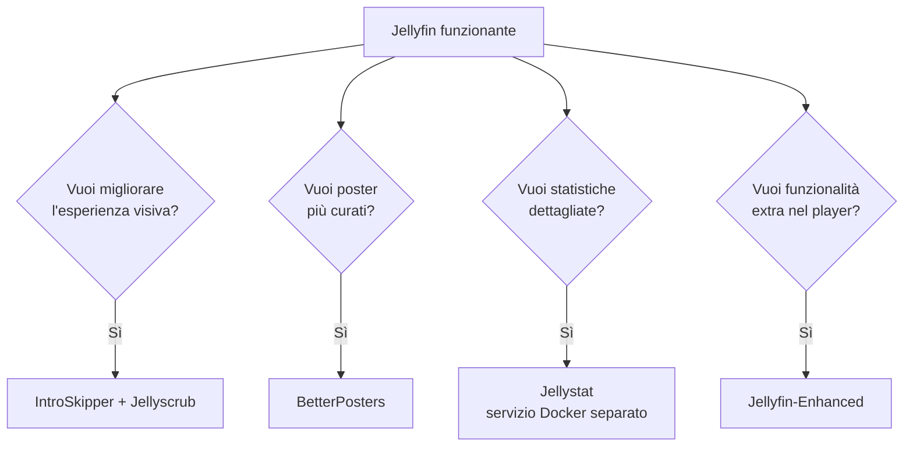

# Plugin utili

## Come installare un plugin (procedura generale)

1. `Dashboard → Plugins → Repositories → +` (se il plugin richiede un repository esterno non ufficiale)
2. Inserisci l'URL del manifest fornito dal plugin (lo trovi nella pagina GitHub del progetto)
3. `Dashboard → Plugins → Catalog` → cerca il plugin → **Install**
4. Riavvia Jellyfin
5. Configura il plugin da `Dashboard → Plugins → My Plugins → [nome plugin] → settings`

## Plugin per l'esperienza di visione

### IntroSkipper

Rileva automaticamente sigle di apertura/chiusura nelle serie TV e permette di saltarle con un clic, come nei servizi di streaming commerciali.

### Trickplay

Genera thumbnail per la barra di scrubbing (l'anteprima che appare passando il mouse sulla timeline durante la riproduzione), non è un plugin di per sè, un tempo esistevano plugin appositi adesso è una funzione integrata di jellyfin. Per farlo dovete:

1. Aprire la dashboard di Jellyfin.
2. Andare in: `Dashboard → Libraries`
3. Selezionare la libreria interessata.
4. Cliccare sui tre punti `⋮` della libreria.
5. Selezionare: `Manage Library`
6. Attivare l'opzione: `Enable trickplay image extraction`
7. Salvare le modifiche.

!!! tip "Attenzione al carico CPU"
La generazione di questi thumbnail (chiamata anche "Trickplay") usa ffmpeg **senza accelerazione hardware**, anche se hai Quick Sync configurato per lo streaming normale. Su hardware limitato, schedula questo task per la notte: `Dashboard → Attività pianificate → Estrai immagini chiave/Trickplay → modifica cadenza`.

## Plugin per copertine avanzate

### BetterPosters (Btttr Posters Plugin)

Sostituisce automaticamente i poster standard con locandine curate in stile "servizio streaming" — badge di qualità (4K, Dolby Vision), rating IMDb/Rotten Tomatoes.

**Installazione**:

1. `Dashboard → Plugins → Repositories → +`
2. URL: `https://raw.githubusercontent.com/TheAceOfficials/BetterPoster-for-Jellyfin/main/manifest.json`
3. Installa dal Catalog, riavvia
4. Configura badge, lingua, fonte rating da `My Plugins`
5. Applica alle librerie esistenti con uno scan e "Sostituisci immagini esistenti"

## Plugin di funzionalità estese

### Jellyfin-Enhanced

Aggiunge scorciatoie da tastiera, integrazione diretta con Jellyseerr, calendario media con monitoraggio download da Sonarr/Radarr, overlay di pausa personalizzato, colori sottotitoli personalizzabili.

!!! warning "Requisito versione"
Richiede Jellyfin 10.11 o superiore — verifica la tua versione prima di installarlo.

## Dashboard di statistiche — non un plugin, ma un servizio Docker separato

Se cerchi un vero pannello analitico (chi guarda cosa, quanto, grafici storici) più ricco di quello nativo, la soluzione non è un plugin interno ma un servizio esterno collegato via API:

### Jellystat

```yaml
services:
  jellystat-db:
    image: postgres:15
    container_name: jellystat-db
    environment:
      - POSTGRES_USER=jellystat
      - POSTGRES_PASSWORD=cambia_questa_password
      - POSTGRES_DB=jellystat
    volumes:
      - ./jellystat/db:/var/lib/postgresql/data
    restart: unless-stopped

  jellystat:
    image: cyfershepard/jellystat:latest
    container_name: jellystat
    environment:
      - POSTGRES_USER=jellystat
      - POSTGRES_PASSWORD=cambia_questa_password
      - POSTGRES_IP=jellystat-db
      - POSTGRES_PORT=5432
      - JWT_SECRET=cambia_anche_questo
    ports:
      - "3001:3000"
    volumes:
      - ./jellystat/backup:/app/backend/backup-data
    depends_on:
      - jellystat-db
    restart: unless-stopped
```

Dopo il deploy, collegalo al tuo server Jellyfin inserendo URL e API Key durante il setup guidato iniziale.

## Riepilogo — cosa installare e in che ordine



Non serve installarli tutti insieme — aggiungili uno alla volta, verificando che ognuno funzioni bene prima di procedere con il successivo.

Con Jellyfin completo, l'ultima sezione della guida copre come mantenere il sistema nel tempo: backup, migrazione, e risoluzione dei problemi più comuni.
