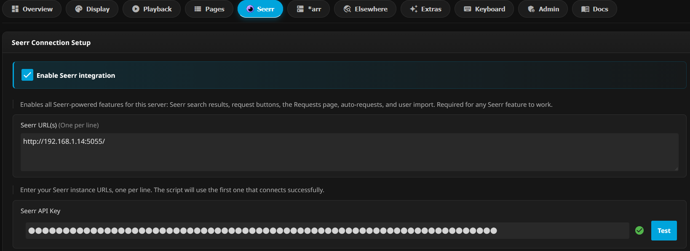
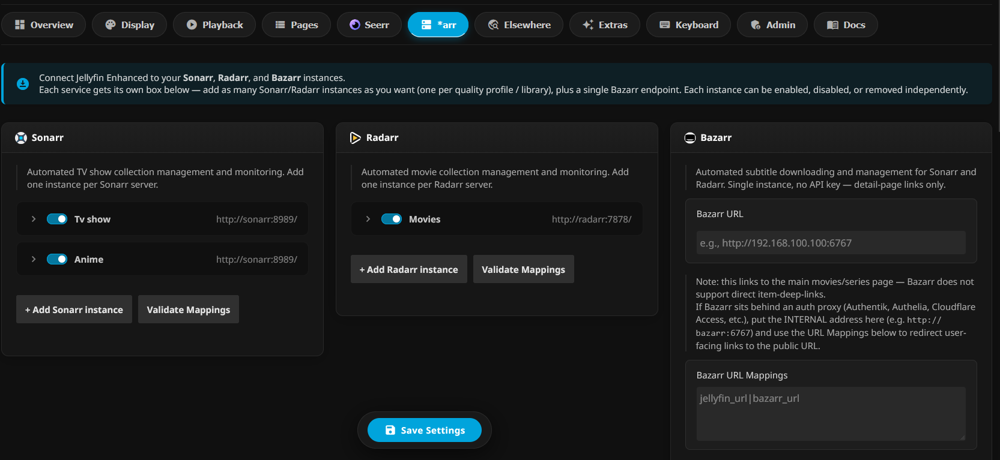

# Plugin consigliati per Jellyfin

Jellyfin è già completo nella sua installazione base, ma alcuni plugin permettono di migliorare notevolmente l'esperienza utente, avvicinandola a quella dei servizi commerciali come Netflix, Prime Video o Disney+.
Questi plugin aggiungono funzionalità come:

- trailer automatici;
- copertine e fanart più curate;
- anteprime durante lo scorrimento degli episodi;
- gestione avanzata dei contenuti;
- integrazione diretta con Jellyseerr e lo stack \*arr.

## Installazione di un plugin

La procedura generale per installare un plugin è:

1. Aprire la dashboard di Jellyfin.
2. Andare in: `Dashboard → Plugins`
3. Se il plugin utilizza un repository esterno: `Plugins → Repositories`
4. Inserire l'URL del manifest del repository.
5. Andare in: `Plugins → Catalog`
6. Cercare il plugin desiderato e premere **Install**.
7. Riavviare Jellyfin.
8. Configurare il plugin da: `Dashboard → Plugins → My Plugins → Nome plugin`

### Plugin consigliati

| Plugin                                                                                                                                                              | Cosa fa                                                                                                                                   |
| ------------------------------------------------------------------------------------------------------------------------------------------------------------------- | ----------------------------------------------------------------------------------------------------------------------------------------- |
| [Jellyfin Enhanced](https://github.com/n00bcodr/Jellyfin-Enhanced)                                                                                                  | Integrazione avanzata con Jellyseerr e Radarr/Sonarr, richieste direttamente da Jellyfin, calendario contenuti, funzioni extra del player |
| [Intro Skipper](https://github.com/intro-skipper/intro-skipper)                                                                                                     | Rileva automaticamente intro e sigle delle serie TV permettendo di saltarle                                                               |
| [In Player Episode Preview](https://github.com/Namo2/InPlayerEpisodePreview)                                                                                        | Mostra anteprime degli episodi direttamente nel player durante lo scorrimento                                                             |
| [Hover Trailer](https://github.com/Fovty/HoverTrailer)                                                                                                              | Riproduce automaticamente trailer passando sopra un contenuto                                                                             |
| [Fanart](https://github.com/jellyfin/jellyfin-plugin-fanart)                                                                                                        | Aggiunge sfondi e immagini artistiche aggiuntive alle pagine dei contenuti                                                                |
| [Get Avatar](https://github.com/cedev-1/jellyfin-plugin-GetAvatar)                                                                                                  | Migliora la gestione degli avatar utenti                                                                                                  |
| [Media Bar](https://github.com/IAmParadox27/jellyfin-plugin-media-bar) + [File Transformation](https://github.com/IAmParadox27/jellyfin-plugin-file-transformation) | Personalizza la schermata iniziale e modifica la visualizzazione dei contenuti                                                            |
| [Skin Manager](https://github.com/danieladov/jellyfin-plugin-skin-manager)                                                                                          | Permette di applicare e gestire temi grafici personalizzati                                                                               |

# Jellyfin Enhanced

Tra tutti i plugin consigliati, **Jellyfin Enhanced** è quello più importante per questo homelab.  
La sua funzione principale è integrare direttamente Jellyfin con il resto dello stack di automazione.  
Permette di:

- cercare contenuti da Jellyfin senza aprire Jellyseerr;
- inviare richieste direttamente dall'interfaccia Jellyfin;
- visualizzare lo stato dei download;
- integrare Radarr e Sonarr;
- aggiungere funzioni extra al player.

In pratica, l'utente rimane sempre dentro Jellyfin: cerca un film o una serie non presente nella libreria e può richiederla senza dover conoscere l'esistenza di Jellyseerr, Radarr o Sonarr.

## Collegare Jellyfin Enhanced a Jellyseerr

Dopo aver installato il plugin:

Vai su:  
**Dashboard → Plugins → My Plugins → Jellyfin Enhanced**

Apri la sezione **Seer** e inserisci:

- **URL Jellyseerr** (es. `http://jellyseerr:5055` o `http://IP_SERVER:5055`)
- **API Key Jellyseerr**

### Dove trovare la Jellyseerr API Key

Apri Jellyseerr → **Settings → General** → copia il valore **API Key**.

Dopo aver inserito i dati:

1. Premere **Test Connection**.
2. Verificare che il test abbia successo.
3. Salvare la configurazione.

<figure markdown="span">
  { width="600" }
  <figcaption>Configurazione integrazione Jellyseerr in Jellyfin Enhanced</figcaption>
</figure>

---

## Collegare Jellyfin Enhanced a Radarr e Sonarr

Sempre dentro:  
**Dashboard → Plugins → My Plugins → Jellyfin Enhanced**

Apri la sezione **\*arr** e aggiungi le istanze di Radarr e Sonarr create precedentemente.

Per ogni servizio inserire:

- Nome servizio
- URL
- API Key

**Esempi:**

- **Radarr**: `http://radarr:7878`
- **Sonarr**: `http://sonarr:8989`

La API Key si recupera da:  
**Radarr/Sonarr → Settings → General → Security → API Key**

Ripetere la configurazione per tutte le istanze create:

- Radarr 1080p
- Radarr 4K
- Sonarr 1080p
- Sonarr 4K
- Sonarr Anime

<figure markdown="span">
  { width="600" }
  <figcaption>Configurazione delle istanze Radarr e Sonarr in Jellyfin Enhanced</figcaption>
</figure>

Una volta completata la configurazione, Jellyfin Enhanced sarà collegato all'intero ecosistema, l'utente potrà quindi utilizzare Jellyfin come unica interfaccia per guardare contenuti già disponibili e richiedere automaticamente quelli mancanti.

    <video controls style="position: absolute; top: 0; left: 0; width: 100%; height: 100%; border-radius: 8px; box-shadow: 0 4px 12px rgba(0,0,0,0.4);">
        <source src="../videos/automazione.mp4" type="video/mp4">
        Il tuo browser non supporta il tag video.
    </video>

    
▶

    

        
Automazione completa dell'homelab

        

            Jellyseerr → Radarr/Sonarr → qBittorrent → Jellyfin: tutto in automatico
        

    

Il video dimostra come tutta la catena funzioni, un utente cerca un film direttamente in jellyfin poi tramite jellyfin enhanced avvia la richiesta a jellyseer che la passa a radarr che trova il file .torrent per poi passarlo al client torrent che avvia il download. Una volta che il tutto sia finito andate nella dashboard di jellyfin, sotto libraries cliccate scan all, tornata alla interfaccia principale e il vostro film sarà stato aggiunto
