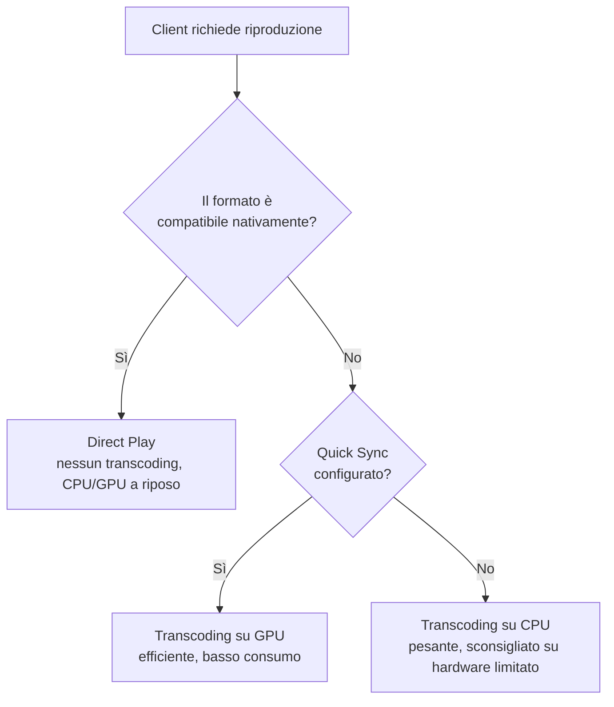

# Jellyfin — installazione e hardware acceleration

## Installazione

```yaml
services:
  jellyfin:
    image: lscr.io/linuxserver/jellyfin:latest
    container_name: jellyfin
    environment:
      - PUID=${PUID}
      - PGID=${PGID}
      - TZ=${TZ}
    volumes:
      - ./jellyfin/config:/config
      - /DATA/Media:/data/media
    devices:
      - /dev/dri:/dev/dri # accesso a Quick Sync per il transcoding hardware
    ports:
      - "8096:8096"
    restart: unless-stopped
    healthcheck:
      test: ["CMD", "curl", "-f", "http://localhost:8096/health"]
      interval: 30s
      timeout: 10s
      retries: 3
```

## Hardware acceleration — Quick Sync (Intel)

Se hai una CPU Intel con grafica integrata (come l'N100 consigliato in questa guida), puoi scaricare il lavoro di transcoding dalla CPU alla GPU integrata, molto più efficiente.

### Verifica sull'host

```bash
ls -la /dev/dri
# Dovresti vedere renderD128 (e talvolta card0/card1)

sudo apt install intel-media-va-driver-non-free vainfo -y
vainfo
```

Output atteso: elenco dei profili supportati (H264, HEVC, VP9...) senza errori.

### Attivazione nell'interfaccia Jellyfin

`Dashboard → Playback → Transcoding`:

1. **Hardware acceleration**: `Intel QuickSync (QSV)` (o `VAAPI`)
2. Attiva `Enable hardware decoding` per H264, HEVC, VP9, VC1
3. Attiva `Enable hardware encoding`
4. **VAAPI Device**: `/dev/dri/renderD128`
5. Salva e riavvia il container

### Verifica che funzioni davvero

```bash
sudo apt install intel-gpu-tools -y
sudo intel_gpu_top
```

Durante una riproduzione con transcoding forzato, se vedi attività sul motore **"Video"** (non "Render/3D"), l'accelerazione hardware è attiva correttamente.



!!! tip "Perché il transcoding a volte pesa comunque sulla CPU"
Alcune operazioni di Jellyfin (es. la generazione delle miniature Trickplay per lo scrubbing) **non usano** l'accelerazione hardware, anche con Quick Sync configurato correttamente — passano sempre dalla CPU. Se noti CPU alta senza nessuno che guarda contenuti, verifica `Dashboard → Attività pianificate` prima di pensare a un problema di configurazione.

## Struttura librerie consigliata

Coerente con la struttura cartelle vista nella pagina Convenzioni:

- **Movies** → tipo libreria "Film"
- **TV** → tipo libreria "Serie TV"
- **Anime** → tipo libreria "Serie TV" separata (permette scraper dedicati come AniDB)
- **Music** → tipo libreria "Musica"

## Refresh automatico della libreria

Due meccanismi complementari:

**1. Notifica diretta da Radarr/Sonarr (istantanea)**

Su entrambi: `Settings → Connect → Add Connection → Emby/Jellyfin`

| Campo            | Valore                                       |
| ---------------- | -------------------------------------------- |
| Host             | `jellyfin`                                   |
| Port             | `8096`                                       |
| API Key          | generata da Jellyfin: `Dashboard → API Keys` |
| Notify on Import | ✅                                           |
| Update Library   | ✅                                           |

**2. Monitoraggio in tempo reale (rete di sicurezza indipendente)**

`Dashboard → Librerie → [libreria] → Modifica → Abilita monitoraggio in tempo reale`: Jellyfin osserva direttamente il filesystem, indipendentemente dalle notifiche API.

**3. Scan periodico di backup**

`Dashboard → Attività pianificate → Scansione libreria multimediale`: imposta una cadenza (es. ogni 6 ore) come ulteriore rete di sicurezza.

Con Jellyfin installato e funzionante, puoi personalizzarne l'aspetto (tema e CSS) o aggiungere funzionalità extra (plugin) — coperti nelle prossime due pagine.
