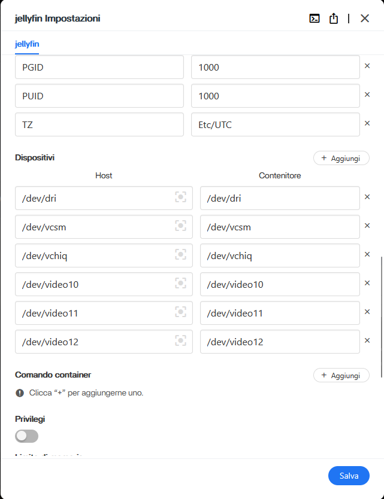
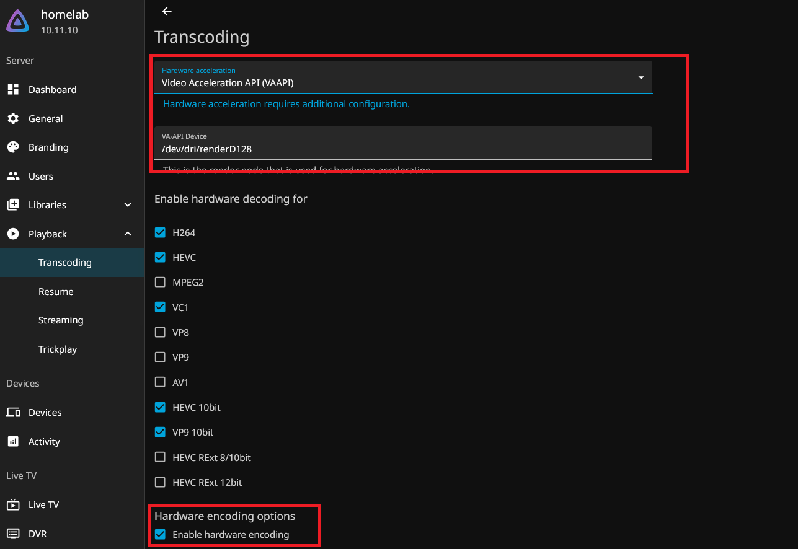
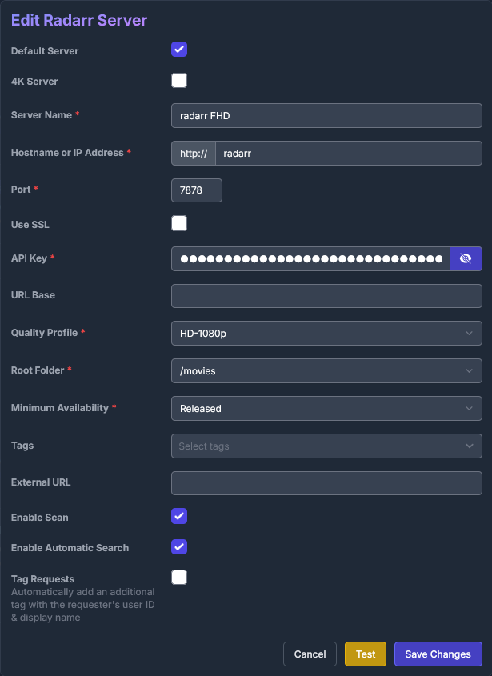
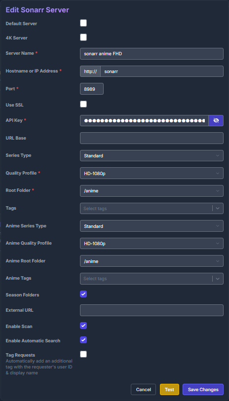
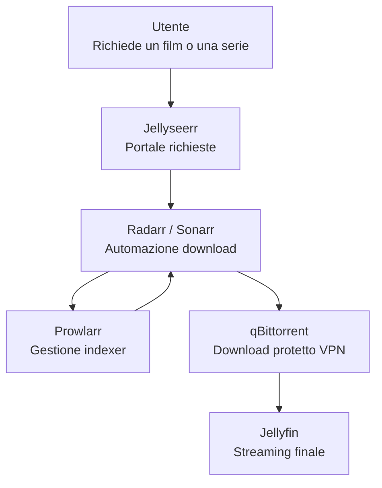

# Jellyfin e Jellyseerr

In questa pagina vedremo come installare **Jellyfin** il nostro gestore dei media, installeremo anche **Jellyseer** per automatizzare le richieste senza interfacciarsi direttamente a radarr/sonarr.

## Installare Jellyfin

Jellyfin sarà il centro del tuo media server: organizzerà tutti i contenuti scaricati da Radarr e Sonarr e li renderà disponibili in streaming su PC, smartphone, Smart TV e qualsiasi altro dispositivo compatibile.

L'installazione può essere eseguita direttamente dallo **Store di CasaOS**, senza utilizzare Docker Compose.

1. Apri **CasaOS**.
2. Vai su **App Store**.
3. Cerca **Jellyfin**.
4. Clicca sulla freccia ▼ accanto al pulsante **Installa**.
5. Seleziona **Installazione personalizzata**.
6. Nella sezione **Rete**, sostituisci **bridge** con **vpn-network**.
7. Verifica che il dispositivo `/dev/dri` sia esposto al container (necessario per il transcoding hardware).
8. Completa l'installazione.

<figure markdown="span">
  { width="600" }
  <figcaption>Impostazioni jellyfin dei device</figcaption>
</figure>

Al primo avvio verrà mostrata una procedura guidata nella quale dovrai:

- creare l'utente amministratore;
- scegliere la lingua;
- configurare le librerie multimediali.

Per questa guida si consiglia di utilizzare la seguente struttura.

| Cartella             | Tipo libreria |
| -------------------- | ------------- |
| `/DATA/Media/Movies` | Film          |
| `/DATA/Media/TV`     | Serie TV      |
| `/DATA/Media/Anime`  | Serie TV      |
| `/DATA/Media/Music`  | Musica        |

Separare gli anime dalle normali serie TV permette di utilizzare in futuro scraper differenti (ad esempio AniDB) senza modificare la libreria principale.

## Abilitare il transcoding hardware

Se il tuo server utilizza una CPU Intel con grafica integrata (ad esempio Intel N100, N95, N305 o processori Intel Core recenti), puoi sfruttare **Intel Quick Sync Video**.

In questo modo il transcoding verrà eseguito dalla GPU integrata invece che dalla CPU, riducendo il consumo di risorse e permettendo più riproduzioni contemporanee.

Per prima cosa verifica che il dispositivo video sia disponibile:

```bash
ls -la /dev/dri
```

Dovresti vedere almeno:

```text
renderD128
```

Successivamente installa gli strumenti di verifica:

```bash
sudo apt install intel-media-va-driver-non-free vainfo -y
vainfo
```

Se `vainfo` mostra l'elenco dei codec supportati senza errori, Quick Sync è disponibile.

Ora apri Jellyfin e vai in:

```
Dashboard
    → Playback
        → Transcoding
```

Configura:

- Hardware acceleration: **Intel Quick Sync (QSV)** oppure **VAAPI**
- Enable hardware decoding
- Enable hardware encoding
- VAAPI Device: `/dev/dri/renderD128`

Salva le modifiche e riavvia Jellyfin.

Per verificare che il transcoding utilizzi realmente la GPU:

```bash
sudo apt install intel-gpu-tools -y
sudo intel_gpu_top
```

Durante una riproduzione che richiede transcoding dovresti vedere attività sul motore **Video**.

<figure markdown="span">
  { width="600" }
  <figcaption>Configurazione del transcoding hardware (nell'esempio viene utilizzato VAAPI perché il server monta una CPU AMD).</figcaption>
</figure>

## Installare Jellyseerr

Jellyseerr è il portale attraverso cui gli utenti richiederanno nuovi contenuti.

L'utente non dovrà mai utilizzare direttamente Radarr o Sonarr: sarà sufficiente cercare un film o una serie TV su Jellyseerr e premere **Request**.

Da quel momento sarà Jellyseerr a coordinare automaticamente tutto il resto del processo.

Per installarlo:

1. Apri **CasaOS**.
2. Vai su **App Store**.
3. Cerca **Jellyseerr**.
4. Clicca sulla freccia ▼ accanto a **Installa**.
5. Seleziona **Installazione personalizzata**.
6. Imposta la rete **vpn-network**.
7. Completa l'installazione.

## Collegare Jellyseerr a Jellyfin

Apri Jellyseerr e vai in:

```
Settings
    → Jellyfin
        → Jellyfin Settings
```

Compila i campi richiesti:

- **Server URL**
- **Username**
- **Password**

Ad esempio:

```
Server URL:
http://jellyfin:8096
```

oppure

```
http://192.168.1.14:8096
```

Una volta salvata la configurazione, Jellyseerr importerà automaticamente:

- gli utenti;
- le librerie;
- i contenuti già presenti.

Da questo momento gli utenti potranno autenticarsi utilizzando direttamente gli account di Jellyfin.

## Collegare Radarr e Sonarr

Dopo aver configurato Jellyfin, bisogna indicare a Jellyseerr quali istanze di Radarr e Sonarr dovrà utilizzare.

Apri:

```
Settings
    → Services
```

Una configurazione tipica è la seguente.

| Servizio | Qualità | Contenuti |
| -------- | ------- | --------- |
| Radarr   | 1080p   | Film      |
| Radarr   | 4K      | Film      |
| Sonarr   | 1080p   | Serie TV  |
| Sonarr   | 4K      | Serie TV  |
| Sonarr   | Anime   | Anime     |

Ogni server rappresenta una diversa libreria o un diverso profilo di qualità.

Ad esempio:

- Radarr 1080p gestirà i film Full HD;
- Radarr 4K gestirà i film Ultra HD;
- Sonarr 1080p gestirà le serie TV;
- Sonarr Anime gestirà esclusivamente gli anime.

### Recuperare l'API Key

Per aggiungere un server è necessario conoscere la sua API Key.

Apri Radarr (oppure Sonarr) e vai in:

```
Settings
    → General
```

Scorri fino alla sezione **Security** e copia il valore presente nel campo:

```
API Key
```

Questa chiave dovrà essere inserita nella configurazione del server all'interno di Jellyseerr.

### Configurare un server

Per ogni server inserisci:

- **Name**
- **URL**
- **API Key**
- **Root Folder**
- **Quality Profile**
- **Language Profile**

Ad esempio, per Radarr:

```
URL:
http://radarr:7878
```

Per Sonarr:

```
URL:
http://sonarr:8989
```

Essendo tutti i container collegati alla rete Docker `vpn-network`, possono comunicare utilizzando direttamente il nome del container.

Per le cartelle principali utilizza:

| Tipo     | Root Folder |
| -------- | ----------- |
| Film     | `/movies`   |
| Serie TV | `/tv`       |
| Anime    | `/anime`    |

Successivamente seleziona il **Quality Profile** e il **Language Profile** creati in precedenza in Radarr o Sonarr.

<figure markdown="span">
  { width="600" }
  <figcaption>Esempio di configurazione di un server Radarr.</figcaption>
</figure>

<figure markdown="span">
  { width="600" }
  <figcaption>Esempio di configurazione di un server Sonarr dedicato agli anime.</figcaption>
</figure>

Ripeti la procedura per tutte le istanze di Radarr e Sonarr che desideri utilizzare.

Se stai configurando un'istanza di Sonarr dedicata alle normali serie TV, lascia vuote le opzioni:

- Anime Series Type
- Anime Quality Profile
- Anime Root Folder

Mantieni invece sempre abilitate le opzioni:

- Season Folders
- Enable Scan
- Enable Automatic Search

## Come funziona l'intero sistema

Una volta terminata la configurazione, tutto il processo diventa completamente automatico.



Quando un utente cerca un contenuto su Jellyseerr e preme **Request**, la richiesta viene inoltrata automaticamente all'istanza corretta di Radarr o Sonarr.

Radarr o Sonarr interrogano Prowlarr per trovare le release disponibili sugli indexer configurati. Individuata quella migliore in base ai profili di qualità, la inviano a qBittorrent, che scarica il contenuto attraverso la VPN.

Al termine del download, Radarr o Sonarr importano automaticamente il file nella libreria corretta, lo rinominano secondo le regole configurate e notificano Jellyfin, che aggiorna immediatamente la libreria.

L'utente dovrà semplicemente attendere il completamento del download: il contenuto comparirà automaticamente in Jellyfin, pronto per essere riprodotto.
