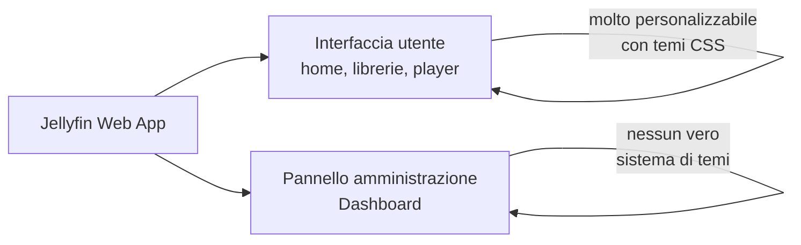
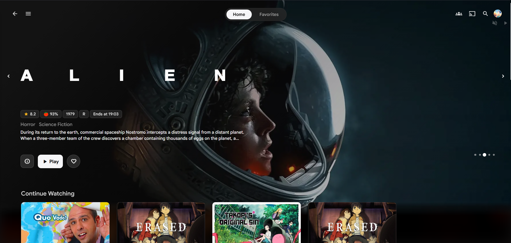

# Temi e Custom CSS

## Due parti diverse dell'interfaccia

Prima di personalizzare, è utile distinguere due sezioni concettualmente diverse della stessa applicazione:



I temi della community sono pensati principalmente per la **parte che vede la famiglia** (home, sfoglia librerie, player) — il pannello di amministrazione resta funzionale ma poco personalizzabile, per scelta di design del progetto Jellyfin.

## Applicare un tema tramite Custom CSS

Il modo più semplice, senza installare plugin:

`Dashboard → General → Custom CSS code` → incolla l'import del tema scelto → Salva.

## Temi consigliati

| Tema                   | Stile                             | Adatto per                                      |
| ---------------------- | --------------------------------- | ----------------------------------------------- |
| **Abyss**              | Minimal Dark                      | Look moderno                                    |
| **JellyFlix**          | Ispirato a Netflix, banner grandi | Sensazione "servizio streaming" per la famiglia |
| **ElegantFin**         | Pulito, ispirato a Jellyseerr     | Look raffinato senza eccessi                    |
| **better-jellyfin-ui** | Moderno, animazioni fluide        | Estetica più "premium"                          |
| **Monochrome**         | Dark minimale                     | Schermi OLED, massima sobrietà                  |

Esempio (Abyss):

```css
@import url("https://cdn.jsdelivr.net/gh/AumGupta/abyss-jellyfin@main/abyss.css");
@import url("https://cdn.jsdelivr.net/gh/AumGupta/abyss-jellyfin@main/styles/abyss-je.css");
@import url("https://cdn.jsdelivr.net/gh/AumGupta/abyss-jellyfin@main/styles/abyss-mbe.css");
```

<figure markdown="span">
  { width="600" }
  <figcaption>Jellyfin con il tema abyss</figcaption>
</figure>

## Installazione tramite plugin — Skin Manager

Se preferisci un installer con un clic invece di gestire il CSS a mano:

1. `Dashboard → Plugins → Repositories → +`
2. Aggiungi il repository di **Skin Manager** (cerca "Jellyfin Skin Manager" su GitHub per l'URL manifest aggiornato)
3. `Catalog` → installa → riavvia Jellyfin
4. Scegli e applica un tema dalla lista disponibile

## Applicare un tema alle librerie esistenti

Alcuni temi cambiano anche lo stile dei poster (badge qualità, rating). Per applicarli retroattivamente:

`Dashboard → Librerie → [libreria] → Scansiona libreria` → opzione **"Sostituisci metadati esistenti"** con **"Sostituisci immagini esistenti"** spuntato.

## Copertine per le librerie stesse

Oltre al tema generale, puoi personalizzare le icone delle librerie (le card "Movies", "TV", "Anime" nella home):

**jfcovers.jan.run** — strumento gratuito: carichi un'immagine di sfondo, scrivi il titolo, genera una cover coerente con lo stile nativo Jellyfin. Alternativa self-hosted: [Jellyfin-Cover-Maker su GitHub](https://github.com/KartoffelChipss/Jellyfin-Cover-Maker), da far girare come container.

Applica da: `Dashboard → Librerie → [libreria] → Modifica immagini → carica manualmente`.

## Fonti per artwork di alta qualità

| Fonte                     | Contenuto                                                                          |
| ------------------------- | ---------------------------------------------------------------------------------- |
| **TMDB** (themoviedb.org) | Poster, backdrop, loghi ufficiali — è già la fonte metadata di default di Jellyfin |
| **Fanart.tv**             | Artwork "pulita" (loghi trasparenti, banner) pensata per media center              |
| **TVDB** (thetvdb.com)    | Alternativa a TMDB, a volte con artwork migliore per serie meno mainstream         |

Con l'aspetto visivo personalizzato, l'ultima pagina di questa sezione copre i plugin che aggiungono funzionalità reali, non solo estetica.
