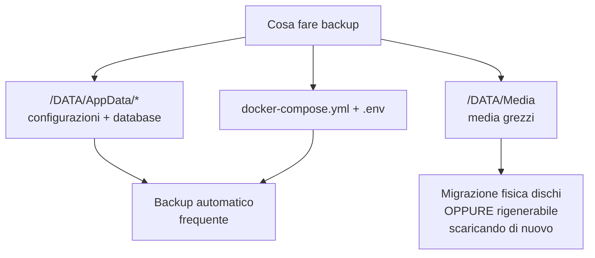
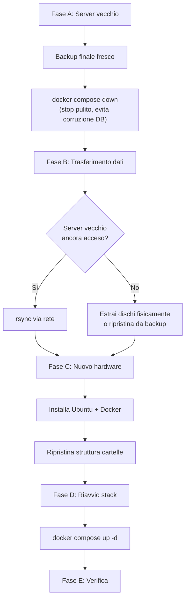

# Backup e migrazione

## Il principio guida — dividi "configurazione" da "dati grezzi"

| Categoria                    | Esempio                                                  | Strategia                                                                  |
| ---------------------------- | -------------------------------------------------------- | -------------------------------------------------------------------------- |
| **Configurazione container** | `docker-compose.yml`, `.env`, cartelle `/DATA/AppData/*` | Backup piccolo, frequente, essenziale                                      |
| **Database applicazioni**    | Watch history Jellyfin, libreria Radarr/Sonarr           | Incluso nelle cartelle AppData                                             |
| **Media grezzi**             | Film, serie in `/DATA/Media`                             | Troppo grande per backup tradizionale — si migra fisicamente o si rigenera |



Se perdi tutta la libreria media, puoi ri-scaricarla (fastidioso, non catastrofico). Se perdi le configurazioni, perdi ore/giorni di lavoro di setup — quello va protetto per primo.

## Script di backup automatico

```bash
mkdir -p ~/backups
vim ~/backups/backup-homelab.sh
```

```bash
#!/bin/bash
DATE=$(date +%F)
tar -czf ~/backups/homelab-config-$DATE.tar.gz \
  /DATA/AppData/ \
  ~/homelab/docker-compose.yml \
  ~/homelab/.env 2>/dev/null

# Mantieni solo gli ultimi 14 backup
find ~/backups/ -name "homelab-config-*.tar.gz" -mtime +14 -delete
```

```bash
chmod +x ~/backups/backup-homelab.sh
crontab -e
```

Aggiungi (backup ogni notte alle 3):

```
0 3 * * * /home/utente/backups/backup-homelab.sh
```

!!! danger "Il backup deve stare FUORI dal server"
Se il backup resta sullo stesso disco che si rompe, non serve a nulla. Copialo periodicamente su un altro dispositivo, una chiavetta USB, o un servizio cloud economico (es. Backblaze B2).

```bash
# Verso un altro dispositivo in rete
rsync -avz ~/backups/ utente@192.168.1.X:/percorso/backup/
```

## Backup separato della chiave VPN

```bash
gpg -c ~/homelab/.env
# crea .env.gpg cifrato, richiede una passphrase
```

Conserva `.env.gpg` in un posto sicuro (password manager, USB offline) — ti permette di ripristinare la VPN senza dover rigenerare le chiavi da capo sul sito del provider.

## Procedura di migrazione completa



### Fase A — Sul server vecchio

```bash
~/backups/backup-homelab.sh

cd ~/homelab
docker compose down
```

!!! warning "Perché fermare i container prima di copiare"
SQLite (usato da Jellyfin, Radarr, Sonarr) può corrompersi se copi i file mentre il database è ancora aperto in scrittura.

### Fase B — Trasferimento

Se il vecchio server è raggiungibile in rete:

```bash
rsync -avzP utente@<IP_VECCHIO_SERVER>:/DATA/AppData/ /DATA/AppData/
rsync -avzP utente@<IP_VECCHIO_SERVER>:/home/utente/homelab/ /home/utente/homelab/
```

Se inaccessibile: estrai fisicamente i dischi, collegali al nuovo hardware, oppure ripristina da un backup esterno:

```bash
tar -xzf homelab-config-2026-07-08.tar.gz -C /
```

Per i media (la parte grande in TB): se possibile, **sposta fisicamente i dischi** invece di copiare via rete — molto più veloce.

### Fase C — Nuovo hardware

Segui la procedura di installazione base (Ubuntu Server, Docker, struttura cartelle) come nella prima installazione, poi copia/ripristina `/DATA/AppData/*` e i file compose.

### Fase D — Riavvio

```bash
cd ~/homelab
docker compose up -d
docker compose ps
```

Poiché i volumi contengono già tutta la configurazione, i container ripartono esattamente nello stato in cui erano.

### Fase E — Verifica post-migrazione

- [x] `docker exec gluetun wget -qO- https://ipinfo.io/ip` → IP mascherato come prima
- [x] Jellyfin mostra libreria e cronologia utenti
- [x] Radarr/Sonarr mostrano i contenuti monitorati
- [x] Prowlarr ha ancora gli indexer configurati
- [x] qBittorrent ha ancora la password impostata

## Regola pratica da ricordare

!!! tip "La regola d'oro"
Tutto quello che conta davvero sta in `/DATA/AppData/*` + `docker-compose.yml` + `.env`. Con un backup recente di queste tre cose (poche centinaia di MB), puoi ricostruire l'intero homelab su hardware completamente nuovo in meno di un'ora, escluso il tempo di trasferimento dei media.

Con backup e migrazione coperti, l'ultima pagina raccoglie i problemi più comuni incontrati costruendo questo tipo di stack.
