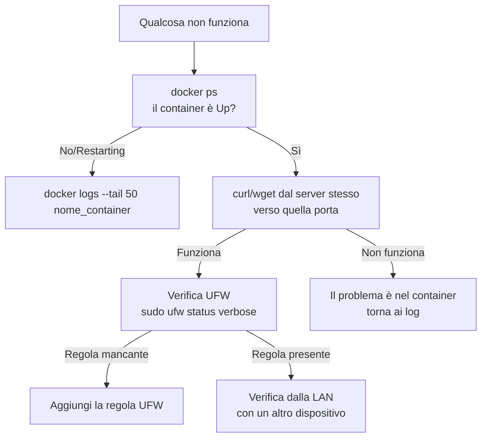

# Troubleshooting

Raccolta dei problemi più comuni incontrati costruendo uno stack come questo, organizzati per area.

## Metodo generale di diagnosi

Prima di cercare la soluzione specifica, segui sempre questo ordine:



## Rete e firewall

**"Impossibile raggiungere il sito"**

- Verifica che il container sia `Up`: `docker ps`
- Verifica che la porta sia effettivamente in ascolto: `sudo ss -tulpn | grep <PORTA>`
- Verifica la regola UFW: `sudo ufw status verbose | grep <PORTA>`

**Ti sei bloccato fuori da SSH dopo una modifica UFW**

- Serve accesso fisico al server (monitor+tastiera)
- `sudo ufw disable` per sbloccare immediatamente
- Verifica la subnet reale con `ip a` sul server e sul dispositivo client — un mismatch di subnet è la causa più comune
- Riattiva UFW solo dopo aver ri-verificato le regole essenziali (SSH prima di tutto)

**"Unauthorized" aprendo un'app da un link senza `http://`**

- I browser moderni tentano automaticamente HTTPS se non specifichi lo schema
- Molti servizi self-hosted parlano solo HTTP semplice
- Soluzione: usa sempre `http://` esplicito nei bookmark

## VPN e download

**qBittorrent non scarica nulla, velocità 0**

- `docker logs gluetun` → verifica che il tunnel sia connesso (`Public IP address is...`)
- Verifica le credenziali WireGuard in `.env`

**Dubbio se l'IP sia davvero nascosto**

- Segui tutti i metodi nella pagina "Verificare la protezione VPN" — non fidarti di un solo test

**"Unable to bind to IP" nei log di qBittorrent**

- Il campo "Indirizzo IP" nella pagina Web UI ha ricevuto un valore non valido (es. un URL invece di un IP puro)
- Correggi il file di configurazione direttamente: cerca `WebUI\Address=` nel file `qBittorrent.conf` e impostalo su `*`

## Stack \*arr

**Indexer bloccato da Cloudflare**

- Serve FlareSolverr collegato tramite tag condiviso (non un menu diretto) — vedi pagina Prowlarr

**"No results in the configured categories"**

- Mismatch tra le categorie dell'indexer e quelle sincronizzate in `Settings → Apps` su Radarr/Sonarr
- Indexer puramente anime vanno collegati solo a Sonarr, non a Radarr

**Contenuti restano "Missing" a lungo**

- Normale nei primi minuti/ore — il sistema ritenta automaticamente (RSS Sync + ricerca periodica)
- Se persiste: usa "Ricerca manuale" per vedere il dettaglio esatto del perché ogni risultato viene scartato
- Cause comuni: Quality Profile troppo restrittivo, Minimum Seeders troppo alto

**Radarr/Sonarr non si connettono a qBittorrent**

- Verifica di usare `gluetun` come host, non `qbittorrent` (la rete appartiene a Gluetun)

**File scaricato non importato, o importato con copia invece di hardlink**

- `/downloads` e `/movies`/`/tv` devono essere sullo stesso filesystem host — verifica i mapping dei volumi in ogni container

**"All indexers are unavailable due to failures" nella pagina Health**

- Spesso un sintomo, non la causa — controlla i log per il vero errore (es. Prowlarr temporaneamente irraggiungibile dopo un riavvio)
- Forza un retry immediato con "Test All" invece di aspettare il periodo di raffreddamento automatico

## Jellyfin

**CPU alta senza nessuno che guarda nulla**

- `ps aux | grep ffmpeg` per identificare il processo esatto
- Causa comune: generazione Trickplay/thumbnail in background, non usa accelerazione hardware
- Verifica in `Dashboard → Attività pianificate`, sposta la schedulazione in orari di basso utilizzo

**Transcoding usa la CPU invece della GPU**

- Verifica `/dev/dri` mappato nel container
- Verifica `vainfo` sull'host per confermare che i driver funzionino
- Verifica con `sudo intel_gpu_top` durante la riproduzione se il motore "Video" della GPU è attivo

## Docker in generale

**Non riesci a modificare un container esistente (network_mode, cap_add, devices)**

- Questi parametri **non sono modificabili** su un container già creato
- Serve `docker stop` + `docker rm` (il volume dati resta intatto) + ricreazione con `docker compose up -d`
- Se il container era gestito da CasaOS, verifica di non avere conflitti di nome quando lo ricrei via Compose/Portainer

**Container con lo stesso nome — conflitto**

```
docker stop nome_container
docker rm nome_container
```

Poi ricrea con la configurazione corretta — il volume `/config` resta sul disco, indipendente dal container.

## Quando in dubbio, questo è l'ordine di verifica

1. Il container è `Up`? (`docker ps`)
2. Cosa dicono i log? (`docker logs --tail 50 <container>`)
3. Il servizio risponde dal server stesso? (`curl`/`wget` locale)
4. UFW lo permette? (`sudo ufw status verbose`)
5. Il problema è di comunicazione tra container? (`docker exec <container> wget ... http://altro-container:porta`)

Seguendo questo ordine sistematicamente, la stragrande maggioranza dei problemi di questo genere di stack si risolve entro pochi minuti, invece di indovinare a caso.

---

_Questa guida copre l'intero percorso dalla scelta hardware fino a un homelab completo, sicuro e automatizzato. Torna a qualsiasi sezione quando ti serve — la struttura è pensata per essere consultata a pezzi, non solo letta in ordine._
