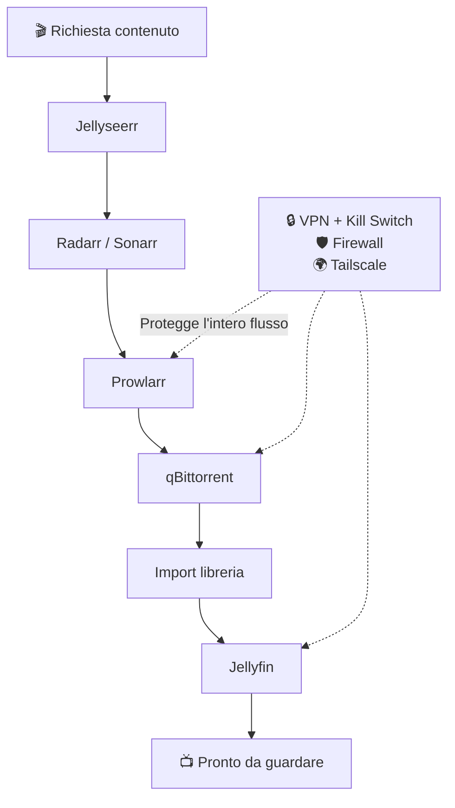

# Homelab Media Server — Guida Completa

Benvenuto. Questa guida ti accompagna passo dopo passo nella costruzione del tuo **homelab personale per lo streaming multimediale**: un server domestico che scarica automaticamente film e serie TV, li organizza, e li rende disponibili in streaming a te e alla tua famiglia — tutto in modo sicuro, protetto da VPN, e senza esporre nulla pubblicamente su Internet.

Non serve essere un sysadmin esperto. Ogni concetto viene spiegato da zero, con un filo logico unico: parti dal _perché_, capisci il _come_, e solo dopo vedi i comandi da copiare.

## Cosa costruirai

Il tutto protetto da una VPN con kill switch (se la VPN cade, il download si ferma — non scarica mai "in chiaro"), raggiungibile da fuori casa in modo sicuro tramite Tailscale, e con un firewall che lascia entrare solo chi deve.

## Come è organizzata questa guida

1. **Inizia qui** — i concetti di base: cos'è un homelab, come funziona un torrent, la visione d'insieme dell'architettura
2. **Hardware** — cosa comprare, da un semplice laptop riciclato fino a un server dedicato espandibile
3. **Rete e Sicurezza** — IP statico, firewall, VPN, accesso remoto sicuro, DNS
4. **Piattaforma Server** — la base software su cui gira tutto
5. **Stack \*arr** — il cuore dell'automazione: ricerca, download, organizzazione
6. **Jellyfin** — il media server che tu e la tua famiglia userete davvero
7. **Manutenzione** — backup, migrazione, risoluzione problemi

## A chi è rivolta

A chiunque parta da zero ma sia disposto a capire _perché_ si fa una cosa, non solo a copiare comandi. Ogni sezione spiega prima il concetto, poi la pratica — così quando qualcosa non funziona (e prima o poi succede sempre), saprai ragionare sul problema invece di essere bloccato.

!!! tip "Consiglio di lettura"
Se sei alle primissime armi, segui l'ordine del menu dall'alto verso il basso. Se hai già un pezzo funzionante (es. hai già un server Ubuntu), puoi saltare direttamente alla sezione che ti serve.
